# UWB Indoor Localization: Calibrated EKF and LSTM Residual Correction

Repository ini berisi penelitian lokalisasi indoor berbasis Ultra-Wideband (UWB)
untuk tugas akhir. Implementasi terbaru menggunakan pipeline yang reproducible
dan **no-data-leakage** dengan tahapan kalibrasi range, EKF berbasis pengukuran
jarak langsung, LSTM residual correction, evaluasi, dan plotting.

**Status hasil terbaru:** EKF berbasis range memperbaiki baseline raw
trilateration dan Kalman lama pada lintasan test held-out. LSTM residual
correction belum meningkatkan generalisasi pada test set, sehingga hasil utama
yang paling kuat saat ini adalah **EKF only**.

---

## Daftar Isi

- [1. Abstrak](#1-abstrak)
  - [1.1 Kata Kunci](#11-kata-kunci)
- [2. Pendahuluan](#2-pendahuluan)
  - [2.1 Latar Belakang](#21-latar-belakang)
  - [2.2 Tujuan Penelitian](#22-tujuan-penelitian)
  - [2.3 Catatan Target Akurasi 5 cm](#23-catatan-target-akurasi-5-cm)
- [3. Dataset dan Struktur Repository](#3-dataset-dan-struktur-repository)
  - [3.1 Dataset](#31-dataset)
  - [3.2 Struktur Kode](#32-struktur-kode)
  - [3.3 Snapshot Hasil Terbaru](#33-snapshot-hasil-terbaru)
- [4. Metodologi](#4-metodologi)
  - [4.1 Data Loading dan Split No-Leakage](#41-data-loading-dan-split-no-leakage)
  - [4.2 Kalibrasi Range per Anchor](#42-kalibrasi-range-per-anchor)
  - [4.3 Anchor Optimization](#43-anchor-optimization)
  - [4.4 Extended Kalman Filter Berbasis Range](#44-extended-kalman-filter-berbasis-range)
  - [4.5 LSTM Residual Correction](#45-lstm-residual-correction)
  - [4.6 Evaluasi dan Visualisasi](#46-evaluasi-dan-visualisasi)
- [5. Hasil Eksperimen Terbaru](#5-hasil-eksperimen-terbaru)
  - [5.1 Split Eksperimen](#51-split-eksperimen)
  - [5.2 Hasil Kalibrasi Range](#52-hasil-kalibrasi-range)
  - [5.3 Hasil Kuantitatif Test Set](#53-hasil-kuantitatif-test-set)
  - [5.4 Hasil Per Lintasan](#54-hasil-per-lintasan)
  - [5.5 Visualisasi](#55-visualisasi)
- [6. Diskusi](#6-diskusi)
  - [6.1 Interpretasi Hasil](#61-interpretasi-hasil)
  - [6.2 Mengapa Target 5 cm Belum Realistis](#62-mengapa-target-5-cm-belum-realistis)
  - [6.3 Implikasi untuk Tugas Akhir](#63-implikasi-untuk-tugas-akhir)
- [7. Cara Menjalankan Pipeline](#7-cara-menjalankan-pipeline)
  - [7.1 Environment](#71-environment)
  - [7.2 Urutan Eksekusi](#72-urutan-eksekusi)
  - [7.3 Output Pipeline](#73-output-pipeline)
- [8. Kesimpulan](#8-kesimpulan)
- [9. Referensi File Penting](#9-referensi-file-penting)

---

## 1. Abstrak

Penelitian ini mengevaluasi sistem lokalisasi indoor berbasis UWB menggunakan
pendekatan berlapis: kalibrasi jarak per anchor, Extended Kalman Filter (EKF)
berbasis range, dan LSTM residual correction. Pipeline terbaru dirancang untuk
menghindari data leakage dengan memisahkan train, validation, dan test sebelum
proses fitting kalibrasi, scaler, sequence window, dan training model.

Hasil terbaru menunjukkan bahwa EKF berbasis range memberikan peningkatan pada
lintasan test held-out dibanding raw trilateration dan Kalman lama. Namun, LSTM
residual correction belum meningkatkan generalisasi pada test set. Hal ini
mengindikasikan bahwa kualitas data range UWB dan variasi lintasan masih menjadi
faktor pembatas utama.

### 1.1 Kata Kunci

UWB indoor localization, Extended Kalman Filter, range calibration, LSTM
residual correction, no data leakage, trajectory evaluation.

---

## 2. Pendahuluan

### 2.1 Latar Belakang

Ultra-Wideband (UWB) sering digunakan untuk lokalisasi indoor karena mampu
memberikan estimasi jarak antar perangkat. Namun, pada praktiknya pengukuran UWB
rentan terhadap bias, multipath, NLOS, kesalahan posisi anchor, dan noise
temporal. Oleh karena itu, estimasi posisi langsung dari trilaterasi raw range
sering belum cukup stabil.

### 2.2 Tujuan Penelitian

Tujuan penelitian ini adalah:

1. Membangun pipeline lokalisasi UWB yang reproducible dan no-data-leakage.
2. Mengevaluasi performa raw trilateration, Kalman lama, EKF berbasis range, dan
   LSTM residual correction.
3. Melaporkan hasil secara jujur menggunakan metrik posisi 2D, terutama
   **2D Euclidean RMSE**.
4. Menentukan apakah dataset saat ini cukup untuk mendekati target error 5 cm.

### 2.3 Catatan Target Akurasi 5 cm

Target error di bawah 5 cm hanya valid jika diuji pada setup yang sangat
terkontrol: posisi anchor presisi, kondisi line-of-sight dominan, kalibrasi range
yang kuat, dan ground truth yang akurat. Metrik utama harus menggunakan RMSE 2D:

```text
RMSE_2D = sqrt(mean((x_pred - x_true)^2 + (y_pred - y_true)^2))
```

Pada dataset terbaru, error range UWB di test set masih berada pada skala puluhan
sentimeter, sehingga target 5 cm belum realistis untuk diklaim.

---

## 3. Dataset dan Struktur Repository

### 3.1 Dataset

Dataset berada di folder `Data hasil/`.

| File | Deskripsi | Peran pada config terbaru |
| --- | --- | --- |
| `data_with_velocity1 (majulurus).csv` | Lintasan maju lurus | Train dan validation tail |
| `kotak 2 loop.csv` | Lintasan kotak dua putaran | Train dan validation tail |
| `diam.csv` | Tag diam | Train dan validation tail |
| `kotak 3 loop.csv` | Lintasan kotak tiga putaran | Test held-out |

Kolom utama yang tersedia:

| Kelompok | Kolom |
| --- | --- |
| Waktu | `time` |
| Range UWB | `d1`, `d2`, `d3` |
| Estimasi jarak tambahan | `el1`, `el2`, `el3` |
| Raw trilateration | `x`, `y` |
| Kalman lama | `x_kf`, `y_kf` |
| Ground truth | `x_true`, `y_true` |

### 3.2 Struktur Kode

Implementasi pipeline baru:

```text
configs/
  uwb_pipeline.yaml

src/uwb_localization/
  data.py
  calibration.py
  anchor_optimization.py
  ekf.py
  features.py
  lstm.py
  constraints.py
  metrics.py
  plotting.py

scripts/
  01_prepare_dataset.py
  02_calibrate_ranges.py
  03_optimize_anchors.py
  04_run_ekf.py
  05_train_lstm_residual.py
  06_evaluate_pipeline.py
  07_plot_results.py
```

Dokumentasi pipeline detail tersedia di:

[docs/UWB_CALIBRATED_PIPELINE.md](docs/UWB_CALIBRATED_PIPELINE.md)

### 3.3 Snapshot Hasil Terbaru

Snapshot hasil terbaru yang diringkas di README ini berada di:

```text
docs/results/20260507_133727/
```

Folder tersebut hanya berisi artifact ringan untuk dokumentasi: metrics,
configuration snapshot, calibration summary, dan plot gambar. Full output mentah
pipeline tetap berada secara lokal di `outputs/`.

---

## 4. Metodologi

### 4.1 Data Loading dan Split No-Leakage

Pipeline membaca seluruh file CSV, menstandardisasi nama kolom, memvalidasi
kolom wajib, dan menambahkan metadata:

```text
source_file, trajectory, segment_id, sample_index, split
```

Strategi split terbaru:

1. `kotak 3 loop` digunakan sebagai **test held-out**.
2. Track train adalah `majulurus`, `kotak 2 loop`, dan `diam`.
3. Validation dibuat dari bagian akhir setiap trajectory train.

Pendekatan ini menjaga test trajectory tidak digunakan pada fitting kalibrasi,
anchor optimization, scaler, early stopping, atau pemilihan model.

### 4.2 Kalibrasi Range per Anchor

Kalibrasi range dilakukan per anchor menggunakan model linear:

```text
d_corrected = a * d_raw + b
```

Parameter `a` dan `b` hanya di-fit pada train split. Ground-truth distance
dihitung dari posisi ground truth tag terhadap posisi anchor.

### 4.3 Anchor Optimization

Pipeline mendukung anchor optimization menggunakan nonlinear least squares.
Namun, pada konfigurasi terbaru fitur ini dibuat **disabled**:

```yaml
anchor_optimization:
  enabled: false
```

Alasannya: pada eksperimen sebelumnya, anchor optimization bergerak sampai batas
maksimum, yang menunjukkan potensi overfit terhadap train split. Untuk hasil
yang lebih defensible, eksperimen terbaru menggunakan posisi anchor asli dari
konfigurasi.

### 4.4 Extended Kalman Filter Berbasis Range

EKF terbaru tidak hanya smoothing posisi `x,y` lama, tetapi memproses range UWB
secara langsung.

State EKF:

```text
[x, y, vx, vy]
```

Measurement model:

```text
h_i(x, y) = sqrt((x - ax_i)^2 + (y - ay_i)^2) + bias_i
```

EKF mendukung:

1. Constant-velocity prediction model.
2. Jacobian measurement model.
3. Process noise dan measurement noise configurable.
4. Innovation gating dan outlier rejection.
5. Minimum valid anchor count.

### 4.5 LSTM Residual Correction

LSTM tidak memprediksi posisi absolut. LSTM dilatih untuk memprediksi residual
terhadap output EKF:

```text
residual_x = x_true - ekf_x
residual_y = y_true - ekf_y
```

Estimasi akhir:

```text
x_lstm = x_ekf + residual_x_pred
y_lstm = y_ekf + residual_y_pred
```

Untuk mencegah koreksi tidak realistis, residual output di-clip menggunakan
`residual_clip_m`.

### 4.6 Evaluasi dan Visualisasi

Metrik yang dilaporkan:

1. RMSE X.
2. RMSE Y.
3. RMSE 2D Euclidean.
4. MAE X.
5. MAE Y.
6. MAE 2D.
7. Median error.
8. P90 dan P95 error.
9. Max error.
10. Persentase sample di bawah 5 cm, 10 cm, 20 cm, dan 50 cm.

---

## 5. Hasil Eksperimen Terbaru

### 5.1 Split Eksperimen

| Split | Trajectory | Jumlah Sample |
| --- | --- | ---: |
| Train | Majulurus | 13,423 |
| Train | Kotak 2 Loop | 19,510 |
| Train | Diam | 1,433 |
| Validation | Majulurus | 2,369 |
| Validation | Kotak 2 Loop | 3,443 |
| Validation | Diam | 253 |
| Test | Kotak 3 Loop | 29,375 |

### 5.2 Hasil Kalibrasi Range

Parameter kalibrasi range:

| Anchor | `a` | `b` | Train RMSE Raw | Train RMSE Calibrated |
| --- | ---: | ---: | ---: | ---: |
| 1 | 0.8453 | 0.5738 | 0.396 m | 0.299 m |
| 2 | 0.8417 | 0.5843 | 0.361 m | 0.307 m |
| 3 | 0.8006 | 1.7030 | 0.458 m | 0.400 m |

Range residual RMSE setelah dicek per split:

| Split | Anchor 1 | Anchor 2 | Anchor 3 |
| --- | ---: | ---: | ---: |
| Train raw -> calibrated | 0.396 -> 0.299 m | 0.361 -> 0.307 m | 0.458 -> 0.400 m |
| Validation raw -> calibrated | 0.421 -> 0.182 m | 0.552 -> 0.386 m | 0.239 -> 0.386 m |
| Test raw -> calibrated | 0.699 -> 0.610 m | 0.714 -> 0.613 m | 0.657 -> 0.613 m |

Interpretasi: kalibrasi membantu, tetapi error range test masih sekitar
**0.61 m**, sehingga target posisi 5 cm belum realistis.

### 5.3 Hasil Kuantitatif Test Set

Evaluasi pada test held-out `kotak 3 loop`:

| Model | RMSE X | RMSE Y | RMSE 2D | MAE 2D | P95 Error | < 5 cm | < 10 cm | < 20 cm | < 50 cm |
| --- | ---: | ---: | ---: | ---: | ---: | ---: | ---: | ---: | ---: |
| Raw trilateration | 0.646 m | 0.753 m | 0.992 m | 0.908 m | 1.624 m | 0.00% | 0.00% | 0.20% | 14.61% |
| Legacy position KF | 0.692 m | 0.755 m | 1.024 m | 0.932 m | 1.582 m | 0.00% | 0.00% | 2.99% | 18.88% |
| EKF only | 0.613 m | 0.632 m | **0.881 m** | **0.813 m** | **1.371 m** | 0.00% | 0.00% | 1.40% | **19.80%** |
| EKF + LSTM residual | 0.633 m | 0.675 m | 0.925 m | 0.845 m | 1.414 m | 0.42% | 1.03% | 5.10% | 16.66% |

Perbandingan utama:

| Perbandingan | Perubahan RMSE 2D |
| --- | ---: |
| EKF only vs Raw trilateration | **+11.24% lebih baik** |
| EKF only vs Legacy position KF | **+13.99% lebih baik** |
| EKF + LSTM residual vs EKF only | **-5.04% lebih buruk** |

### 5.4 Hasil Per Lintasan

| Split | Trajectory | Model Terbaik | RMSE 2D Terbaik |
| --- | --- | --- | ---: |
| Train | Majulurus | EKF + LSTM residual | 0.472 m |
| Train | Kotak 2 Loop | EKF + LSTM residual | 0.371 m |
| Train | Diam | Legacy position KF | 0.201 m |
| Validation | Majulurus | EKF only | 0.378 m |
| Validation | Kotak 2 Loop | EKF + LSTM residual | 0.716 m |
| Validation | Diam | Legacy position KF | 0.204 m |
| Test | Kotak 3 Loop | EKF only | 0.881 m |

### 5.5 Visualisasi

#### 5.5.1 Perbandingan Metode pada Test Set

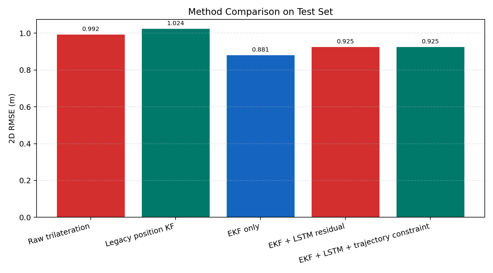

#### 5.5.2 CDF Error 2D pada Test Set

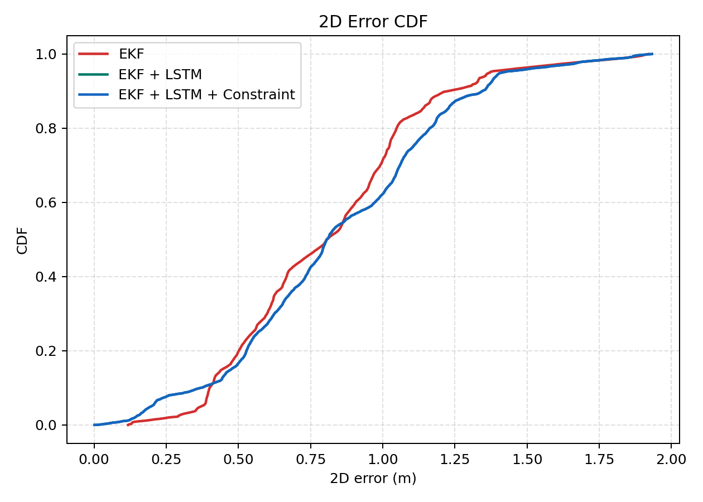

#### 5.5.3 Full Trajectory Comparison

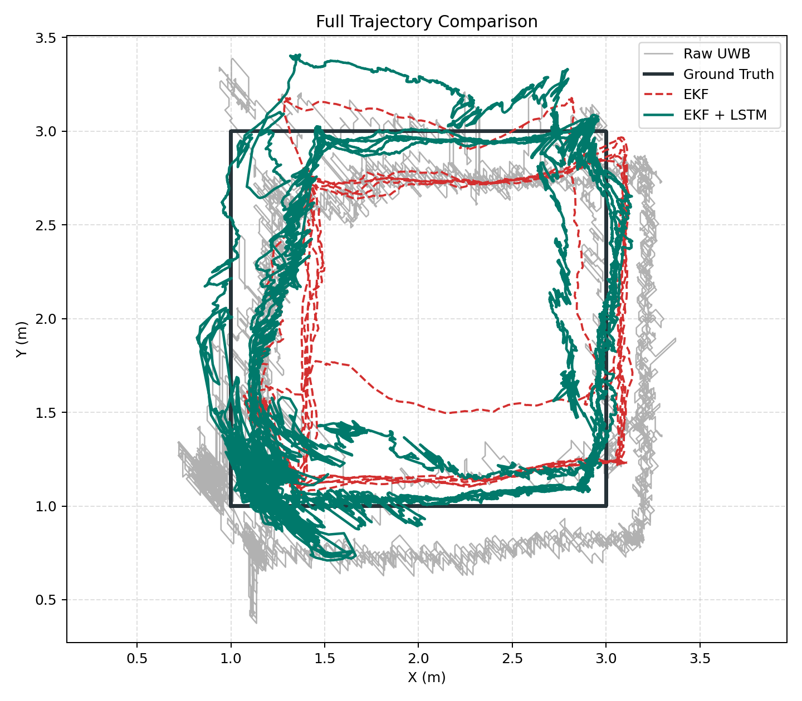

#### 5.5.4 Trajectory per Lintasan

| Majulurus | Kotak 2 Loop |
| --- | --- |
| 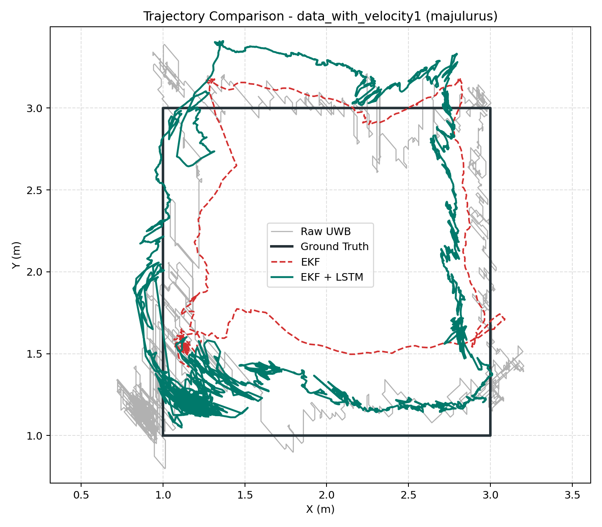 | 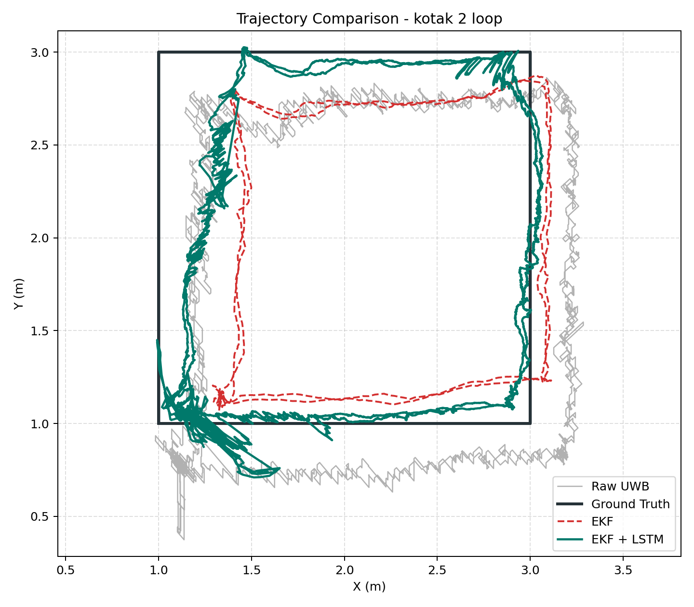 |

| Kotak 3 Loop | Diam |
| --- | --- |
| 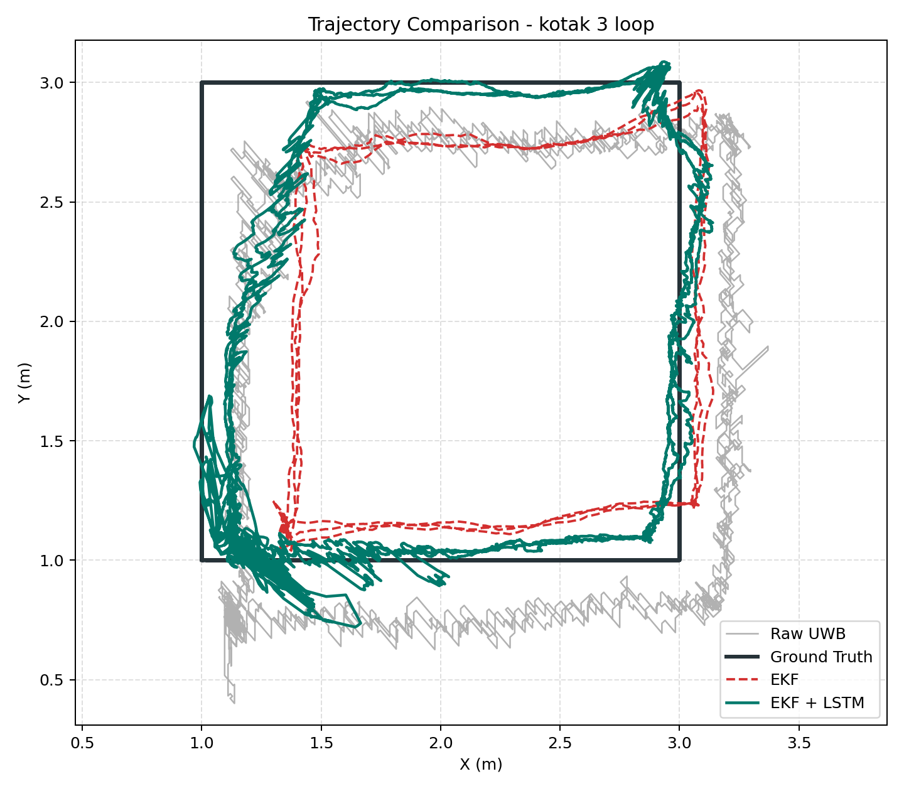 | 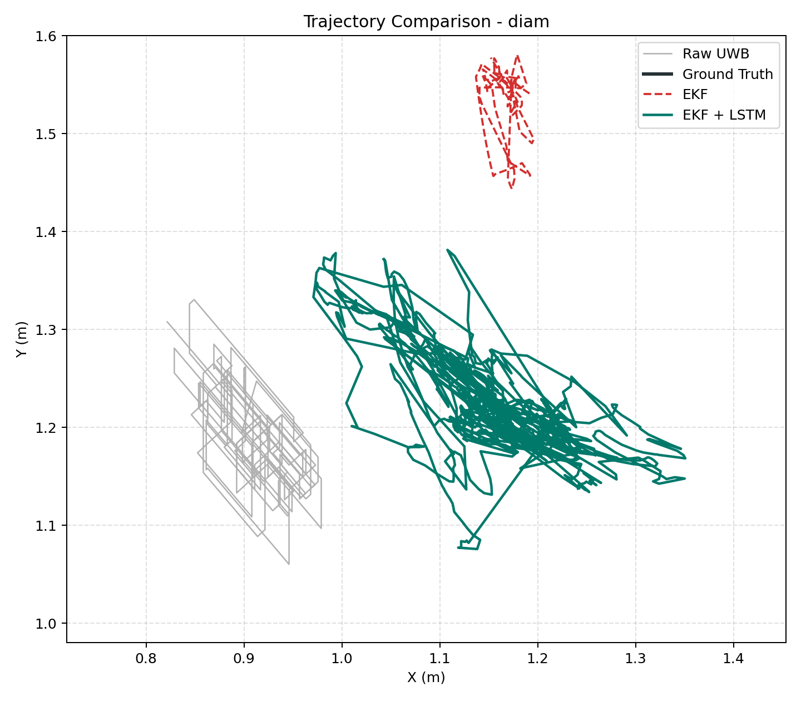 |

#### 5.5.5 Error Over Time per Lintasan

| Majulurus | Kotak 2 Loop |
| --- | --- |
| 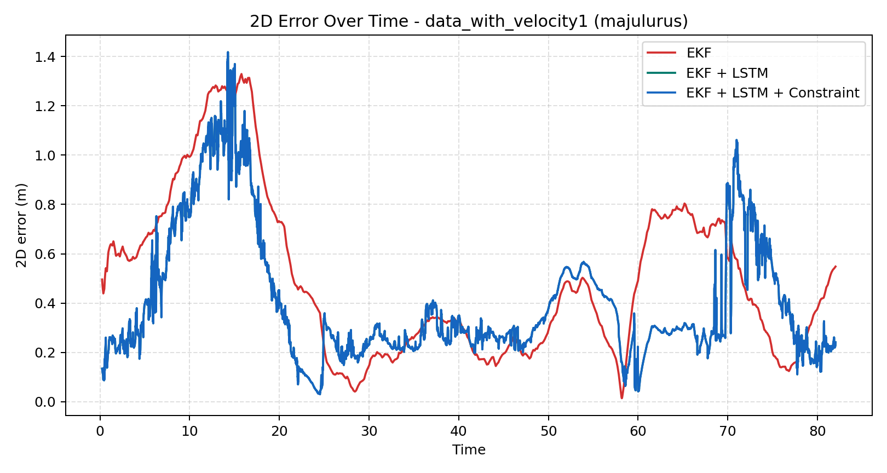 | 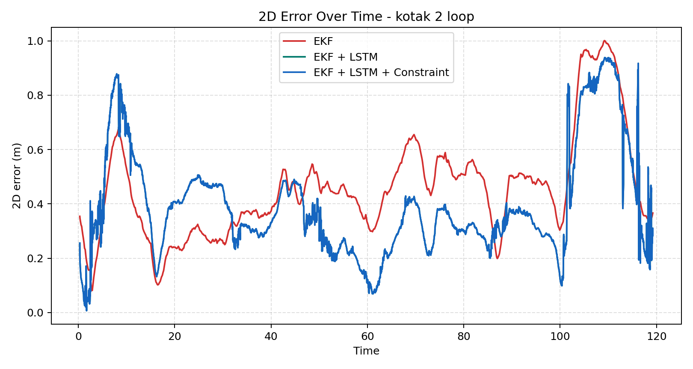 |

| Kotak 3 Loop | Diam |
| --- | --- |
| 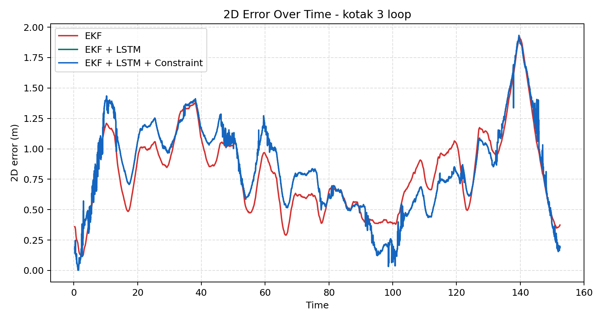 | 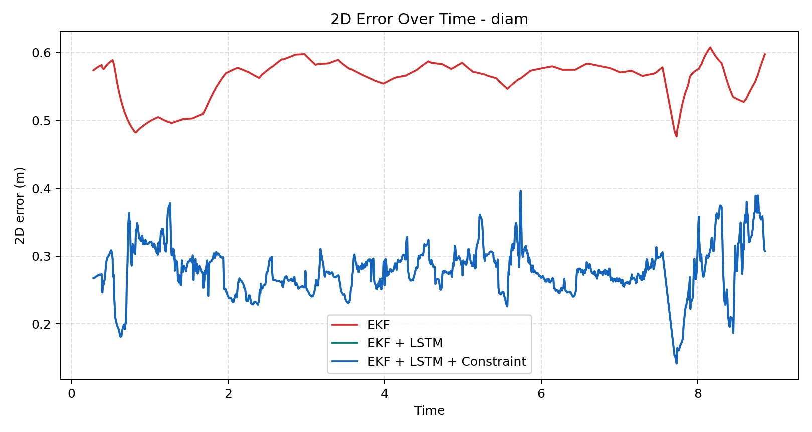 |

#### 5.5.6 Residual Distribution LSTM

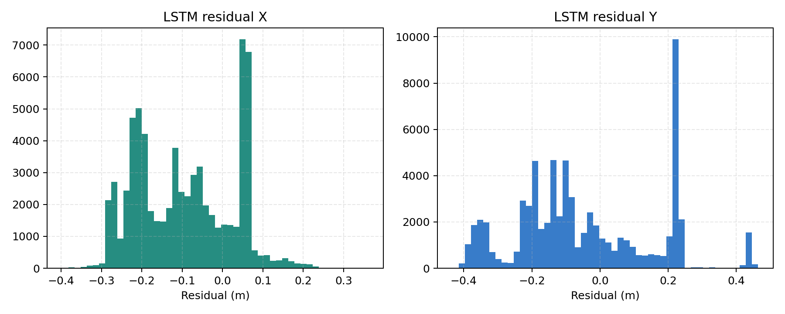

---

## 6. Diskusi

### 6.1 Interpretasi Hasil

Hasil terbaru menunjukkan bahwa EKF berbasis range adalah metode paling kuat pada
test held-out. EKF memperbaiki raw trilateration dan Kalman lama, tetapi LSTM
residual correction belum meningkatkan generalisasi test. Pada train set, LSTM
mampu menurunkan error, tetapi pada test set performanya memburuk. Ini
menunjukkan residual yang dipelajari LSTM belum stabil antar trajectory.

### 6.2 Mengapa Target 5 cm Belum Realistis

Target 5 cm belum realistis pada dataset saat ini karena error range test setelah
kalibrasi masih sekitar 0.61 m per anchor. Jika input jarak ke anchor masih
memiliki error puluhan sentimeter, estimasi posisi 2D yang valid secara ilmiah
sulit mencapai error 5 cm tanpa constraint lintasan yang sangat kuat atau data
leakage.

Dengan kata lain, keterbatasan utama bukan hanya algoritma, tetapi kualitas dan
karakteristik data range UWB.

### 6.3 Implikasi untuk Tugas Akhir

Narasi yang paling aman untuk tugas akhir:

> EKF berbasis range mampu memperbaiki performa lokalisasi UWB dibanding raw
> trilateration dan Kalman lama pada lintasan test held-out. LSTM residual
> correction belum mampu meningkatkan generalisasi pada lintasan yang tidak
> dilihat saat training, sehingga LSTM diposisikan sebagai eksperimen tambahan,
> bukan hasil utama.

Narasi yang sebaiknya dihindari:

> Sistem mencapai akurasi 5 cm menggunakan LSTM.

Klaim tersebut belum didukung oleh dataset saat ini.

---

## 7. Cara Menjalankan Pipeline

### 7.1 Environment

Aktifkan conda environment:

```bash
conda activate tensor
```

Jika dependency belum lengkap:

```bash
conda install -n tensor -c conda-forge pyyaml scipy joblib -y
```

Alternatif:

```bash
conda env update -n tensor -f environment.yml
```

### 7.2 Urutan Eksekusi

Jalankan dari root repository:

```bash
python scripts/01_prepare_dataset.py --config configs/uwb_pipeline.yaml
python scripts/02_calibrate_ranges.py --config configs/uwb_pipeline.yaml
python scripts/03_optimize_anchors.py --config configs/uwb_pipeline.yaml
python scripts/04_run_ekf.py --config configs/uwb_pipeline.yaml
python scripts/05_train_lstm_residual.py --config configs/uwb_pipeline.yaml
python scripts/06_evaluate_pipeline.py --config configs/uwb_pipeline.yaml
python scripts/07_plot_results.py --config configs/uwb_pipeline.yaml
```

### 7.3 Output Pipeline

Setiap run membuat folder timestamp:

```text
outputs/uwb_calibrated_pipeline/<timestamp>/
```

Output penting:

| Folder | Isi |
| --- | --- |
| `01_prepared/` | Dataset tersplit dan manifest |
| `02_range_calibration/` | Parameter kalibrasi range |
| `03_anchor_optimization/` | Anchor config yang digunakan |
| `04_ekf/` | Output EKF per sample |
| `05_lstm_residual/` | Model LSTM, scaler, training history |
| `06_evaluation/` | Metrics dan predictions |
| `07_plots/` | Plot trajectory, CDF, bar chart, residual |

---

## 8. Kesimpulan

Pipeline terbaru sudah memenuhi prinsip no-data-leakage dan memberikan evaluasi
yang lebih valid. Pada hasil terbaru, **EKF only** adalah metode terbaik pada
test held-out dengan RMSE 2D sebesar **0.881 m**, lebih baik daripada raw
trilateration dan Kalman lama. LSTM residual correction belum memperbaiki test
set, sehingga belum layak dijadikan klaim utama.

Target akurasi 5 cm belum realistis untuk dataset saat ini karena error range
UWB setelah kalibrasi masih berada pada kisaran 0.61 m pada test set. Untuk
mendekati 5 cm, dibutuhkan pengambilan data ulang dengan setup kalibrasi yang
lebih terkontrol, posisi anchor lebih presisi, dan ground truth yang lebih
akurat.

---

## 9. Referensi File Penting

| File / Folder | Keterangan |
| --- | --- |
| `configs/uwb_pipeline.yaml` | Konfigurasi utama pipeline terbaru |
| `src/uwb_localization/` | Source code modular |
| `scripts/` | Script CLI per stage |
| `docs/UWB_CALIBRATED_PIPELINE.md` | Dokumentasi pipeline detail |
| `docs/results/20260507_133727/metrics.csv` | Metrics hasil terbaru |
| `docs/results/20260507_133727/` | Snapshot gambar dan artifact ringan |
| `output_lstm_no_leakage/` | Output eksperimen LSTM lama/no-leakage awal |
