# UWB Positioning Tugas Akhir

Eksperimen lokalisasi indoor berbasis Ultra-Wideband (UWB) dengan pendekatan
hybrid **Kalman Filter + LSTM residual correction**. Repository ini berisi data,
kode eksperimen, model terlatih, hasil metrik, dan visualisasi trajectory.

---

## Daftar Isi

- [1. Ringkasan Proyek](#1-ringkasan-proyek)
  - [1.1 Tujuan Penelitian](#11-tujuan-penelitian)
  - [1.2 Ide Utama Metode Hybrid](#12-ide-utama-metode-hybrid)
- [2. Struktur Repository](#2-struktur-repository)
  - [2.1 Data Input](#21-data-input)
  - [2.2 Kode Utama](#22-kode-utama)
  - [2.3 Output Eksperimen](#23-output-eksperimen)
- [3. Metodologi](#3-metodologi)
  - [3.1 Kalman Filter](#31-kalman-filter)
  - [3.2 LSTM Residual Correction](#32-lstm-residual-correction)
  - [3.3 Strategi No Data Leakage](#33-strategi-no-data-leakage)
  - [3.4 Kalibrasi Residual](#34-kalibrasi-residual)
- [4. Hasil Kuantitatif](#4-hasil-kuantitatif)
  - [4.1 Perbandingan Metrik Test Set](#41-perbandingan-metrik-test-set)
  - [4.2 Improvement Dibanding Kalman Filter](#42-improvement-dibanding-kalman-filter)
  - [4.3 Hasil Per Lintasan](#43-hasil-per-lintasan)
- [5. Visualisasi Hasil](#5-visualisasi-hasil)
  - [5.1 Grafik Ringkasan](#51-grafik-ringkasan)
  - [5.2 Training History](#52-training-history)
  - [5.3 Full Trajectory](#53-full-trajectory)
  - [5.4 Test Error Over Time](#54-test-error-over-time)
- [6. Cara Menjalankan](#6-cara-menjalankan)
  - [6.1 Environment](#61-environment)
  - [6.2 Run Script](#62-run-script)
- [7. Interpretasi dan Kesimpulan](#7-interpretasi-dan-kesimpulan)
  - [7.1 Temuan Utama](#71-temuan-utama)
  - [7.2 Catatan Kualitatif](#72-catatan-kualitatif)
  - [7.3 Pengembangan Lanjutan](#73-pengembangan-lanjutan)
- [8. Kesimpulan Singkat](#8-kesimpulan-singkat)

---

## 1. Ringkasan Proyek

### 1.1 Tujuan Penelitian

Tujuan penelitian ini adalah mengevaluasi performa lokalisasi UWB untuk estimasi
posisi 2D indoor. Sistem menggunakan Kalman Filter sebagai estimasi posisi awal,
kemudian LSTM digunakan untuk mempelajari residual error dari hasil Kalman
Filter.

### 1.2 Ide Utama Metode Hybrid

LSTM tidak menggantikan Kalman Filter. Pada eksperimen ini, Kalman Filter tetap
menjadi estimator utama, sedangkan LSTM hanya digunakan sebagai korektor
residual.

```text
residual = posisi ground truth - posisi Kalman Filter
posisi akhir = posisi Kalman Filter + residual LSTM
```

Alur metode:

```text
Data UWB
  -> Estimasi posisi Kalman Filter
  -> Hitung residual error terhadap ground truth
  -> Training LSTM untuk memprediksi residual
  -> Kalibrasi residual menggunakan validation set
  -> Posisi akhir hybrid Kalman + LSTM
```

---

## 2. Struktur Repository

### 2.1 Data Input

Dataset yang digunakan berada pada folder `Data hasil/`.

| File | Deskripsi |
| --- | --- |
| `data_with_velocity1 (majulurus).csv` | Lintasan maju lurus. |
| `kotak 2 loop.csv` | Lintasan kotak dua putaran. |
| `kotak 3 loop.csv` | Lintasan kotak tiga putaran. |
| `diam.csv` | Kondisi tag diam. |

### 2.2 Kode Utama

| File | Keterangan |
| --- | --- |
| `Kalman Filter.py` | Script estimasi posisi menggunakan Kalman Filter. |
| `LSTM.py` | Script LSTM awal. |
| `LSTM_no_leakage.py` | Script eksperimen terbaru: split kronologis, no data leakage, LSTM residual correction, dan residual calibration. |
| `KODE TERBARU LOGGING (serial).py` | Script logging data serial. |

### 2.3 Output Eksperimen

Output terbaru disimpan di folder `output_lstm_no_leakage/`.

| File | Keterangan |
| --- | --- |
| `metrics.csv` | Ringkasan metrik train, validation, dan test. |
| `predictions.csv` | Prediksi per sample: Kalman, LSTM raw, dan LSTM calibrated. |
| `calibration_candidates.csv` | Perbandingan kandidat kalibrasi residual pada validation set. |
| `training_history.csv` | Riwayat training LSTM. |
| `best_lstm_residual_corrector.keras` | Model terbaik berdasarkan validation loss. |
| `summary_metrics_comparison.png` | Grafik ringkasan metrik test set. |
| `per_track_rmse_comparison.png` | Grafik RMSE per lintasan test. |
| `full_trajectory_*.png` | Visualisasi trajectory penuh. |
| `test_error_over_time_*.png` | Visualisasi error test terhadap waktu. |

---

## 3. Metodologi

### 3.1 Kalman Filter

Kalman Filter digunakan sebagai metode filtering untuk menghasilkan estimasi
posisi yang lebih stabil dibanding posisi raw UWB. Output utama yang digunakan
oleh LSTM adalah:

```text
x_kf, y_kf
```

Kolom tersebut menjadi baseline posisi sebelum dikoreksi oleh LSTM.

### 3.2 LSTM Residual Correction

LSTM dilatih untuk memprediksi residual error dari hasil Kalman Filter.

Target model:

```text
err_x = x_true - x_kf
err_y = y_true - y_kf
```

Jumlah fitur input: **29 fitur**.

Kelompok fitur yang digunakan:

| Kelompok Fitur | Contoh |
| --- | --- |
| Posisi raw UWB | `x`, `y` |
| Posisi Kalman Filter | `x_kf`, `y_kf` |
| Jarak UWB | `d1`, `d2`, `d3` |
| Estimasi jarak/elemen anchor | `el1`, `el2`, `el3` |
| Innovation terhadap anchor | `d1_innov`, `d2_innov`, `d3_innov` |
| Selisih antar jarak | `d12_diff`, `d23_diff`, `d13_diff` |
| Dinamika posisi | `kf_dx`, `kf_dy`, `raw_dx`, `raw_dy` |
| Kecepatan | `kf_speed`, `raw_speed` |
| Waktu | `dt` |

Arsitektur model:

| Layer | Output Shape | Parameter |
| --- | ---: | ---: |
| GaussianNoise | `(None, 30, 29)` | 0 |
| Bidirectional LSTM | `(None, 30, 192)` | 96,768 |
| LayerNormalization | `(None, 30, 192)` | 384 |
| LSTM | `(None, 48)` | 46,272 |
| Dense | `(None, 64)` | 3,136 |
| Dense | `(None, 32)` | 2,080 |
| Output Dense | `(None, 2)` | 66 |

Total parameter model: **148,802**.

### 3.3 Strategi No Data Leakage

Eksperimen terbaru dibuat untuk menghindari data leakage pada data time-series.

| Langkah | Tujuan |
| --- | --- |
| Split dilakukan secara kronologis | Menghindari train dan test tercampur secara waktu. |
| Sliding window dibuat setelah split | Window tidak melewati batas train, validation, dan test. |
| Scaler hanya fit pada data train | Statistik validation dan test tidak bocor ke train. |
| Validation untuk early stopping | Test tidak dipakai untuk memilih epoch. |
| Test hanya untuk evaluasi akhir | Menjaga evaluasi tetap objektif. |

Jumlah window:

| Split | Jumlah Window |
| --- | ---: |
| Train | 48,747 |
| Validation | 10,355 |
| Test | 10,356 |

### 3.4 Kalibrasi Residual

Hasil LSTM raw tidak langsung digunakan sebagai hasil akhir karena pada test set
residual mentah justru memperburuk estimasi. Oleh karena itu, dilakukan
kalibrasi residual menggunakan validation set.

Kandidat kalibrasi:

| Kandidat | Keterangan |
| --- | --- |
| Validation-selected Kalman only | Tidak memakai residual LSTM. |
| Kalman + LSTM raw | Residual LSTM langsung ditambahkan ke Kalman. |
| Kalman + LSTM scalar calibrated | Satu skala residual untuk `x` dan `y`. |
| Kalman + LSTM per-axis calibrated | Skala residual berbeda untuk `x` dan `y`. |
| Kalman + LSTM affine calibrated | Skala dan bias residual berbeda untuk `x` dan `y`. |

Kandidat terbaik berdasarkan validation RMSE Euclidean:

```text
Kalman + LSTM affine calibrated
```

Parameter kalibrasi terpilih:

| Parameter | Nilai |
| --- | ---: |
| `alpha_x` | 2.7830 |
| `beta_x` | 0.3807 |
| `alpha_y` | 2.6250 |
| `beta_y` | 0.1741 |

---

## 4. Hasil Kuantitatif

### 4.1 Perbandingan Metrik Test Set

| Model | RMSE X (m) | RMSE Y (m) | RMSE Avg Axis (m) | RMSE Euclidean (m) | MAE Euclidean (m) | P95 Error (m) |
| --- | ---: | ---: | ---: | ---: | ---: | ---: |
| Kalman Filter | 0.3009 | 0.9486 | 0.7037 | 0.9952 | 0.8789 | 1.8460 |
| Kalman + LSTM raw | 0.3134 | 0.9706 | 0.7212 | 1.0200 | 0.9116 | 1.8686 |
| Kalman + LSTM affine calibrated | 0.3461 | 0.8598 | 0.6554 | 0.9269 | 0.8139 | 1.7788 |

### 4.2 Improvement Dibanding Kalman Filter

| Model | RMSE X | RMSE Y | RMSE Euclidean | MAE Euclidean | P95 Error |
| --- | ---: | ---: | ---: | ---: | ---: |
| Kalman + LSTM raw | -4.1597% | -2.3201% | -2.4896% | -3.7303% | -1.2231% |
| Kalman + LSTM affine calibrated | -15.0091% | 9.3594% | 6.8662% | 7.3882% | 3.6379% |

### 4.3 Hasil Per Lintasan

| Lintasan | KF RMSE Euclidean (m) | Calibrated RMSE Euclidean (m) | Keterangan |
| --- | ---: | ---: | --- |
| Majulurus | 0.5386 | 0.4949 | Membaik |
| Kotak 2 Loop | 0.7589 | 0.7349 | Membaik |
| Kotak 3 Loop | 1.3178 | 1.2154 | Membaik |
| Diam | 0.2041 | 0.2383 | Memburuk |

---

## 5. Visualisasi Hasil

### 5.1 Grafik Ringkasan

Grafik berikut menunjukkan bahwa LSTM raw belum memperbaiki estimasi, sedangkan
LSTM yang sudah dikalibrasi mampu menurunkan RMSE Euclidean, MAE Euclidean, dan
P95 error pada test set.

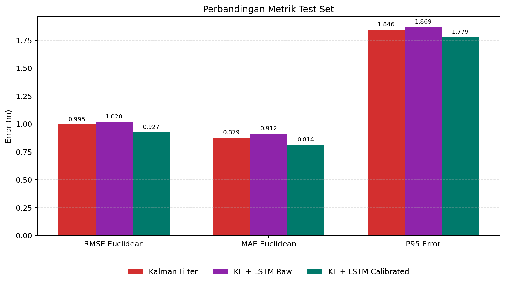

Perbandingan RMSE Euclidean per lintasan:

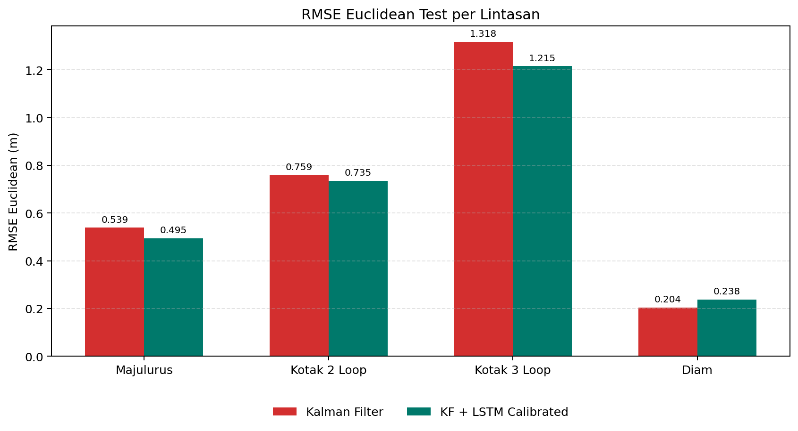

### 5.2 Training History

Grafik training history menunjukkan proses optimasi LSTM berdasarkan train loss
dan validation loss.

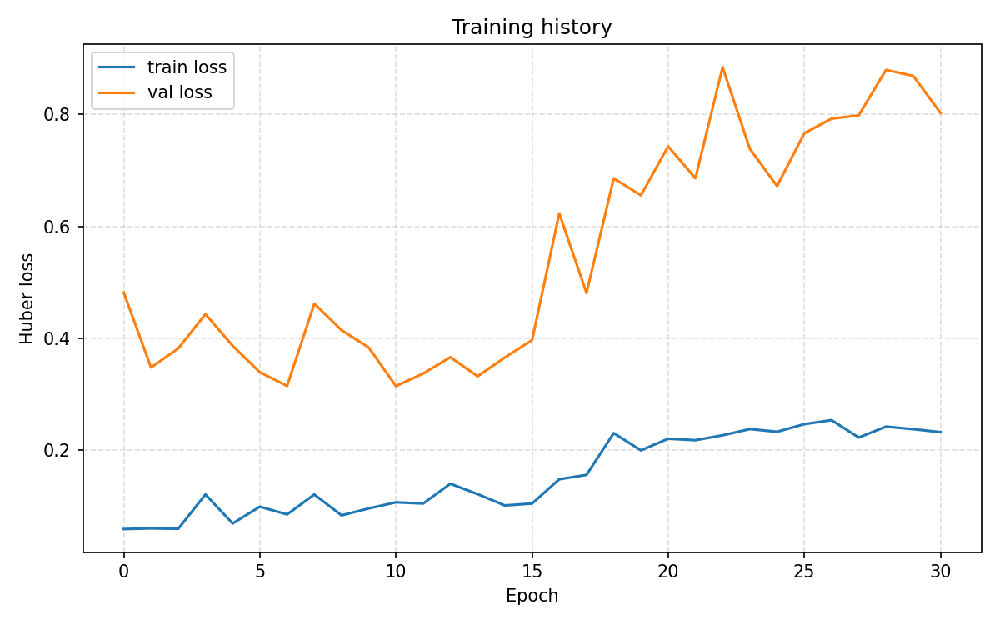

### 5.3 Full Trajectory

Full trajectory menampilkan gabungan train, validation, dan test. Titik biru
menandai awal segmen test.

| Majulurus | Diam |
| --- | --- |
| 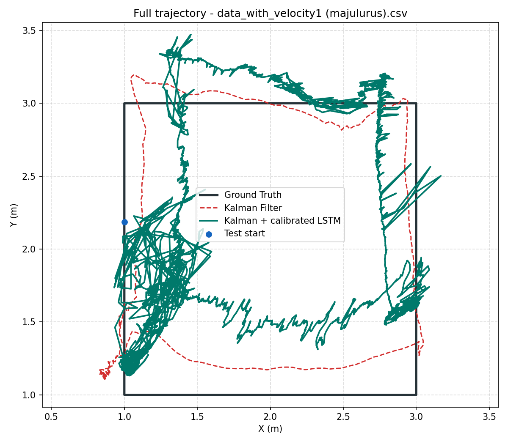 | 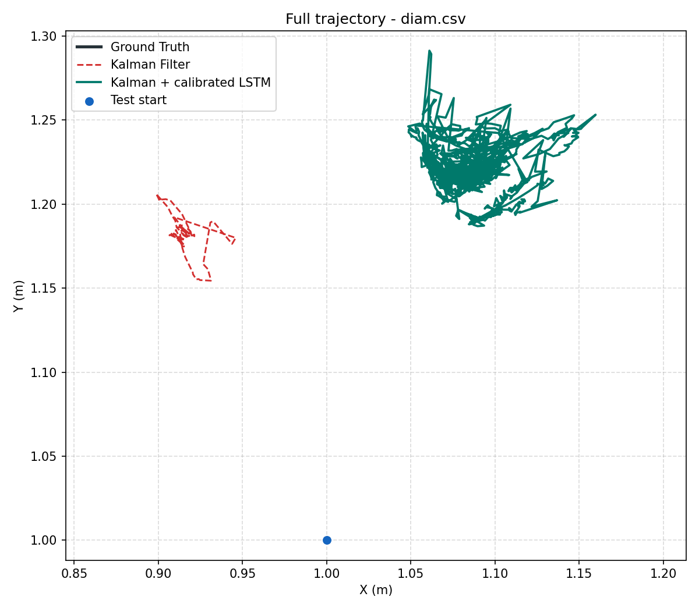 |

| Kotak 2 Loop | Kotak 3 Loop |
| --- | --- |
| 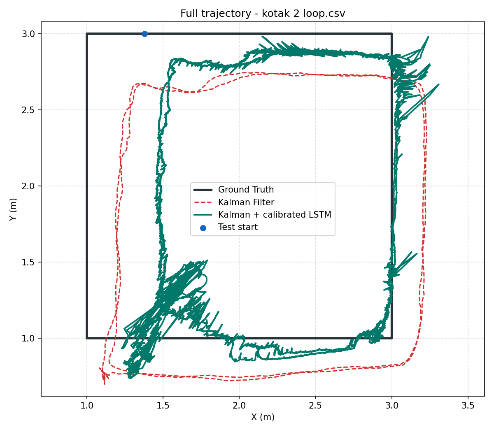 | 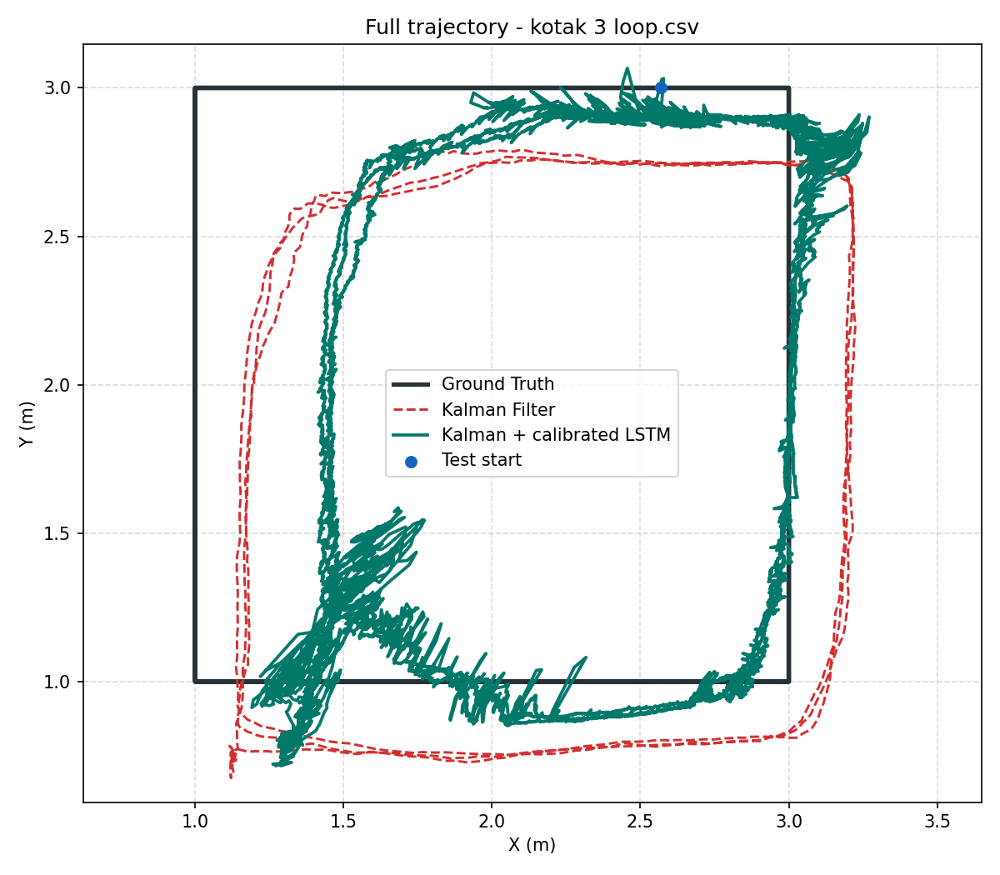 |

### 5.4 Test Error Over Time

Grafik error terhadap waktu membantu melihat kapan koreksi LSTM memperbaiki atau
memperburuk estimasi Kalman Filter.

| Majulurus | Diam |
| --- | --- |
| 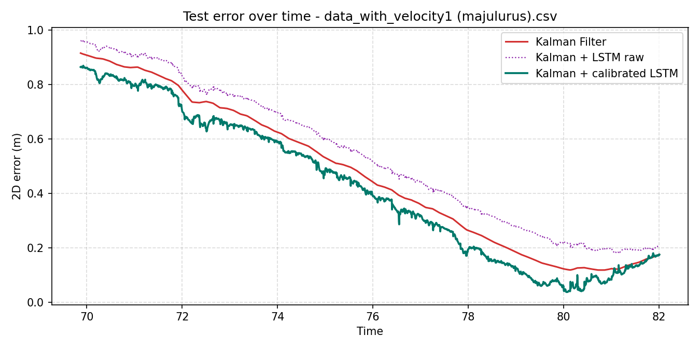 | 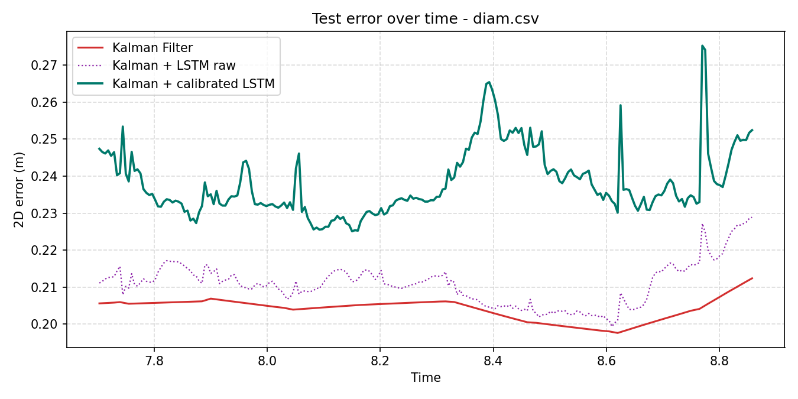 |

| Kotak 2 Loop | Kotak 3 Loop |
| --- | --- |
| 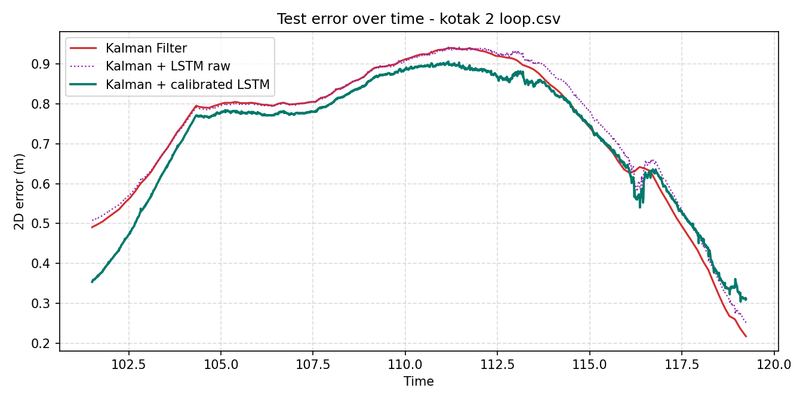 | 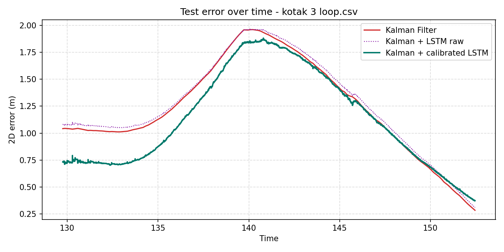 |

---

## 6. Cara Menjalankan

### 6.1 Environment

Environment conda yang digunakan:

```bash
conda activate tensor
```

Library utama:

| Library | Versi |
| --- | --- |
| Python | 3.11.15 |
| TensorFlow | 2.19.1 |
| NumPy | 2.4.3 |
| Pandas | 3.0.2 |
| Scikit-learn | 1.8.0 |
| Matplotlib | 3.10.9 |

### 6.2 Run Script

Jalankan dari root repository:

```bash
cd /home/ucl/Documents/UWB_Positioning_Tugas_Akhir
python LSTM_no_leakage.py
```

Secara default, script akan memuat model yang sudah tersimpan:

```python
RETRAIN_MODEL = False
```

Untuk training ulang dari awal:

```python
RETRAIN_MODEL = True
```

Output akan disimpan ke:

```text
output_lstm_no_leakage/
```

---

## 7. Interpretasi dan Kesimpulan

### 7.1 Temuan Utama

Kalman Filter menghasilkan estimasi yang stabil dan menjadi baseline utama.
LSTM raw belum mampu memperbaiki hasil Kalman Filter secara langsung. Setelah
residual LSTM dikalibrasi menggunakan validation set, performa test set membaik
berdasarkan RMSE Euclidean, MAE Euclidean, dan P95 error.

Ringkasan hasil test:

| Model | RMSE Euclidean (m) | MAE Euclidean (m) |
| --- | ---: | ---: |
| Kalman Filter | 0.9952 | 0.8789 |
| Kalman + LSTM raw | 1.0200 | 0.9116 |
| Kalman + LSTM affine calibrated | 0.9269 | 0.8139 |

### 7.2 Catatan Kualitatif

Walaupun metrik posisi 2D membaik setelah kalibrasi, hasil kualitatif trajectory
belum sepenuhnya konsisten. Koreksi LSTM lebih banyak memperbaiki komponen `y`,
tetapi komponen `x` pada test set memburuk. Pada data `diam`, metode hybrid juga
belum memberikan perbaikan.

Dengan demikian, hasil ini lebih tepat dibaca sebagai indikasi bahwa pendekatan
hybrid memiliki potensi, namun belum sepenuhnya robust untuk semua kondisi
lintasan.

### 7.3 Pengembangan Lanjutan

Beberapa arah pengembangan yang dapat dilakukan:

1. Menambah variasi dataset untuk lintasan dan kondisi lingkungan yang lebih
   beragam.
2. Menguji split by track untuk melihat kemampuan generalisasi ke lintasan yang
   benar-benar tidak dilihat saat training.
3. Membatasi magnitude residual correction agar LSTM tidak menggeser trajectory
   terlalu agresif.
4. Mencoba arsitektur sequence model yang lebih ringan atau regularized.
5. Menggabungkan validasi visual trajectory sebagai bagian dari proses seleksi
   model, bukan hanya berdasarkan RMSE.

---

## 8. Kesimpulan Singkat

Pendekatan **Kalman Filter + LSTM residual correction** berhasil dibangun tanpa
data leakage dan dapat menurunkan error posisi 2D setelah kalibrasi residual.
Namun, hasil visual trajectory masih menunjukkan keterbatasan, sehingga metode
ini belum dapat dianggap final secara kualitatif. Kalman Filter tetap menjadi
komponen utama yang stabil, sedangkan LSTM berperan sebagai korektor residual
yang masih membutuhkan penyempurnaan.
