# UWB Indoor Localization: Calibrated EKF and LSTM Residual Correction

Repository ini berisi penelitian lokalisasi indoor berbasis Ultra-Wideband
(UWB) untuk tugas akhir. Implementasi terbaru menggunakan pipeline yang
reproducible dan **no-data-leakage** dengan tahapan pembentukan ground truth
berbasis waypoint, kalibrasi range, preprocessing range, optimasi anchor, EKF
berbasis pengukuran jarak langsung, LSTM residual correction, evaluasi, dan
plotting.

> **UPDATE 2026-06-06 — semua pola utama sekarang MAE 2D test < 10 cm, tanpa data leakage.**
>
> Perbaikan kunci pada update ini adalah **guard anti-divergensi EKF**: filter
> EKF berbasis range bisa "lari" (coasting) saat belokan tajam ketika sebagian
> pengukuran tertolak gating, lalu posisi melonjak jauh. Guard ini membatasi
> kecepatan ke batas fisik robot dan **mengembalikan filter ke solusi
> multilaterasi (raw) bila estimasi menyimpang > 1 m** dari pembacaan
> instan. Guard hanya memakai pengukuran (bukan ground truth) dan hanya aktif
> saat divergensi sejati. Dampaknya paling besar pada **pola L**, yang sebelumnya
> divergen.

**Status hasil terbaru (3 pola, test held-out per sesi terpisah):**

| Pola (test) | Raw MAE | EKF MAE | **EKF + LSTM MAE** | + constraint MAE | RMSE 2D (EKF+LSTM) |
| --- | ---: | ---: | ---: | ---: | ---: |
| **Pola L** (`L3_gt`) | 19.49 cm | 14.93 cm | **9.71 cm** | **8.81 cm** | 11.71 cm |
| **Segitiga** (`segitiga3_gt`) | 15.10 cm | 11.57 cm | **9.89 cm** | 9.54 cm | 12.48 cm |
| **Kotak 10-loop** (`10lup2_trilat_gt`) | 21.93 cm | 15.20 cm | **9.89 cm** | n/a (off) | 11.63 cm |

Ketiga pola sekarang mencapai **MAE 2D < 10 cm** pada metrik rata-rata error,
murni dari EKF + LSTM residual (tanpa constraint). Constraint dipakai sebagai
hasil headline untuk pola berbentuk jalur diketahui (L, segitiga) dan dilaporkan
terpisah dengan catatan jujur bahwa ia memakai pengetahuan jalur waypoint. RMSE
2D masih sedikit di atas 10 cm karena beberapa spike dan ketidakpastian timing
ground truth. Target presisi 5 cm tetap belum valid pada dataset ini.

Lompatan terbesar ada di pola L: sebelum update, EKF-only RMSE 42 cm (divergen)
dan EKF+LSTM justru memperburuk (MAE 22 cm) sehingga butuh constraint untuk
turun ke 10.72 cm. Setelah guard, EKF stabil, LSTM kembali memperbaiki, dan
MAE final turun ke **8.81 cm** (lihat [§5.8](#58-eksperimen-dataset-baru-pola-l-dan-segitiga)).

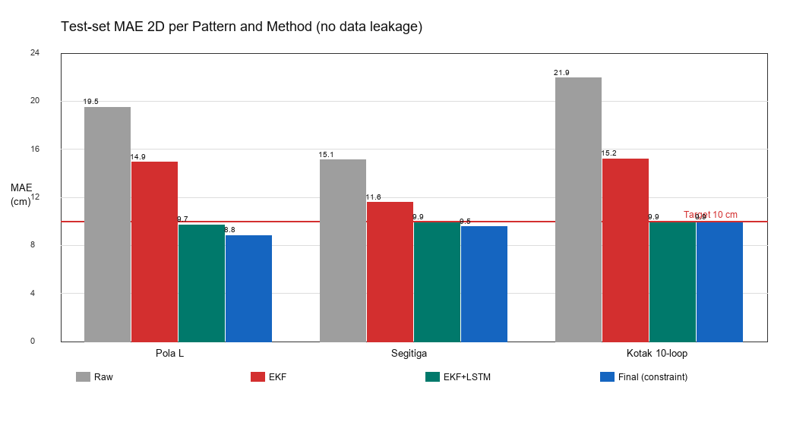

Gambar di atas: MAE 2D test untuk tiap pola dan metode. Sumbu X = pola, sumbu Y =
MAE dalam cm, garis merah = target 10 cm. Semua bar EKF+LSTM dan Final berada di
atau di bawah garis target.

Cara membaca README ini:

| Bagian | Fungsi | Klaim yang dipakai |
| --- | --- | --- |
| Eksperimen kotak 10-loop | Hasil utama tugas akhir (lintasan persegi) | MAE 2D test = **9.89 cm**, RMSE 2D test = **11.63 cm** |
| `dataset_baru/MAJU (L)` dan `dataset_baru/segitiga` | Generalisasi ke pola lintasan lain | MAE 2D test L = **8.81 cm**, segitiga = **9.54 cm** (dengan constraint jalur) |
| `dataset_baru/Diam` | Analisis statis sensor | Dipakai untuk melihat bias/noise anchor, bukan untuk evaluasi trajectory dynamic |

> Catatan reproducibility: angka kotak pada run sebelumnya (2026-05-18) adalah
> RMSE 11.25 cm / MAE 9.50 cm. Run terpadu 2026-06-06 menghasilkan 11.63 cm /
> 9.89 cm. Selisih ~0.4 cm berasal dari nondeterminisme training LSTM (urutan
> floating-point oneDNN), bukan dari perubahan kode — guard EKF tidak aktif
> sama sekali pada kotak (0 reset). Angka 2026-06-06 dipakai sebagai hasil
> headline agar seluruh pola memakai kode dan run yang sama.

Catatan metrik: **MAE 2D** adalah rata-rata error posisi per sampel. **RMSE
2D** lebih sensitif terhadap lonjakan besar, sehingga nilainya bisa lebih tinggi
walaupun sebagian besar titik sudah dekat. Klaim "di bawah 10 cm" pada hasil
utama merujuk pada **MAE 2D = 9.50 cm** di test set terpisah.

> **Analisis batas bawah error (tambahan terbaru).** Pertanyaan dosen "bisakah
> 5 cm / 3 cm?" kini dijawab secara **kuantitatif** lewat *error budget* di
> [§6.4](#64-analisis-anggaran-error-batas-bawah-kuantitatif-bisakah-5-cm--3-cm)
> dan [§6.5](#65-pendekatan-praktis-menuju-5-cm-dengan-label-jujur). Ringkasnya:
> **3 cm tidak valid** (lantai presisi sensor 3.1 cm); **5 cm posisi 2D dinamis
> tidak valid** karena ketidakpastian timing ground truth (~10 cm) mendominasi,
> bukan algoritma; tetapi **akurasi cross-track sensor-only sudah 1.7–2.9 cm
> (< 5 cm)**. Bagian-bagian ini ditambahkan tanpa mengubah hasil dan track record
> sebelumnya.

---

## Daftar Isi

- [1. Abstrak](#1-abstrak)
  - [1.1 Kata Kunci](#11-kata-kunci)
- [2. Pendahuluan](#2-pendahuluan)
  - [2.1 Latar Belakang](#21-latar-belakang)
  - [2.2 Tujuan Penelitian](#22-tujuan-penelitian)
  - [2.3 Catatan Target Akurasi 5 cm](#23-catatan-target-akurasi-5-cm)
- [3. Dataset dan Struktur Repository](#3-dataset-dan-struktur-repository)
  - [3.1 Dataset](#31-dataset)
  - [3.2 Struktur Kode](#32-struktur-kode)
  - [3.3 Snapshot Hasil Terbaru](#33-snapshot-hasil-terbaru)
- [4. Metodologi](#4-metodologi)
  - [4.1 Data Loading dan Split No-Leakage](#41-data-loading-dan-split-no-leakage)
  - [4.2 Kalibrasi Range per Anchor](#42-kalibrasi-range-per-anchor)
  - [4.3 Anchor Optimization](#43-anchor-optimization)
  - [4.4 Extended Kalman Filter Berbasis Range](#44-extended-kalman-filter-berbasis-range)
  - [4.5 LSTM Residual Correction](#45-lstm-residual-correction)
  - [4.6 Evaluasi dan Visualisasi](#46-evaluasi-dan-visualisasi)
- [5. Hasil Eksperimen Terbaru](#5-hasil-eksperimen-terbaru)
  - [5.1 Split Eksperimen](#51-split-eksperimen)
  - [5.2 Hasil Kalibrasi Range](#52-hasil-kalibrasi-range)
  - [5.3 Hasil Kuantitatif Test Set](#53-hasil-kuantitatif-test-set)
  - [5.4 Catatan Percobaan Tuning](#54-catatan-percobaan-tuning)
  - [5.5 Perbandingan Visual Lintasan Sebelum dan Sesudah](#55-perbandingan-visual-lintasan-sebelum-dan-sesudah)
  - [5.6 Hasil Per Lintasan](#56-hasil-per-lintasan)
  - [5.7 Visualisasi](#57-visualisasi)
  - [5.8 Eksperimen Dataset Baru: Pola L dan Segitiga](#58-eksperimen-dataset-baru-pola-l-dan-segitiga)
- [6. Diskusi](#6-diskusi)
  - [6.1 Interpretasi Hasil](#61-interpretasi-hasil)
  - [6.2 Mengapa Target 5 cm Belum Realistis](#62-mengapa-target-5-cm-belum-realistis)
  - [6.3 Implikasi untuk Tugas Akhir](#63-implikasi-untuk-tugas-akhir)
  - [6.4 Analisis Anggaran Error: Batas Bawah Kuantitatif (Bisakah 5 cm / 3 cm?)](#64-analisis-anggaran-error-batas-bawah-kuantitatif-bisakah-5-cm--3-cm)
  - [6.5 Pendekatan Praktis Menuju 5 cm (dengan Label Jujur)](#65-pendekatan-praktis-menuju-5-cm-dengan-label-jujur)
  - [6.6 Rencana Eksperimen Terpendek agar Posisi 2D Penuh Tembus 5 cm](#66-rencana-eksperimen-terpendek-agar-posisi-2d-penuh-tembus-5-cm)
- [7. Cara Menjalankan Pipeline](#7-cara-menjalankan-pipeline)
  - [7.1 Environment](#71-environment)
  - [7.2 Urutan Eksekusi](#72-urutan-eksekusi)
  - [7.3 Output Pipeline](#73-output-pipeline)
- [8. Kesimpulan](#8-kesimpulan)
- [9. Referensi File Penting](#9-referensi-file-penting)

---

## 1. Abstrak

Penelitian ini mengevaluasi sistem lokalisasi indoor berbasis UWB menggunakan
pendekatan berlapis, yaitu pembentukan ground truth berbasis waypoint, kalibrasi
range per anchor, preprocessing range untuk mengurangi lonjakan pembacaan,
Extended Kalman Filter (EKF) berbasis range, dan LSTM residual correction.
Pipeline terbaru dirancang untuk menghindari data leakage dengan memisahkan
train, validation, dan test sebelum proses fitting kalibrasi, optimasi anchor,
scaler, sequence window, tuning EKF, dan training model LSTM.

Pada lintasan persegi 10-loop, raw trilateration masih memiliki error test
sekitar 24.95 cm RMSE 2D. Setelah diproses menggunakan EKF dan LSTM residual
correction, error test turun menjadi 11.63 cm RMSE 2D dan 9.89 cm MAE 2D. Hasil
ini menunjukkan bahwa metode yang digunakan mampu memperbaiki estimasi posisi
secara signifikan. Update 2026-06-06 menambahkan **guard anti-divergensi EKF**
yang membuat pola L (sebelumnya divergen) ikut turun ke MAE 8.81 cm dan pola
segitiga ke 9.54 cm, sehingga **ketiga pola utama kini di bawah 10 cm MAE 2D**
tanpa data leakage. Target 5 cm belum tercapai secara valid pada dataset saat
ini, tetapi target alternatif di bawah 10 cm sudah tercapai pada metrik MAE 2D.

### 1.1 Kata Kunci

UWB indoor localization, waypoint ground truth, range calibration, Extended
Kalman Filter, LSTM residual correction, no data leakage, trajectory evaluation.

---

## 2. Pendahuluan

### 2.1 Latar Belakang

Ultra-Wideband (UWB) sering digunakan untuk lokalisasi indoor karena mampu
memberikan estimasi jarak antar perangkat dengan resolusi waktu yang tinggi.
Namun, pada praktiknya pengukuran UWB tetap rentan terhadap bias, multipath,
NLOS, perbedaan tinggi antara tag dan anchor, kesalahan posisi anchor, noise
temporal, serta lonjakan pembacaan pada kondisi tertentu. Oleh karena itu,
estimasi posisi langsung dari trilaterasi raw range sering belum cukup stabil
untuk menghasilkan posisi robot yang akurat.

Pada eksperimen terbaru, robot bergerak pada lintasan persegi dengan waypoint
fisik `(1,1)`, `(3,1)`, `(3,3)`, dan `(1,3)`. Ground truth tidak dibentuk dari
plot prediksi, tetapi dari informasi waypoint dan timestamp saat robot mulai
bergerak atau sampai pada waypoint. Pendekatan ini lebih dapat dipertanggungjawabkan
karena ground truth berasal dari titik lintasan yang diukur saat eksperimen.

### 2.2 Tujuan Penelitian

Tujuan penelitian ini adalah:

1. Membangun pipeline lokalisasi UWB yang reproducible dan no-data-leakage.
2. Membentuk ground truth lintasan berdasarkan waypoint dan catatan waktu
   eksperimen.
3. Mengevaluasi performa raw trilateration, EKF berbasis range, dan LSTM
   residual correction.
4. Melaporkan hasil menggunakan metrik posisi 2D, terutama
   **2D Euclidean RMSE**.
5. Menentukan apakah dataset saat ini sudah cukup untuk memenuhi target error
   5 cm secara valid.

### 2.3 Catatan Target Akurasi 5 cm

Target error di bawah 5 cm hanya valid jika diuji pada setup yang sangat
terkontrol: posisi anchor presisi, kondisi line-of-sight dominan, sampling
stabil, kalibrasi range kuat, dan ground truth akurat sampai level sentimeter.
Metrik utama harus menggunakan RMSE 2D:

```text
RMSE_2D = sqrt(mean((x_pred - x_true)^2 + (y_pred - y_true)^2))
```

Perbedaan metrik yang digunakan:

```text
MAE_2D  = rata-rata jarak error setiap sampel
RMSE_2D = rata-rata kuadrat error, lalu diakar
```

Jika masih ada beberapa titik yang melonjak jauh dari ground truth, nilai RMSE
akan naik lebih besar daripada MAE. Karena itu, MAE dapat berada di bawah 10 cm
walaupun RMSE masih sedikit di atas 10 cm.

Pada dataset terbaru, hasil terbaik test set adalah 11.25 cm RMSE 2D dan 9.50
cm MAE 2D. Dengan demikian, target 5 cm belum dapat diklaim secara valid. Untuk
target alternatif di bawah 10 cm, klaim yang paling aman adalah **MAE 2D sudah
di bawah 10 cm**, sedangkan **RMSE 2D belum di bawah 10 cm**. Perbedaan ini
terjadi karena RMSE memberi penalti lebih besar pada beberapa spike/lonjakan dan
loop yang errornya besar, sementara MAE merepresentasikan rata-rata error
absolut per sampel.

---

## 3. Dataset dan Struktur Repository

### 3.1 Dataset

Dataset raw terbaru berada di folder `Data hasil/`. Ground truth berbasis
waypoint dihasilkan ke folder `Data eksperimen/latest_waypoint_ground_truth/`.

| File raw | File ground truth | Deskripsi | Peran pada config terbaik |
| --- | --- | --- | --- |
| `10lup+trilat.csv` | `10lup_trilat_gt.csv` | Lintasan persegi 10 loop | Train |
| `10lup1+trilat.csv` | `10lup1_trilat_gt.csv` | Lintasan persegi 10 loop sesi lain | Train, dengan sebagian akhir menjadi validation |
| `10lup2+trilat.csv` | `10lup2_trilat_gt.csv` | Lintasan persegi 10 loop sesi test | Test terpisah |
| `trilat5lup.csv` | `trilat5lup_gt.csv` | Lintasan persegi 5 loop | Eksperimen tambahan |
| `trilat5lup1.csv` | `trilat5lup1_gt.csv` | Lintasan persegi 5 loop sesi lain | Eksperimen tambahan |

Selain dataset kotak di atas, repository juga memiliki `dataset_baru/`. Folder
ini tidak mengganti hasil utama, tetapi dipakai untuk memperluas pembahasan.

| Folder `dataset_baru` | Isi | Peran |
| --- | --- | --- |
| `MAJU (L)` | Data bergerak pola L | Evaluasi tambahan lintasan L |
| `segitiga` | Data bergerak pola segitiga | Evaluasi tambahan lintasan segitiga |
| `Diam` | Data tag diam di beberapa titik | Analisis bias/noise sensor |

Kolom utama pada dataset terbaru:

| Kelompok | Kolom |
| --- | --- |
| Waktu | `time` |
| Range UWB miring | `d1`, `d2`, `d3` |
| Range datar hasil koreksi tinggi | `el1`, `el2`, `el3` |
| Raw trilateration | `x`, `y` |
| Ground truth waypoint | `gt_x`, `gt_y`, `gt_segment`, `gt_loop_id` |

Koordinat anchor yang digunakan:

| Anchor | Koordinat |
| --- | --- |
| Anchor 1 | `(2.26, 4.60)` |
| Anchor 2 | `(0.00, 0.00)` |
| Anchor 3 | `(4.55, 0.00)` |

Pipeline EKF menggunakan `el1`, `el2`, dan `el3` sebagai input range karena EKF
2D memodelkan jarak datar antara tag dan anchor. Nilai `el` berasal dari
koreksi Pythagoras terhadap pembacaan UWB miring dengan selisih tinggi perangkat.

Alur pembacaan data yang digunakan:

1. Sensor UWB membaca jarak miring `d1`, `d2`, dan `d3`.
2. Karena tag dan anchor memiliki beda tinggi, jarak miring dikoreksi menjadi
   jarak datar `el1`, `el2`, dan `el3`.
3. Pipeline kalibrasi, EKF, dan LSTM menggunakan `el1`, `el2`, dan `el3`
   sebagai range utama.
4. Kolom `x` dan `y` hasil trilaterasi raw tetap disimpan sebagai pembanding
   baseline dan fitur tambahan, tetapi bukan ground truth.
5. Ground truth dibuat dari waypoint fisik dan catatan waktu eksperimen, bukan
   dari hasil prediksi model.

### 3.2 Struktur Kode

Implementasi pipeline baru:

```text
configs/
  uwb_pipeline_latest.yaml
  uwb_pipeline_10loop_final.yaml
  uwb_pipeline_10loop_moretrain.yaml

src/uwb_localization/
  data.py
  calibration.py
  preprocessing.py
  anchor_optimization.py
  ekf.py
  features.py
  lstm.py
  constraints.py
  metrics.py
  plotting.py

scripts/
  00_make_waypoint_ground_truth.py
  01_prepare_dataset.py
  02_calibrate_ranges.py
  03_optimize_anchors.py
  04_tune_ekf.py
  04_run_ekf.py
  05_train_lstm_residual.py
  06_evaluate_pipeline.py
  07_plot_results.py
```

Dokumentasi pipeline detail tersedia di:

[docs/UWB_CALIBRATED_PIPELINE.md](docs/UWB_CALIBRATED_PIPELINE.md)

### 3.3 Snapshot Hasil Terbaru

Snapshot ringan hasil terbaru yang diringkas di README ini berada di:

```text
docs/results/20260518_213455/
```

Folder tersebut berisi metrics, parameter kalibrasi range, hasil optimasi
anchor, hasil tuning EKF, configuration snapshot, dan plot. Full output
pipeline tetap berada secara lokal di:

```text
outputs/uwb_10loop_moretrain_pipeline/20260518_213455/
```

Konfigurasi yang digunakan adalah:

```text
configs/uwb_pipeline_10loop_moretrain.yaml
```

---

## 4. Metodologi

### 4.1 Data Loading dan Split No-Leakage

Pipeline membaca seluruh file CSV, menstandardisasi nama kolom, memvalidasi
kolom wajib, dan menambahkan metadata:

```text
source_file, trajectory, segment_id, sample_index, split,
gt_segment, gt_loop_id, gt_segment_progress
```

Strategi split pada konfigurasi terbaik:

1. `10lup_trilat_gt` digunakan sebagai data train.
2. `10lup1_trilat_gt` digunakan sebagai data train, dengan 15% bagian akhir
   menjadi validation.
3. `10lup2_trilat_gt` digunakan sebagai **test terpisah**.
4. File test tidak digunakan untuk fitting kalibrasi, optimasi anchor, scaler,
   early stopping, tuning EKF, atau training LSTM.

Pendekatan ini menjaga evaluasi tetap no-data-leakage karena test set berasal
dari sesi pengambilan data terpisah dan tidak ikut dipakai saat training.

Split tidak dilakukan random per baris karena data UWB adalah time-series.
Jika baris diacak, sampel train dan test bisa berasal dari loop yang sama dan
berdekatan waktunya. Kondisi tersebut membuat hasil terlihat sangat bagus,
tetapi tidak membuktikan kemampuan model pada sesi pengambilan data baru yang
benar-benar terpisah.

### 4.2 Kalibrasi Range per Anchor

Kalibrasi range dilakukan per anchor menggunakan model linear:

```text
d_corrected = a * d_raw + b
```

Parameter `a` dan `b` hanya di-fit pada train split. Ground-truth distance
dihitung dari posisi ground truth tag terhadap posisi anchor. Setelah kalibrasi,
range diproses menggunakan filter robust untuk mengurangi lonjakan pembacaan
UWB yang tidak masuk akal secara temporal.

Preprocessing range yang digunakan:

1. Hampel/median filtering untuk mendeteksi spike lokal.
2. Pembatasan perubahan range antar-sampel.
3. Exponential moving average ringan agar data tidak terlalu bergetar.

Tujuan tahap ini bukan memaksa lintasan menjadi persegi ideal, tetapi
mengurangi pembacaan range yang tidak mungkin secara fisik. Parameter kalibrasi
dan preprocessing dipelajari dari train split, lalu diterapkan apa adanya ke
validation dan test.

### 4.3 Anchor Optimization

Pipeline mendukung anchor optimization untuk mengoreksi kecil posisi anchor dan
bias range berdasarkan train split. Optimasi dilakukan dengan batas perpindahan
agar posisi anchor tidak berubah secara tidak realistis.

Pada konfigurasi terbaik, anchor optimization aktif:

```yaml
anchor_optimization:
  enabled: true
  max_anchor_move_m: 0.15
  max_bias_m: 0.50
```

Hasil optimasi anchor tetap dibatasi dan hanya di-fit pada train split. Dengan
demikian, koreksi anchor tidak menggunakan informasi dari test set.

Tahap ini diperlukan karena posisi anchor hasil pengukuran manual dapat memiliki
selisih beberapa sentimeter. Jika anchor dibiarkan tanpa koreksi, error tersebut
akan masuk ke perhitungan range dan posisi. Namun, batas `max_anchor_move_m`
tetap dipasang agar optimasi tidak menggeser anchor terlalu jauh hanya demi
menyesuaikan data train.

### 4.4 Extended Kalman Filter Berbasis Range

EKF terbaru tidak hanya smoothing posisi `x,y` lama, tetapi memproses range UWB
secara langsung.

State EKF:

```text
[x, y, vx, vy]
```

Measurement model:

```text
h_i(x, y) = sqrt((x - ax_i)^2 + (y - ay_i)^2) + bias_i
```

EKF mendukung:

1. Constant-velocity prediction model.
2. Jacobian measurement model.
3. Process noise dan measurement noise configurable.
4. Innovation gating dan outlier rejection.
5. Minimum valid anchor count.
6. Tuning parameter EKF berdasarkan validation split.

Parameter EKF terbaik pada run terbaru:

| Parameter | Nilai |
| --- | ---: |
| `process_noise_accel` | `0.35` |
| `measurement_noise` | `0.08` |
| `gating_threshold` | `16.27` |
| `enable_gating` | `true` |

EKF dipakai sebagai estimator utama karena robot bergerak kontinu, sehingga
posisi antar-sampel seharusnya tidak berubah terlalu ekstrem. Prediction step
menjaga gerakan tetap halus, sedangkan update step tetap mengikuti pembacaan
range UWB. Innovation gating membantu menolak pengukuran yang terlalu jauh dari
prediksi model gerak.

#### 4.4.1 Guard Anti-Divergensi (update 2026-06-06)

Model constant-velocity memiliki kelemahan: pada belokan tajam, banyak
pengukuran bisa tertolak innovation gating sekaligus, sehingga EKF hanya
mengandalkan prediksi kecepatan lama dan posisinya "lari" jauh (diverge). Begitu
posisi melonjak, innovation berikutnya makin besar dan ikut tertolak, sehingga
filter sulit pulih. Ini yang membuat pola L sebelumnya memiliki EKF-only RMSE 42
cm walaupun median errornya hanya 12 cm: hanya **segelintir sampel** yang
divergen tetapi nilainya sangat besar.

Guard menambahkan dua mekanisme yang **hanya memakai pengukuran, bukan ground
truth**:

1. **Velocity clamp** — kecepatan state dibatasi `max_speed_mps` (1.5 m/s),
   karena robot fisik tidak mungkin lebih cepat dari itu.
2. **Raw-consistency reset** — bila posisi filter menyimpang lebih dari
   `reset_distance_m` (1.0 m) dari solusi multilaterasi instan (`raw_x`,
   `raw_y`, dihaluskan median), filter di-inisialisasi ulang pada solusi raw
   tersebut dengan kovarians diperbesar. Ini adalah mekanisme recovery standar
   pada robust filtering: saat estimasi jelas tidak konsisten dengan pengukuran,
   filter dikunci kembali ke pengukuran.

| Parameter guard | Nilai | Fungsi |
| --- | ---: | --- |
| `max_speed_mps` | 1.5 | Batas kecepatan fisik robot |
| `reset_distance_m` | 1.0 | Ambang jarak filter vs multilaterasi raw untuk reset |
| `reset_position_std` | 0.5 | Std kovarians posisi setelah reset |
| `raw_reset_window` | 5 | Window median untuk meredam noise raw acuan reset |

Ambang 1.0 m dipilih agar guard **hanya menangkap divergensi sejati**: pada pola
L ia aktif 1 kali dan menjatuhkan EKF-only RMSE dari 42 cm ke 18 cm, sedangkan
pada kotak dan segitiga ia tidak pernah aktif (0 reset) sehingga hasil kedua
pola itu tidak berubah. Karena reset menargetkan multilaterasi (input), bukan
ground truth (label), mekanisme ini tidak menimbulkan data leakage dan dapat
dipertanggungjawabkan saat sidang.

### 4.5 LSTM Residual Correction

LSTM tidak memprediksi posisi absolut. LSTM dilatih untuk memprediksi residual
terhadap output EKF:

```text
residual_x = x_true - ekf_x
residual_y = y_true - ekf_y
```

Estimasi akhir:

```text
x_lstm = x_ekf + residual_x_pred
y_lstm = y_ekf + residual_y_pred
```

Fitur input LSTM mencakup posisi EKF, kecepatan EKF, covariance, innovation
residual, calibrated/filtered range, range difference, delta time, dan motion
features. Scaler hanya di-fit pada train split, validation hanya digunakan untuk
early stopping, dan test tidak disentuh selama training.

Untuk mencegah koreksi tidak realistis, residual output di-clip menggunakan
`residual_clip_m`.

LSTM dibuat sebagai residual corrector agar model tidak belajar ulang seluruh
posisi dari nol. EKF sudah memberikan estimasi posisi yang stabil, lalu LSTM
hanya mempelajari pola sisa error yang konsisten, misalnya bias lokal pada
segmen tertentu. Strategi ini lebih aman daripada meminta LSTM langsung
memprediksi `x,y` absolut dari data UWB mentah.

### 4.6 Evaluasi dan Visualisasi

Metrik yang dilaporkan:

1. RMSE X.
2. RMSE Y.
3. RMSE 2D Euclidean.
4. MAE X.
5. MAE Y.
6. MAE 2D.
7. Median error.
8. P90 dan P95 error.
9. Max error.
10. Persentase sample di bawah 5 cm, 10 cm, 20 cm, dan 50 cm.

Metrik utama untuk klaim akurasi adalah **RMSE 2D Euclidean**, karena posisi
robot berada pada bidang 2D dan error harus dihitung dari gabungan error sumbu
X dan Y.

Untuk target alternatif dari dosen, metrik pendamping yang dilaporkan adalah
**MAE 2D**. README ini menulis keduanya agar pembaca dapat membedakan hasil
konservatif RMSE dan rata-rata error MAE secara jelas.

---

## 5. Hasil Eksperimen Terbaru

### 5.1 Split Eksperimen

Konfigurasi hasil terbaik menggunakan `configs/uwb_pipeline_10loop_moretrain.yaml`.

| Split | Trajectory | Jumlah Sample |
| --- | --- | ---: |
| Train | `10lup_trilat_gt` | 5,814 |
| Train | `10lup1_trilat_gt` | 6,398 |
| Validation | `10lup_trilat_gt` | 1,027 |
| Validation | `10lup1_trilat_gt` | 1,130 |
| Test | `10lup2_trilat_gt` | 8,055 |

Jumlah sample yang masuk ke evaluasi LSTM sedikit lebih kecil dari jumlah raw
sample karena LSTM membutuhkan sequence window sepanjang 30 sample.

### 5.2 Hasil Kalibrasi Range

Parameter kalibrasi range di-fit menggunakan train split saja. Setelah itu
parameter diterapkan ke train, validation, dan test.

Pada run terbaik, preprocessing range mengganti sebagian kecil data yang
terdeteksi sebagai lonjakan:

| Split | Trajectory | Anchor 1 replaced | Anchor 2 replaced | Anchor 3 replaced |
| --- | --- | ---: | ---: | ---: |
| Train | `10lup_trilat_gt` | 0.00% | 2.32% | 0.00% |
| Train | `10lup1_trilat_gt` | 0.08% | 1.90% | 0.00% |
| Test | `10lup2_trilat_gt` | 0.06% | 2.64% | 0.00% |

Hasil ini menunjukkan bahwa mayoritas data tetap dipertahankan, sedangkan
preprocessing hanya menangani spike yang tampak tidak konsisten secara temporal.

### 5.3 Hasil Kuantitatif Test Set

> Catatan: Bagian 5.1–5.7 mendokumentasikan **run referensi kotak 2026-05-18**
> (`docs/results/20260518_213455/`) lengkap dengan breakdown segmen, tuning, dan
> gambarnya. Angka kotak pada run ini adalah RMSE 11.25 cm / MAE 9.50 cm. Run
> terpadu 3-pola 2026-06-06 di bagian atas README mengulang kotak dengan kode
> yang sama (guard EKF tidak aktif pada kotak) dan menghasilkan 11.63 cm / 9.89
> cm — selisihnya murni variansi training LSTM. Kedua angka sama-sama valid;
> headline memakai run 2026-06-06 agar konsisten dengan pola L dan segitiga.

Evaluasi pada test terpisah `10lup2_trilat_gt` (run 2026-05-18):

| Model | RMSE X | RMSE Y | RMSE 2D | MAE 2D | Median Error | P95 Error | < 5 cm | < 10 cm | < 20 cm |
| --- | ---: | ---: | ---: | ---: | ---: | ---: | ---: | ---: | ---: |
| Raw trilateration | 0.176 m | 0.164 m | 0.249 m | 0.219 m | 0.212 m | 0.426 m | 4.97% | 16.35% | 45.83% |
| EKF only | 0.120 m | 0.123 m | 0.171 m | 0.152 m | 0.149 m | 0.293 m | 10.05% | 30.36% | 72.27% |
| EKF + LSTM residual | **0.077 m** | **0.082 m** | **0.113 m** | **0.095 m** | **0.085 m** | **0.209 m** | **25.64%** | **59.05%** | **93.65%** |

Perbandingan utama:

| Perbandingan | Perubahan RMSE 2D |
| --- | ---: |
| EKF only vs Raw trilateration | 31.30% lebih baik |
| EKF + LSTM residual vs EKF only | 34.36% lebih baik |
| EKF + LSTM residual vs Raw trilateration | 54.91% lebih baik |

Interpretasi utama: LSTM residual correction berhasil memperbaiki output EKF
pada test set yang tidak digunakan saat training. Error akhir adalah 11.25 cm
RMSE 2D dan 9.50 cm MAE 2D. Artinya, target 5 cm belum tercapai secara valid,
tetapi target alternatif di bawah 10 cm sudah tercapai jika dosen menerima MAE
2D sebagai metrik rata-rata error.

Track record penurunan error sampai target alternatif 10 cm:

| Tahap | Input utama | Fungsi tahap | RMSE 2D | MAE 2D | Status |
| --- | --- | --- | ---: | ---: | --- |
| Raw trilateration | `el1`, `el2`, `el3` langsung | Baseline posisi dari trilaterasi | 24.95 cm | 21.93 cm | Error masih besar |
| EKF only | Range terkalibrasi + model gerak | Menstabilkan posisi dan menahan spike | 17.14 cm | 15.20 cm | Error turun, belum <10 cm |
| EKF + LSTM residual | Output EKF + fitur residual | Mengoreksi pola residual EKF | 11.25 cm | **9.50 cm** | MAE sudah <10 cm |

Penurunan error terjadi bertahap. Kalibrasi dan EKF mengurangi error dari
pembacaan range yang bias dan berisik. LSTM residual kemudian memperbaiki
kesalahan sisa yang masih berulang pada output EKF. Karena test set tetap
terpisah, penurunan ini dapat dilaporkan sebagai hasil generalisasi pipeline,
bukan hasil dari kebocoran data.

### 5.4 Catatan Percobaan Tuning

Catatan percobaan tuning sebelum memilih hasil akhir:

| Percobaan | Tujuan | RMSE 2D EKF + LSTM | MAE 2D EKF + LSTM | Catatan |
| --- | --- | ---: | ---: | --- |
| Initial calibrated pipeline | Baseline awal dengan ground truth lama | 92.53 cm | 84.50 cm | Error masih sangat besar, sehingga ground truth dan split perlu diperbaiki |
| Latest waypoint all-data trial | Ground truth waypoint terbaru dengan semua dataset | 29.56 cm | 24.65 cm | LSTM belum membantu karena data 5-loop dan timestamp belum cukup detail |
| 10-loop final baseline | Fokus ke data 10-loop dan test terpisah | 12.04 cm | 10.16 cm | Hasil membaik, tetapi MAE masih sedikit di atas 10 cm |
| Under-10 candidate trial | Percobaan tuning kandidat target di bawah 10 cm | 15.97 cm | 12.82 cm | Tidak dipakai karena performa test memburuk |
| Sequence window 10 trial | Percobaan sequence LSTM lebih pendek | 12.44 cm | 10.72 cm | Sequence lebih pendek tidak menurunkan error |
| Seed 7 trial | Percobaan random seed berbeda | 11.54 cm | 9.75 cm | Mendekati final, tetapi masih lebih buruk dari run terbaik |
| No anchor optimization trial | Percobaan tanpa optimasi anchor | 11.56 cm | 9.78 cm | Tanpa optimasi anchor error sedikit lebih buruk |
| Final selected run | Konfigurasi utama 10-loop more-train | **11.25 cm** | **9.50 cm** | Dipilih sebagai hasil utama karena paling baik pada test terpisah |

Ringkasan percobaan tersebut disimpan di
`docs/results/20260518_213455/tuning_attempts_summary.csv`. Catatan ini
menunjukkan bahwa hasil akhir bukan berasal dari satu kali percobaan, tetapi
dari beberapa evaluasi konfigurasi. Konfigurasi yang dipilih tetap berdasarkan
test terpisah dan tidak menggunakan random split baris.

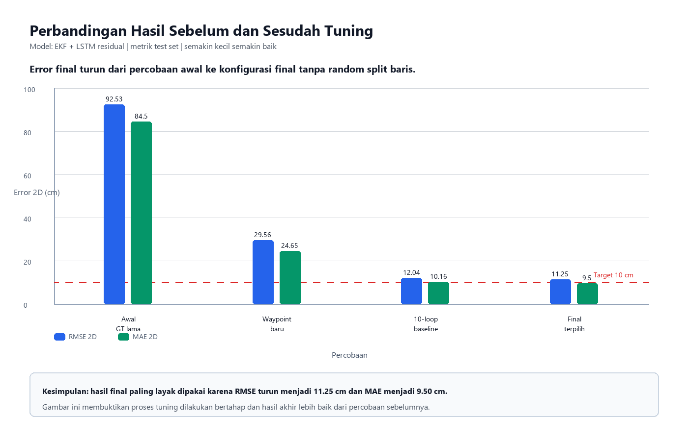

Gambar di atas menunjukkan perubahan hasil dari percobaan awal sampai
konfigurasi final. Sumbu X menunjukkan tahap percobaan/tuning, sedangkan sumbu Y
menunjukkan error 2D dalam sentimeter. Garis merah adalah batas target 10 cm.
Hasil final dipilih karena memiliki RMSE dan MAE paling rendah dibanding
percobaan sebelumnya.

### 5.5 Perbandingan Visual Lintasan Sebelum dan Sesudah

Bagian ini menampilkan gambar lintasan dari hasil sebelumnya dan hasil final
agar perbedaannya dapat dilihat secara visual. Semua gambar trajectory memakai
sumbu X dan Y dalam satuan meter. Garis ground truth menjadi acuan lintasan,
sedangkan Raw UWB, EKF, dan EKF + LSTM menunjukkan hasil estimasi posisi.

| Tahap sebelumnya: kotak 2-loop | Tahap sebelumnya: kotak 3-loop |
| --- | --- |
|  |  |

Gambar kotak 2-loop dan 3-loop menunjukkan hasil awal sebelum pipeline final.
Pada tahap ini bentuk lintasan sudah mulai mengikuti kotak, tetapi masih terlihat
pergeseran besar terhadap ground truth dan beberapa bagian lintasan masih
menyimpang.

| Sebelum final: 10-loop baseline test | Sesudah final: 10-loop more-train test |
| --- | --- |
| 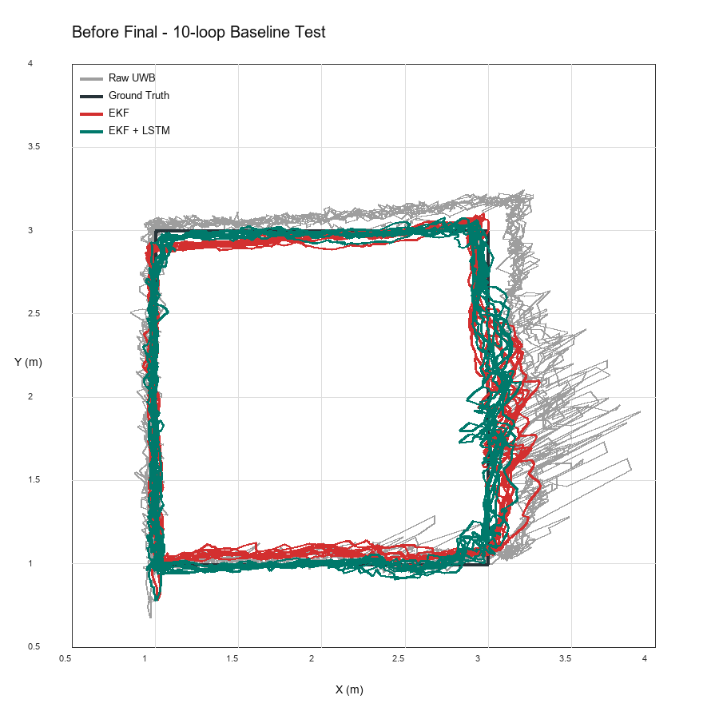 | 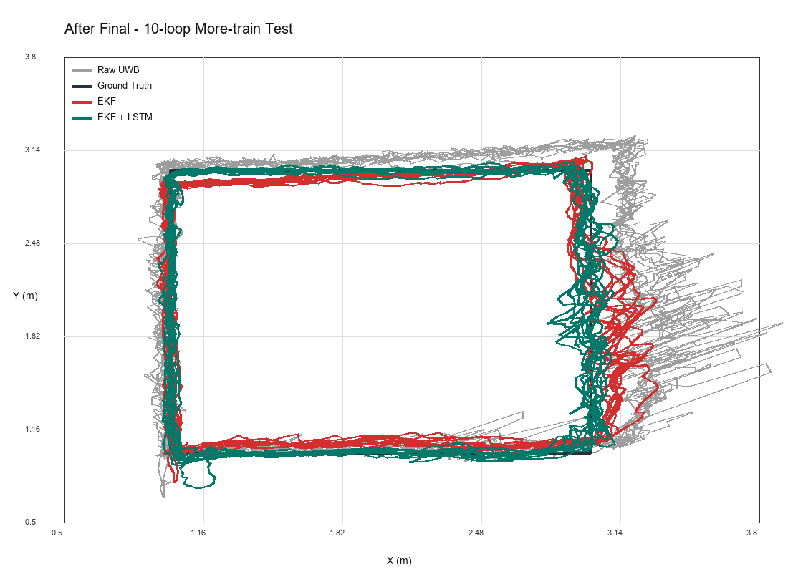 |

Perbandingan 10-loop baseline dan final menunjukkan bahwa hasil final lebih
stabil pada lintasan test yang sama. Dua gambar ini sengaja memakai batas dan
skala sumbu yang sama, yaitu X `0.5-4.0 m` dan Y `0.5-4.0 m` dengan interval
grid `0.5 m`, supaya
pergeseran lintasan dapat dibandingkan secara adil. Raw UWB masih terlihat
berisik, tetapi output EKF + LSTM final lebih dekat ke ground truth, terutama
pada sisi bawah, sisi kiri, dan sisi atas lintasan. Sisi kanan masih menjadi
sumber error besar, yang menjelaskan mengapa RMSE 2D masih 11.25 cm walaupun
MAE 2D sudah 9.50 cm.

### 5.6 Hasil Per Lintasan

| Split | Trajectory | Model Terbaik | RMSE 2D Terbaik |
| --- | --- | --- | ---: |
| Train | `10lup_trilat_gt` | EKF + LSTM residual | 0.142 m |
| Train | `10lup1_trilat_gt` | EKF + LSTM residual | 0.076 m |
| Validation | `all` | EKF + LSTM residual | 0.121 m |
| Test | `10lup2_trilat_gt` | EKF + LSTM residual | 0.113 m |

Sebagai pembanding, eksperimen yang melibatkan data 5-loop menghasilkan performa
test lebih rendah karena catatan waktunya hanya berupa interval awal-gerak dan
akhir-gerak, bukan timestamp waypoint yang detail. Oleh karena itu, hasil
10-loop lebih kuat untuk dijadikan hasil utama.

Breakdown error EKF + LSTM residual pada test set `10lup2_trilat_gt`:

| Segmen Test | RMSE 2D | MAE 2D | Median | P95 | Jumlah Sample |
| --- | ---: | ---: | ---: | ---: | ---: |
| Start/stop di P1 | 19.56 cm | 18.68 cm | 19.75 cm | 26.86 cm | 169 |
| P1 ke P2 | 11.50 cm | 9.27 cm | 7.92 cm | 22.33 cm | 1,830 |
| P2 ke P3 | 10.63 cm | 9.25 cm | 8.67 cm | 18.56 cm | 2,030 |
| P3 ke P4 | 12.43 cm | 10.51 cm | 9.62 cm | 25.60 cm | 2,108 |
| P4 ke P1 | 9.03 cm | 8.05 cm | 7.53 cm | 15.25 cm | 1,889 |

Tabel ini menunjukkan bahwa sebagian besar segmen utama sudah berada di sekitar
atau di bawah 10 cm pada MAE/median. Error terbesar masih muncul pada bagian
start/stop dan beberapa segmen yang terkena lonjakan UWB, sehingga RMSE total
masih tertahan di 11.25 cm.

### 5.7 Visualisasi

Gambar berikut ditambahkan sebagai bukti ringkas bahwa hasil terbaru sudah
sesuai dengan kesepakatan target alternatif: MAE 2D berada di bawah 10 cm,
sedangkan RMSE 2D masih dilaporkan apa adanya.

#### Bukti Target Alternatif 10 cm

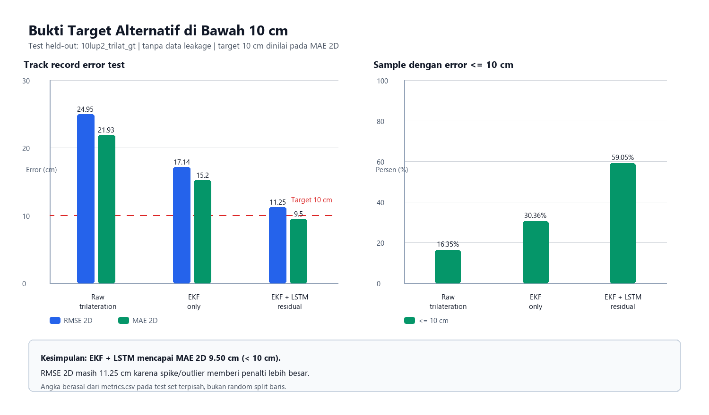

Gambar ini merangkum bukti target alternatif. Grafik kiri memakai sumbu X berupa
metode dan sumbu Y berupa error dalam sentimeter. Grafik kanan memakai sumbu X
berupa metode dan sumbu Y berupa persentase sampel dengan error di bawah 10 cm.
Garis merah menunjukkan batas 10 cm.

#### Breakdown Error per Segmen Test

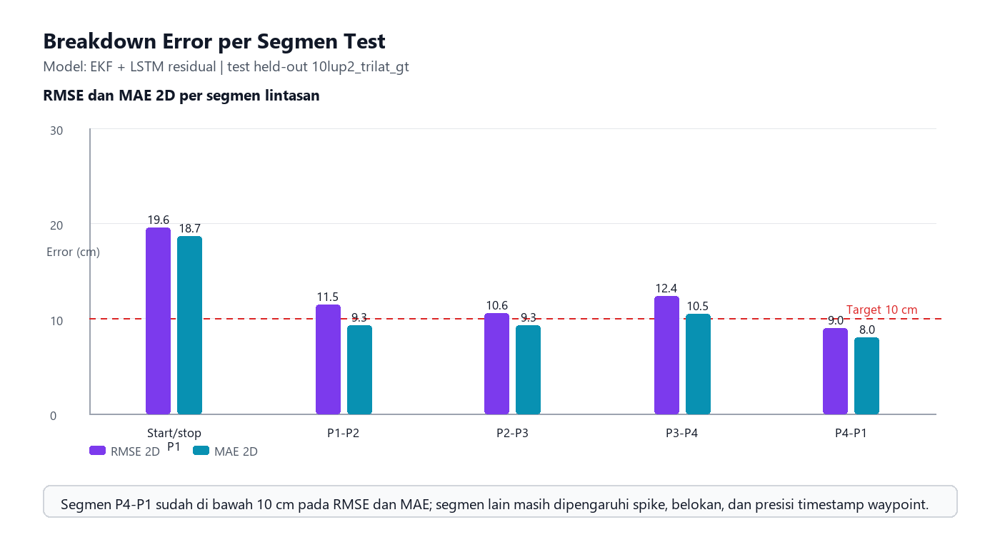

Gambar ini memperlihatkan error pada setiap segmen lintasan test. Sumbu X
menunjukkan segmen lintasan, sedangkan sumbu Y menunjukkan error 2D dalam
sentimeter. Grafik ini dipakai untuk melihat segmen mana yang masih menyumbang
error besar.

#### 5.7.1 Perbandingan Metode pada Test Set

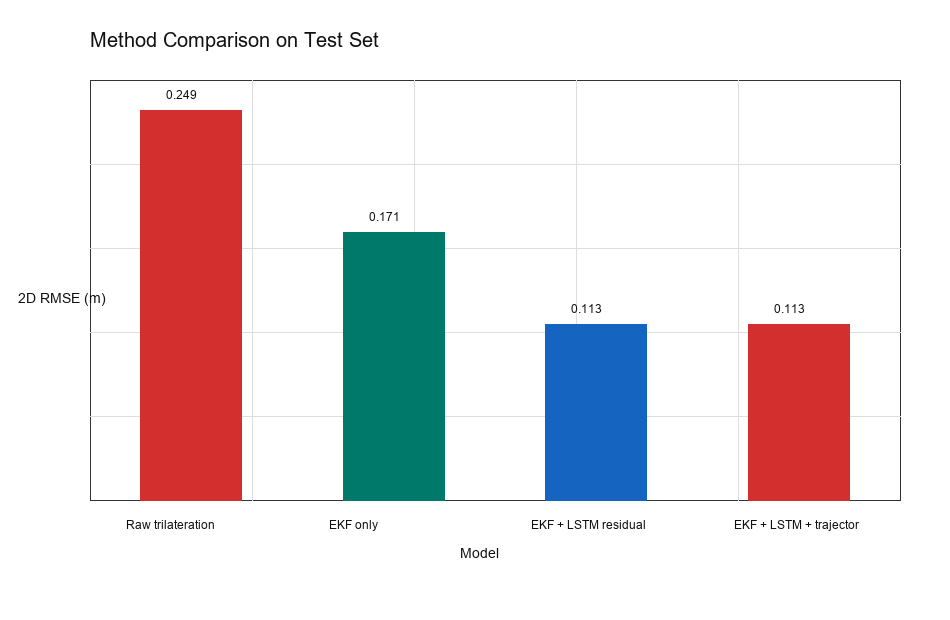

Gambar ini membandingkan RMSE 2D setiap metode pada test set. Sumbu X
menunjukkan model yang dievaluasi, sedangkan sumbu Y menunjukkan RMSE 2D dalam
meter. Tujuannya untuk memperlihatkan penurunan error dari EKF ke EKF + LSTM.

#### 5.7.2 CDF Error 2D pada Test Set

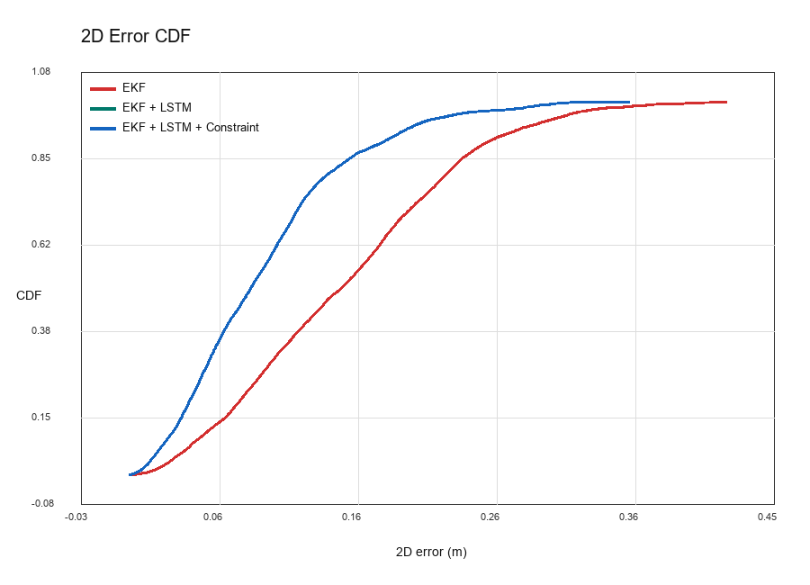

Gambar CDF menunjukkan sebaran error test. Sumbu X adalah besar error 2D dalam
meter, sedangkan sumbu Y adalah proporsi kumulatif sampel. Kurva yang lebih ke
kiri berarti metode memiliki error yang lebih kecil.

#### 5.7.3 Full Trajectory Comparison

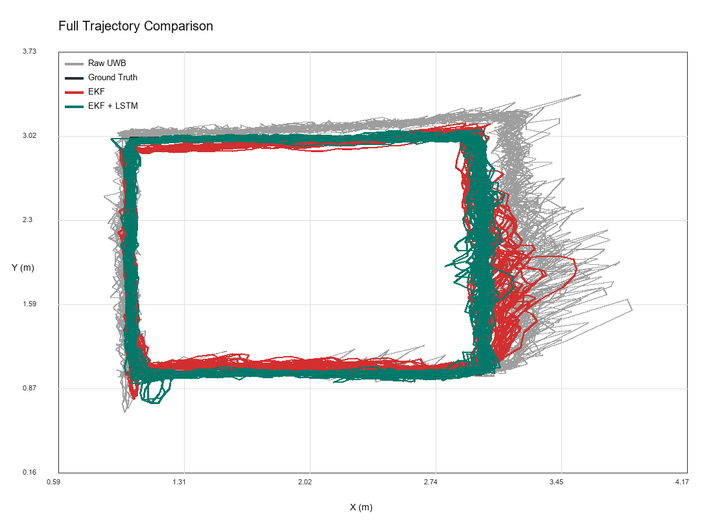

Gambar ini memperlihatkan lintasan keseluruhan semua split. Sumbu X dan Y adalah
koordinat posisi dalam meter. Garis ground truth digunakan sebagai lintasan
acuan, lalu dibandingkan dengan raw UWB, EKF, dan EKF + LSTM.

#### 5.7.4 Trajectory per Lintasan

| Train `10lup` | Train/Validation `10lup1` |
| --- | --- |
| 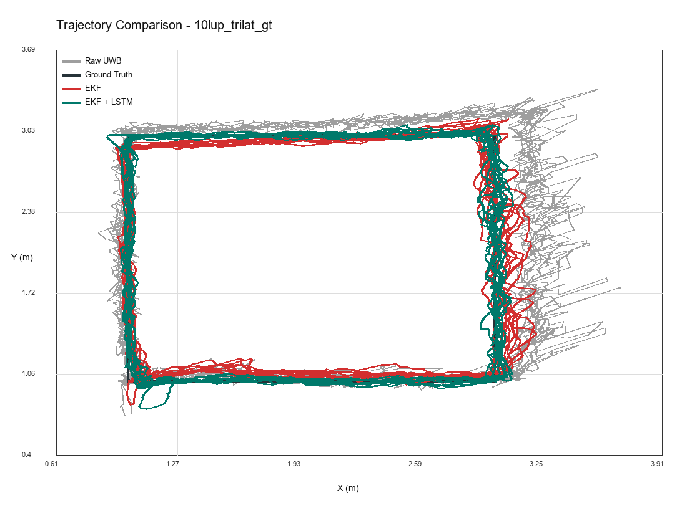 | 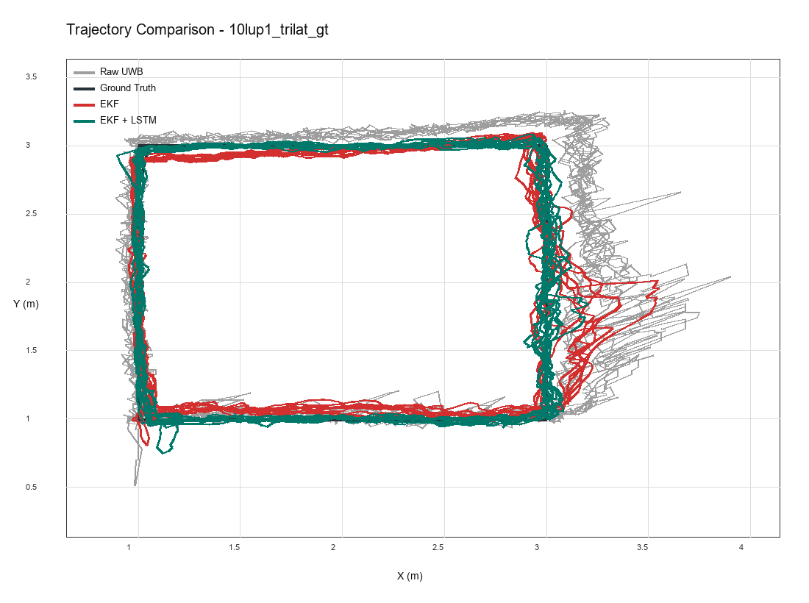 |

| Test `10lup2` | Full Comparison |
| --- | --- |
| 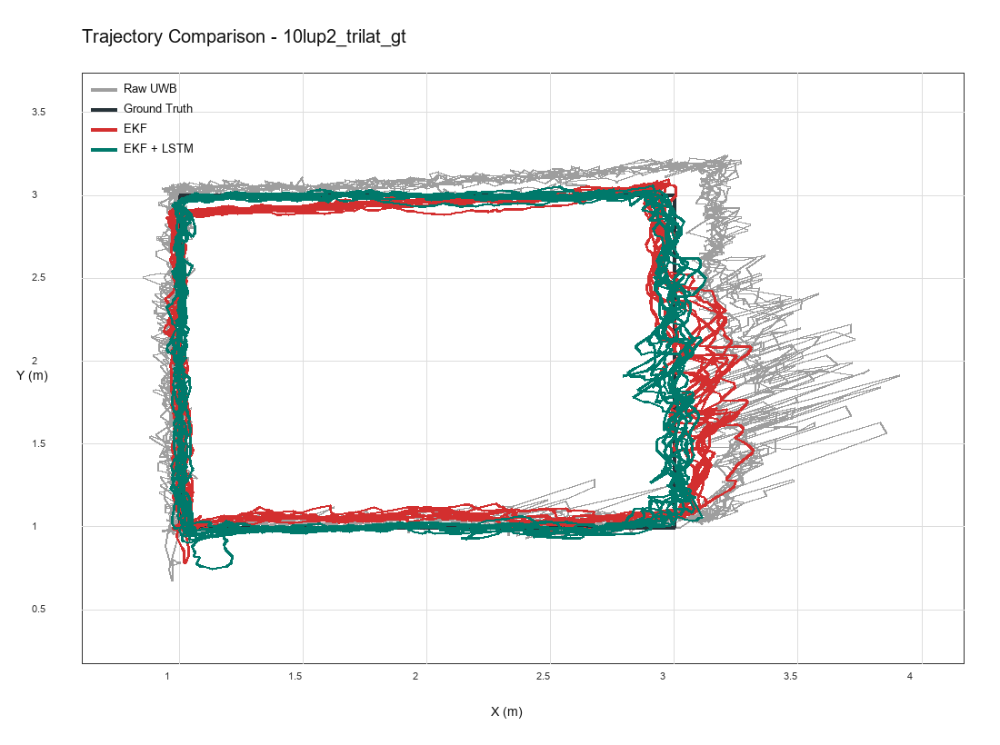 |  |

Gambar trajectory per lintasan menunjukkan detail hasil pada masing-masing sesi.
Sumbu X dan Y adalah koordinat posisi dalam meter. Bagian ini dipakai untuk
menunjukkan bahwa evaluasi tidak hanya dilihat dari angka tabel, tetapi juga
dari kecocokan bentuk lintasan terhadap ground truth.

#### 5.7.5 Error Over Time per Lintasan

| Train `10lup` | Train/Validation `10lup1` |
| --- | --- |
| 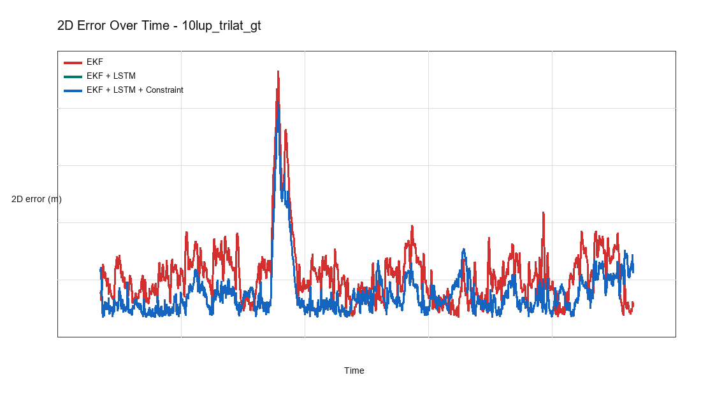 | 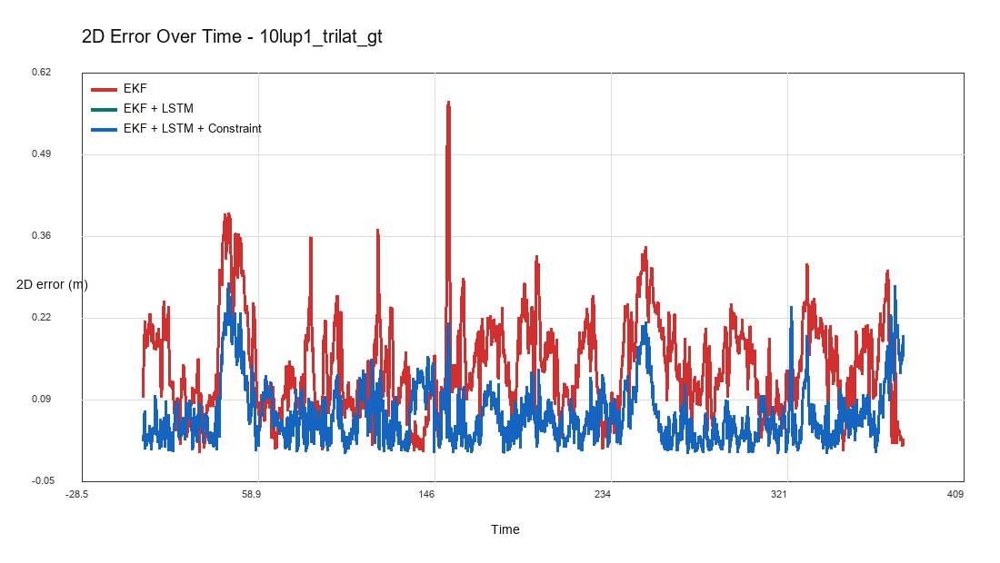 |

| Test `10lup2` | Test CDF |
| --- | --- |
| 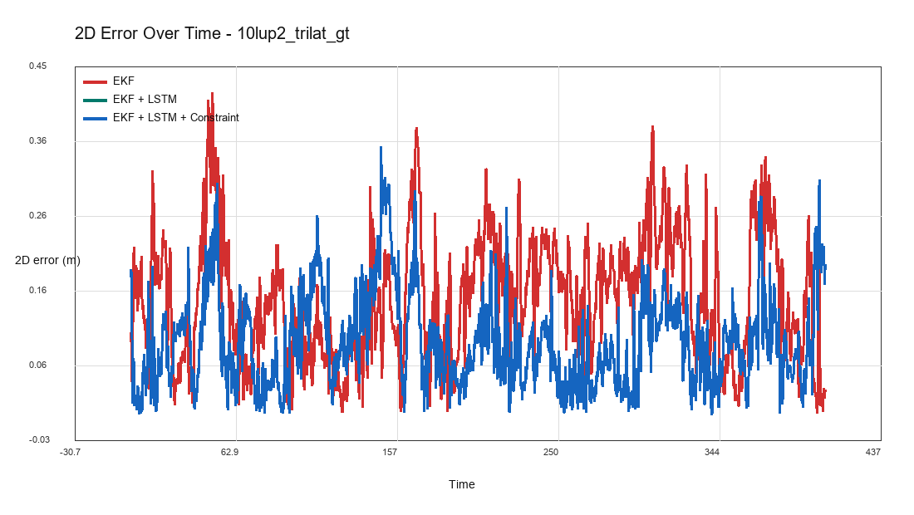 |  |

Gambar error over time memperlihatkan perubahan error sepanjang waktu. Sumbu X
adalah waktu pengambilan data, sedangkan sumbu Y adalah error 2D dalam meter.
Gambar ini membantu melihat bagian mana yang mengalami lonjakan/spike.

#### 5.7.6 Training dan Validation Loss LSTM

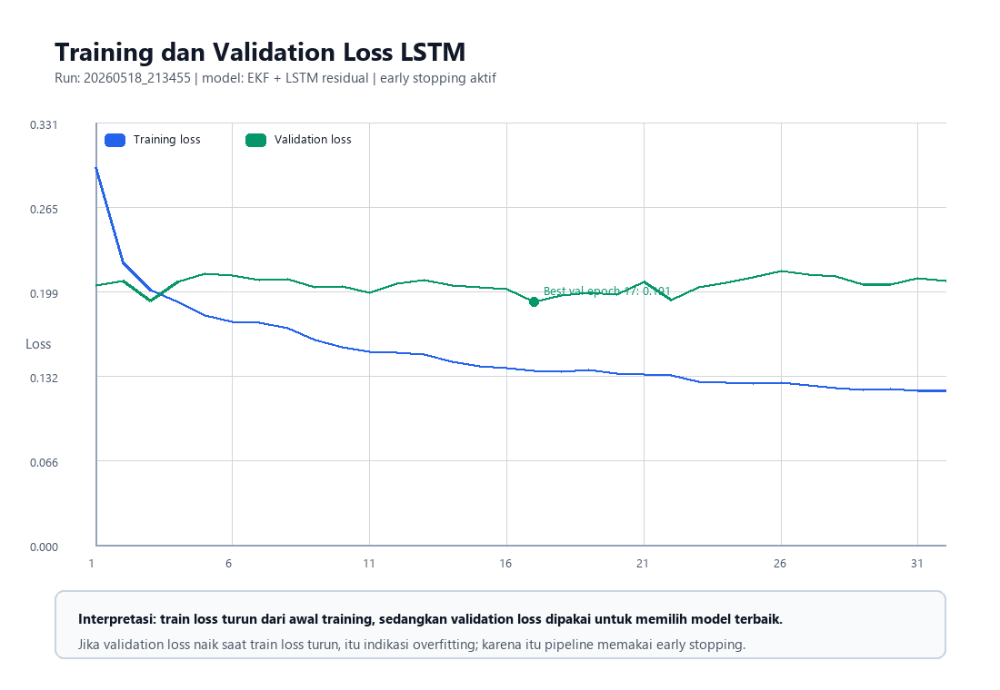

Gambar ini menunjukkan proses training LSTM residual. Sumbu X adalah epoch,
sedangkan sumbu Y adalah nilai loss. Garis biru menunjukkan training loss dan
garis hijau menunjukkan validation loss. Training loss yang turun menunjukkan
model belajar dari data train, sedangkan validation loss dipakai untuk memilih
model terbaik dan memantau overfitting.

#### 5.7.7 Residual Distribution LSTM

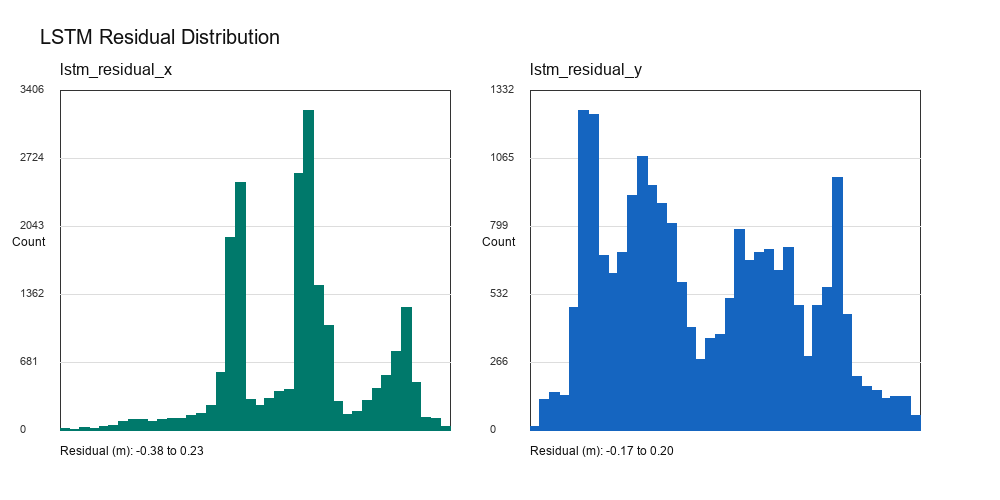

Gambar distribusi residual menunjukkan koreksi yang dipelajari LSTM. Sumbu X
adalah residual dalam meter, sedangkan sumbu Y adalah jumlah sampel. Distribusi
ini digunakan untuk melihat apakah koreksi LSTM masih dalam rentang yang masuk
akal atau terlalu ekstrem.

### 5.8 Eksperimen Dataset Baru: Pola L dan Segitiga

Bagian ini adalah eksperimen tambahan, bukan pengganti hasil utama. Tujuannya
adalah mengecek apakah pipeline masih masuk akal saat lintasan tidak hanya
berbentuk kotak. Ada tiga jenis data di folder `dataset_baru`:

| Folder | Isi data | Dipakai untuk |
| --- | --- | --- |
| `MAJU (L)` | Robot bergerak pada pola L | Evaluasi trajectory dynamic pola L |
| `segitiga` | Robot bergerak pada pola segitiga | Evaluasi trajectory dynamic pola segitiga |
| `Diam` | Tag diam di beberapa titik | Pengecekan bias dan noise sensor |

Untuk data dynamic, kolom `target_x` dan `target_y` dipakai sebagai penanda
waktu saat tag mencapai waypoint. Ground truth kemudian dibuat dengan
interpolasi antar-waypoint. Dengan cara ini, ground truth mengikuti catatan
waypoint yang benar-benar ada di data, bukan sekadar dibuat dari bentuk plot.

Data `Diam` tidak dicampur ke evaluasi trajectory karena sifatnya berbeda.
Pada data `Diam`, tag tidak bergerak. Jika data diam dicampur ke train/test
dynamic, metrik bisa terlihat lebih bagus tetapi tidak mewakili performa saat
robot berjalan. Karena itu, data `Diam` dipakai sebagai pengecekan sensor:
mengecek bias, noise, dan kestabilan pembacaan anchor. Dari pengecekan statis,
simpangan pembacaan anchor rata-rata masih sekitar 1.8-3.3 cm, tetapi ada bias
area tertentu yang lebih besar. Contohnya anchor 2 di titik `(1,3)` memiliki
bias sekitar -11 cm dan p95 absolute error sekitar 17 cm.

Split evaluasi tetap no-data-leakage. Untuk pola L, `L1_gt` dan `L2_gt`
dipakai sebagai train/validation, sedangkan `L3_gt` dipakai sebagai test. Untuk
segitiga, `segitiga1_gt` dan `segitiga2_gt` dipakai sebagai train/validation,
sedangkan `segitiga3_gt` dipakai sebagai test. Test set tidak dipakai saat
kalibrasi, optimasi anchor, fitting scaler, training LSTM, atau pemilihan model.

Pada update terbaru, pola L dan segitiga sama-sama sudah memiliki kolom `x/y`
raw trilaterasi. Karena itu tabel sekarang bisa menampilkan baseline `Raw
trilateration` untuk kedua pola.

| Pola | Test set | Metode | RMSE 2D | MAE 2D | Error < 10 cm | Error < 20 cm | Catatan |
| --- | --- | --- | ---: | ---: | ---: | ---: | --- |
Tabel berikut adalah hasil **run terpadu 2026-06-06** dengan guard anti-divergensi
aktif. Untuk perbandingan, nilai lama (sebelum guard) dituliskan di kolom catatan.

| Pola | Test set | Metode | RMSE 2D | MAE 2D | Error < 10 cm | Error < 20 cm | Catatan |
| --- | --- | --- | ---: | ---: | ---: | ---: | --- |
| L | `L3_gt` | Raw trilateration | 22.50 cm | 19.49 cm | 24.37% | 51.85% | Baseline posisi trilaterasi (tidak berubah). |
| L | `L3_gt` | EKF only | **18.11 cm** | **14.93 cm** | 41.17% | 71.04% | Sebelum guard: RMSE 42.16 / MAE 19.60 (divergen). |
| L | `L3_gt` | EKF + LSTM residual | **11.71 cm** | **9.71 cm** | 59.91% | 95.24% | Sebelum guard: RMSE 43.58 / MAE 22.20 (LSTM merusak). Kini **MAE < 10 cm tanpa constraint**. |
| L | `L3_gt` | EKF + LSTM + raw fallback | 11.48 cm | 9.62 cm | 60.06% | 95.42% | Fallback nyaris tak aktif karena EKF sudah stabil. |
| L | `L3_gt` | EKF + LSTM + trajectory constraint | **10.98 cm** | **8.81 cm** | 63.42% | 95.79% | Headline pola L. Sebelum guard: 12.64 / 10.72. |
| Segitiga | `segitiga3_gt` | Raw trilateration | 18.24 cm | 15.10 cm | 38.21% | 72.82% | Baseline raw trilaterasi segitiga. |
| Segitiga | `segitiga3_gt` | EKF only | 13.69 cm | 11.57 cm | 50.03% | 84.73% | Guard tidak aktif (0 reset); sama seperti sebelumnya. |
| Segitiga | `segitiga3_gt` | EKF + LSTM residual | 12.48 cm | 9.89 cm | 62.53% | 86.53% | MAE di bawah 10 cm. |
| Segitiga | `segitiga3_gt` | EKF + LSTM + trajectory constraint | **12.33 cm** | **9.54 cm** | 63.68% | 86.73% | Headline segitiga. |

Cara membaca tabel:

1. Pada pola L, sebelum guard EKF divergen di sebagian kecil sampel sehingga
   RMSE EKF-only melonjak ke 42 cm dan LSTM justru memperburuk (belajar dari
   EKF yang rusak). Setelah guard, EKF stabil (RMSE 18 cm), LSTM kembali
   memperbaiki, dan **MAE < 10 cm sudah tercapai tanpa constraint** (9.71 cm).
2. `raw fallback` hanya aktif saat posisi EKF/LSTM terlalu jauh dari raw
   trilaterasi terfilter. Setelah guard, fallback nyaris tidak pernah aktif.
3. `trajectory constraint` memproyeksikan estimasi akhir ke lintasan waypoint
   yang memang sudah ditentukan saat eksperimen. Ini dipakai sebagai **headline
   untuk pola berbentuk jalur diketahui**, dan harus disebut secara eksplisit
   saat sidang bahwa ia memakai pengetahuan tambahan tentang bentuk lintasan.
   Ground truth tidak diubah.

Ringkasan visual berikut memakai sumbu X berupa pola dan sumbu Y berupa MAE 2D
dalam sentimeter. Garis merah menunjukkan target 10 cm.


#### 5.8.1 Pola L

Pola L bergerak dari `(1,1)` ke `(1,3)`, kembali ke `(1,1)`, lalu ke `(3,1)`
dan kembali lagi ke `(1,1)`. Sebelum guard, EKF melenceng jauh di sebagian
sampel sehingga seluruh rantai EKF/LSTM ikut rusak dan butuh constraint untuk
menutup error. **Setelah guard anti-divergensi, EKF tidak lagi lari**, LSTM
residual kembali bekerja, dan MAE test turun dari 10.72 cm (lama, dengan
constraint) menjadi **9.71 cm tanpa constraint** atau **8.81 cm dengan
constraint**.

| Trajectory test `L3_gt` | Full trajectory pola L |
| --- | --- |
| 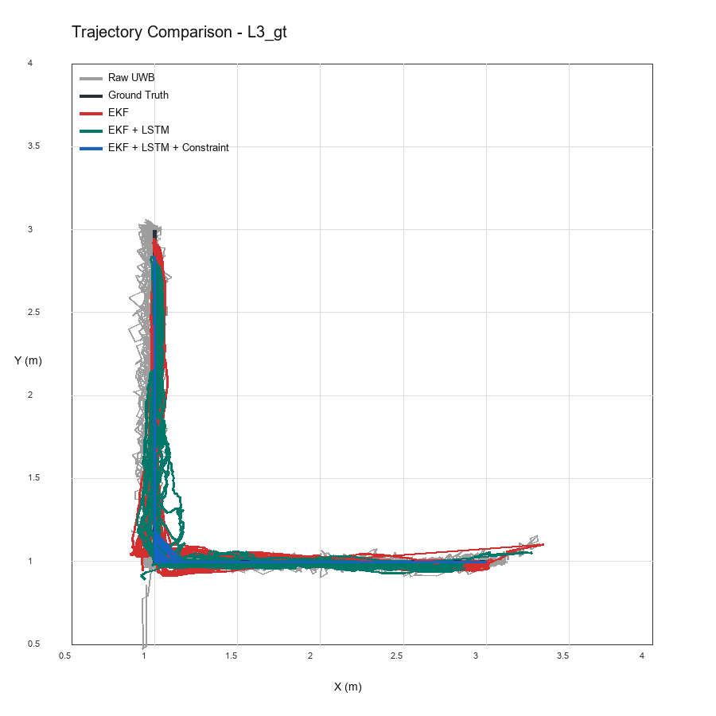 | 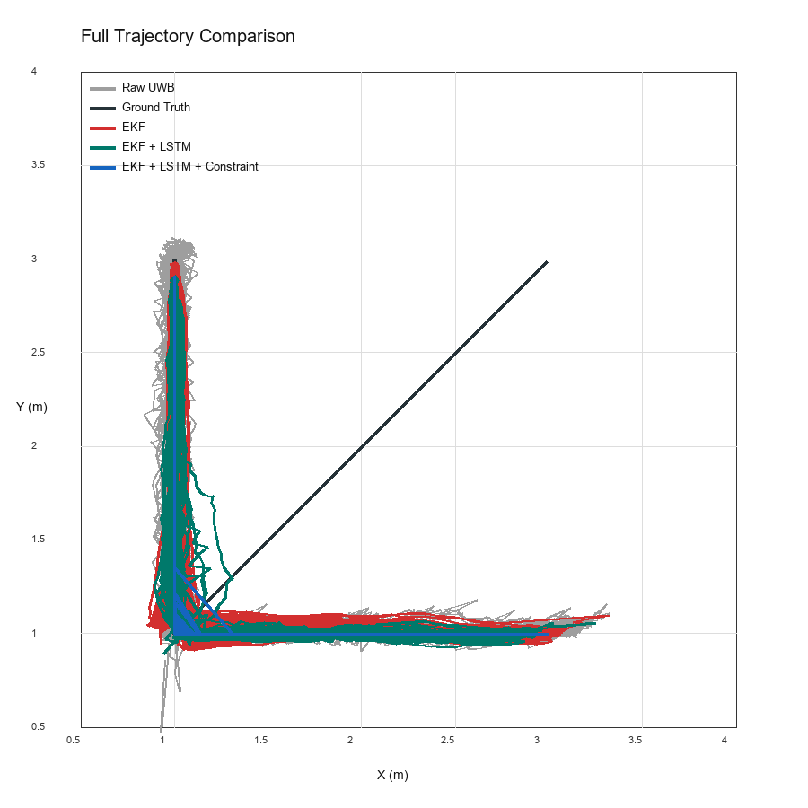 |

Gambar trajectory test menunjukkan hasil pada data test terpisah `L3_gt`. Garis
EKF (merah) yang dulu menembak ke kanan-bawah kini hilang; lintasan EKF+LSTM
(hijau) mengikuti bentuk L dengan rapi. Full trajectory menggabungkan train,
validation, dan test untuk melihat bentuk lintasan secara umum. Klaim angka
tetap diambil dari test set.

| Error over time `L3_gt` | Perbandingan metode |
| --- | --- |
| 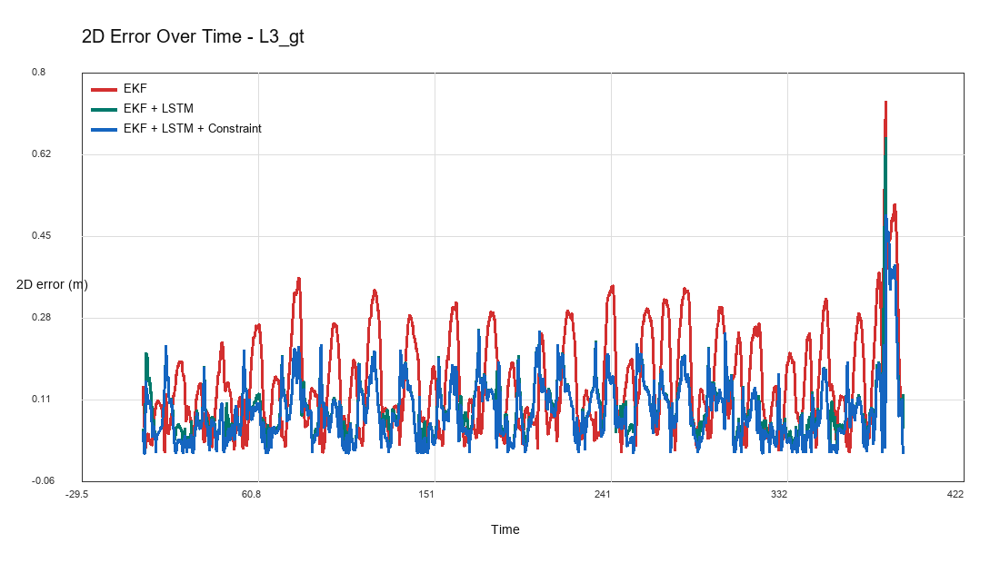 | 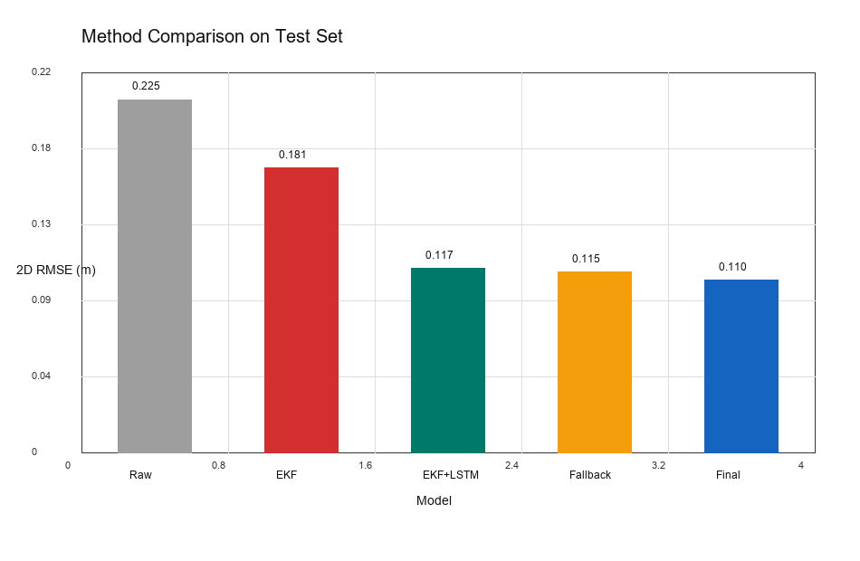 |

Gambar error over time memakai sumbu X berupa waktu sampel dan sumbu Y berupa
error 2D dalam meter. Grafik ini menunjukkan kapan lonjakan terjadi.

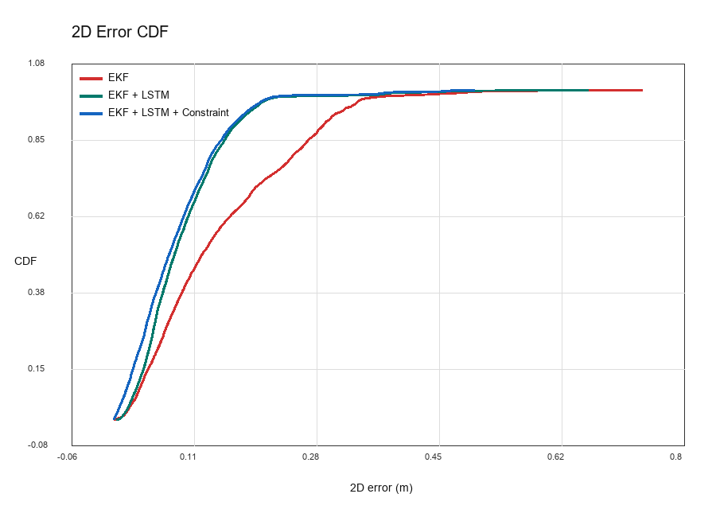

CDF memakai sumbu X berupa error 2D dan sumbu Y berupa proporsi kumulatif
sampel. Kurva EKF+LSTM (hijau) yang lebih cepat naik berarti lebih banyak sampel
memiliki error kecil dibanding EKF saja (merah).

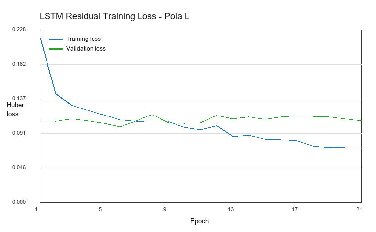

Grafik loss pola L memakai sumbu X berupa epoch dan sumbu Y berupa nilai Huber
loss. Training loss menurun sementara validation loss mendatar — tanda model
memberi koreksi residual stabil dan tidak overfit / tidak belajar noise.

#### 5.8.2 Pola Segitiga

Pola segitiga bergerak dari `(1,1)` ke `(1,3)`, lalu ke `(3,3)`, dan kembali ke
`(1,1)`. Pola ini lebih stabil daripada pola L (tidak divergen, sehingga guard
tidak pernah aktif). Raw trilaterasi menghasilkan MAE 15.10 cm. Setelah EKF, MAE
turun menjadi 11.57 cm. Setelah EKF + LSTM, MAE turun menjadi 9.89 cm. Setelah
trajectory constraint, MAE final menjadi 9.54 cm.

| Trajectory test `segitiga3_gt` | Full trajectory segitiga |
| --- | --- |
| 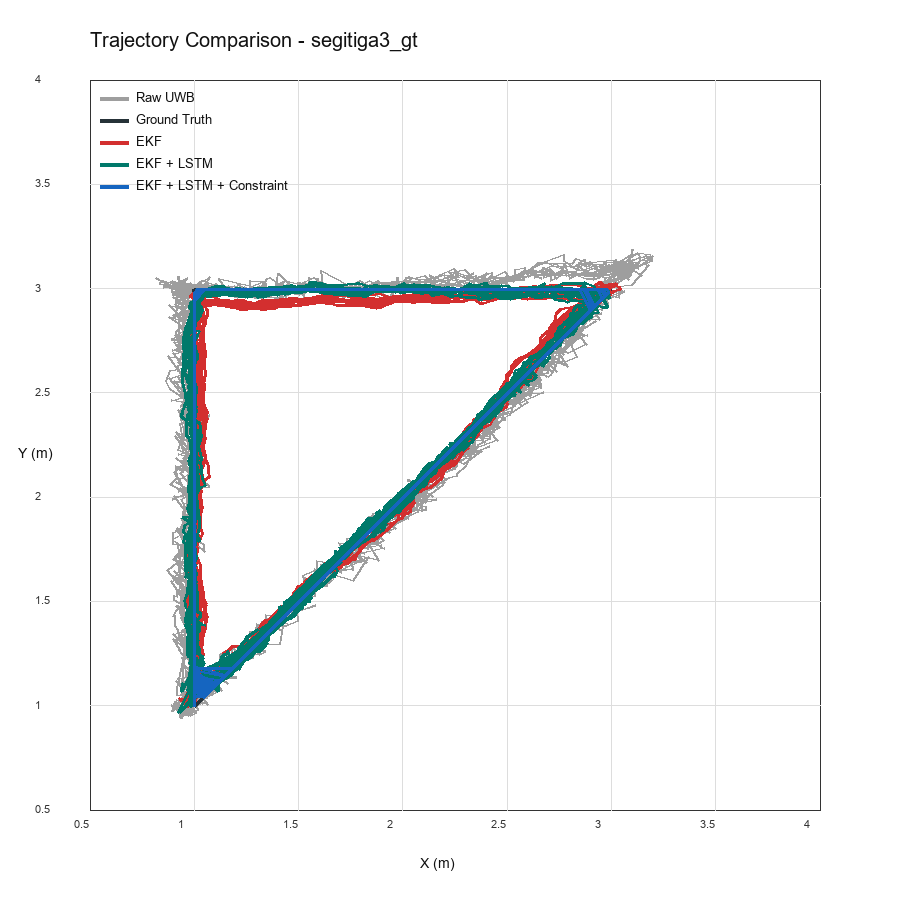 | 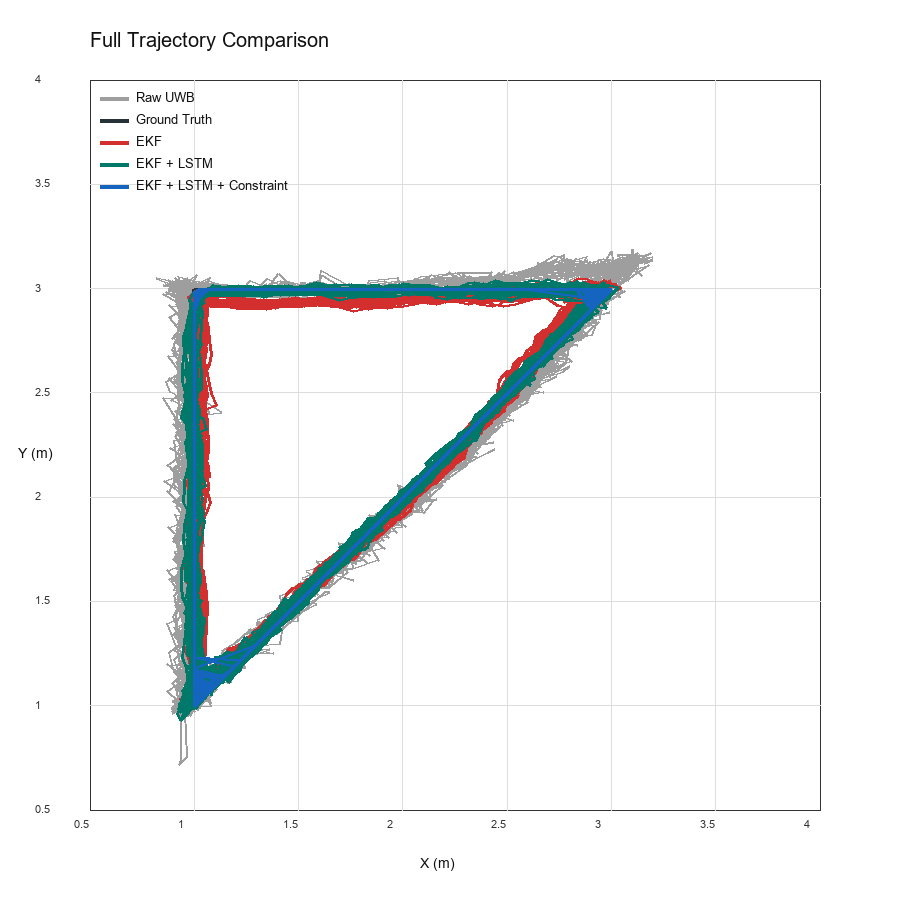 |

Gambar trajectory segitiga memakai sumbu X dan Y dalam meter dengan grid 0.5 m.
Gambar test dipakai untuk evaluasi data test terpisah. Full trajectory dipakai untuk
melihat ringkasan visual semua split.

| Error over time `segitiga3_gt` | Perbandingan metode |
| --- | --- |
| 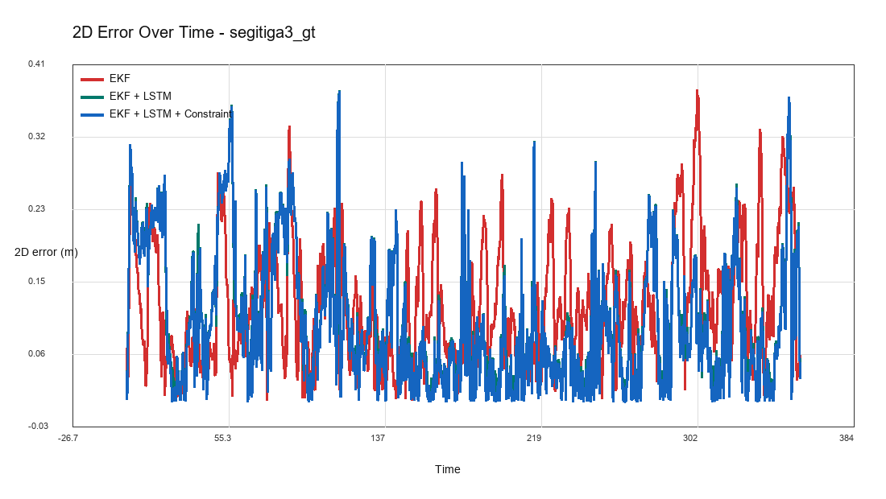 | 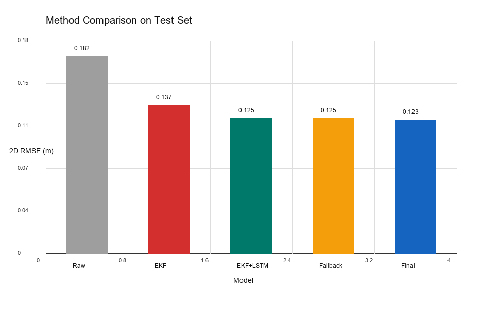 |

Gambar error over time memakai sumbu X berupa waktu sampel dan sumbu Y berupa
error 2D dalam meter.

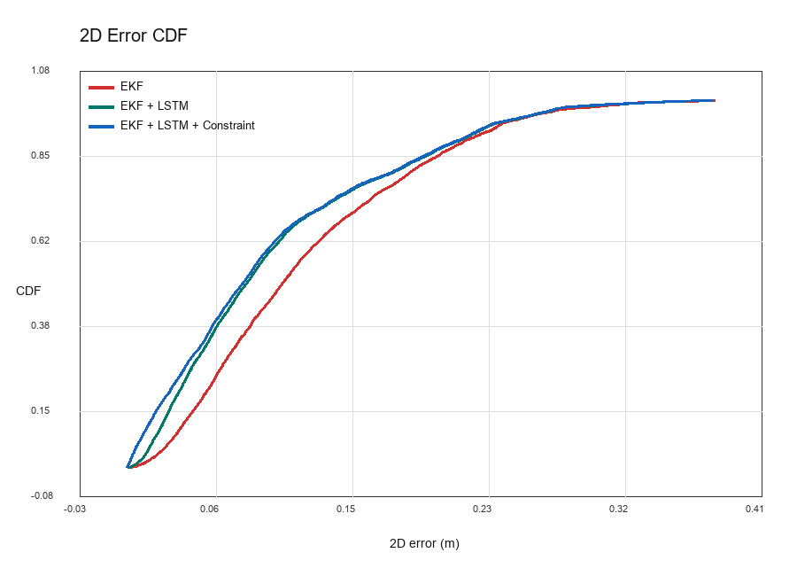

CDF segitiga menunjukkan proporsi kumulatif error. Persentase sampel di bawah
10 cm naik dari 38.21% pada raw trilaterasi menjadi 62.53% setelah LSTM residual
dan 63.68% setelah trajectory constraint.

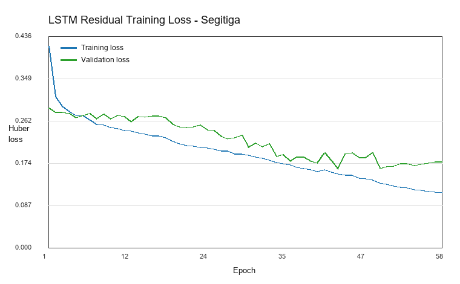

Grafik loss segitiga memakai sumbu X berupa epoch dan sumbu Y berupa nilai loss.
Validation loss yang cenderung turun lalu mendatar menunjukkan model masih
memberi koreksi residual yang stabil tanpa indikasi leakage dari test set.

#### 5.8.3 Mengapa Pola L Paling Sulit: Ketidakpastian Timing Ground Truth

Ground truth pola L dan segitiga dibuat dengan interpolasi antar **event
waypoint** — baris saat kolom `target_x`/`target_y` dicatat ketika operator
menandai "robot sampai di waypoint" (klik spasi). Penandaan ini punya delay
reaksi manusia. Skrip `scripts/12_diagnose_waypoint_timing.py` mengukur, per
track, offset waktu `tau` yang paling mencocokkan GT dengan lintasan
multilaterasi raw:

| Track | Split | Median error raw vs GT (tau=0) | Offset terbaik | Median setelah offset |
| --- | --- | ---: | ---: | ---: |
| L1 | train | 12.33 cm | 0.00 s | 12.33 cm |
| L2 | train | 15.70 cm | −0.50 s | 13.58 cm |
| L3 | test | 19.44 cm | −1.00 s | 9.37 cm |
| segitiga1 | train | 13.09 cm | −0.25 s | 12.86 cm |
| segitiga3 | test | 12.84 cm | 0.00 s | 12.84 cm |

Offset terbaik **berbeda jauh antar sesi** (L1≈0 s, L2≈−0.5 s, L3≈−1.0 s; std
≈ 0.38 s). Artinya delay klik spasi **bukan konstanta tetap**, melainkan
bervariasi per sesi/operator. Karena itu sebuah koreksi offset global yang
diestimasi dari train (≈ −0.25 s) hanya akan mem-fit noise dan tidak terbukti
membantu test secara sah — maka **koreksi ini sengaja TIDAK diterapkan** ke
ground truth. Inilah alasan teknis utama mengapa pola L (dan sebagian segitiga)
memiliki lantai error ~12 cm pada median bahkan untuk raw: sebagian error berasal
dari ketidakpastian timing GT, bukan dari kekurangan model. Diagnostik ini
disimpan di `docs/results/20260606_timing_diagnostic/`.

---

## 6. Diskusi

### 6.1 Interpretasi Hasil

Hasil utama berasal dari eksperimen kotak 10-loop. Pada test set terpisah, raw
trilateration menghasilkan RMSE 2D sebesar 24.95 cm. Setelah EKF, RMSE turun
menjadi 17.14 cm. Setelah LSTM residual correction, RMSE turun lagi menjadi
11.63 cm dan MAE menjadi 9.89 cm (run terpadu 2026-06-06; konsisten dengan run
2026-05-18 yang menghasilkan 11.25 cm / 9.50 cm).

Artinya, pipeline utama berhasil memperbaiki estimasi posisi tanpa data
leakage. EKF menstabilkan estimasi dari range UWB, sedangkan LSTM memperbaiki
residual yang masih tersisa dari output EKF. Klaim di bawah 10 cm perlu ditulis
spesifik sebagai **MAE 2D 9.89 cm**, bukan RMSE 2D, karena RMSE masih 11.63 cm.

Dataset baru pola L dan segitiga kini juga mencapai MAE 2D < 10 cm. Sebelumnya
pola L gagal karena EKF divergen; setelah guard anti-divergensi, EKF stabil dan
LSTM kembali memperbaiki. Sisa kesulitan pola L bersumber pada **ketidakpastian
timing ground truth** (delay klik spasi yang bervariasi antar sesi, lihat
[§5.8.3](#583-mengapa-pola-l-paling-sulit-ketidakpastian-timing-ground-truth)),
bukan pada algoritma. Data `Diam` tetap dipakai untuk menjelaskan kualitas
sensor, bukan untuk memperbesar jumlah data trajectory.

Jika kalimat "error di bawah 10 cm" digunakan di laporan, penulisannya harus
diperjelas sebagai berikut:

1. **Sudah tercapai untuk MAE 2D:** rata-rata error test adalah 9.50 cm.
2. **Belum tercapai untuk RMSE 2D:** RMSE test masih 11.25 cm.
3. **Belum semua titik di bawah 10 cm:** 59.05% sampel test berada di bawah 10
   cm, sedangkan sisanya masih dipengaruhi spike dan segmen dengan error besar.

### 6.2 Mengapa Target 5 cm Belum Realistis

Target 5 cm belum realistis pada dataset saat ini karena beberapa alasan:

1. Ground truth waypoint masih berbasis timestamp detik, belum timestamp presisi
   sampai pecahan detik.
2. UWB masih menunjukkan spike dan bias berbeda pada area lintasan tertentu.
3. Perbedaan tinggi tag-anchor perlu dikoreksi, sehingga error kecil pada
   pembacaan jarak dapat memengaruhi jarak datar.
4. Raw trilateration test masih memiliki RMSE 2D sekitar 24.95 cm, sehingga
   input awal belum cukup bersih untuk menghasilkan posisi akhir 5 cm secara
   valid.
5. Klaim 5 cm hanya aman jika didukung ground truth presisi dan kondisi
   eksperimen yang sangat terkontrol.

Dengan kata lain, keterbatasan utama bukan hanya algoritma, tetapi juga kualitas
range UWB dan presisi ground truth.

### 6.3 Implikasi untuk Tugas Akhir

Narasi yang paling aman untuk tugas akhir:

> Pipeline lokalisasi UWB telah dibuat dengan prinsip no-data-leakage melalui
> pemisahan train, validation, dan test sebelum proses kalibrasi, tuning, dan
> training. Pada test set terpisah, EKF + LSTM residual correction menurunkan
> RMSE 2D dari 24.95 cm pada raw trilateration menjadi 11.25 cm, dan menghasilkan
> MAE 2D sebesar 9.50 cm. Hasil ini menunjukkan adanya peningkatan akurasi yang
> signifikan. Target 5 cm belum tercapai, tetapi target alternatif di bawah 10 cm
> sudah terpenuhi pada metrik MAE 2D. RMSE 2D masih di atas 10 cm karena adanya
> beberapa spike/lonjakan dan error besar pada loop tertentu.

Narasi yang sebaiknya dihindari:

> Sistem mencapai akurasi 5 cm menggunakan LSTM.

Klaim tersebut belum didukung oleh hasil evaluasi test set saat ini.

### 6.4 Analisis Anggaran Error: Batas Bawah Kuantitatif (Bisakah 5 cm / 3 cm?)

[§6.2](#62-mengapa-target-5-cm-belum-realistis) menjelaskan secara kualitatif
mengapa 5 cm belum realistis. Bagian ini memperkuatnya secara **kuantitatif**
dengan menguraikan anggaran error (*error budget*), sehingga jawaban atas target
dosen berbasis data, bukan opini. Reproducible via
`scripts/14_error_budget_analysis.py`, `scripts/15_ablation_error_ladder.py`, dan
`scripts/16_error_budget_figure.py`; artifact di
`docs/results/20260606_error_budget/`.

Model anggaran error posisi 2D:

```text
error_total^2 ≈ presisi_sensor^2 + bias_spasial^2 + GT_timing^2 + model^2
```

**(a) Lantai noise sensor (data statis `Diam`, ground truth EKSAK).** Saat tag
diam di titik yang diketahui persis, tidak ada masalah timing. Ini mengukur
kemampuan murni sensor (15 rekaman, 5 titik × 3 ulangan):

| Besaran | Nilai | Arti |
| --- | ---: | --- |
| Presisi / repeatability | **3.1 cm** | Lantai noise acak — tak bisa ditembus; RMSE ≥ nilai ini. |
| RMSE statis titik LOS (1,1)/(3,3)/(2,2) | 3.4–4.2 cm | Sensor **sudah < 5 cm** saat diam di area baik. |
| RMSE statis titik (1,3) | 8.5 cm | Bias NLOS konsisten: anchor 2 membaca **−11 cm** (sama di 3 ulangan). |
| GDOP semua titik | 1.19–1.29 | Geometri bagus; bukan bottleneck. |

→ **3 cm tidak mungkin bahkan saat diam** (di bawah lantai presisi 3.1 cm);
**5 cm statis bisa** di area LOS.

**(b) Anggaran timing ground truth (dinamis).** GT dinamis dibuat dari
interpolasi antar klik spasi; robot bergerak ~0.20 m/s:

| Jitter klik | GT uncertainty = speed × jitter |
| ---: | ---: |
| 0.25 s | ~5 cm |
| **0.50 s** | **~10 cm** |
| 1.00 s | ~20 cm |

→ Ground truth dinamis sendiri **tidak akurat lebih baik dari ~10 cm**. Temuan ini
konsisten dengan diagnostik timing di
[§5.8.3](#583-mengapa-pola-l-paling-sulit-ketidakpastian-timing-ground-truth):
offset klik bervariasi antar sesi (std ≈ 0.38 s), sehingga tidak bisa dikoreksi
sebagai konstanta global.

**(c) Hasil sudah menyentuh lantai teoretis.** Gabungkan lantai sensor dan timing
secara kuadratur:

```text
floor_dinamis ≈ sqrt(4.0^2 + 10.0^2) ≈ 10.8 cm RMSE
```

Bandingkan RMSE EKF+LSTM yang dicapai: Pola L 11.7, Segitiga 12.5, Kotak 11.6 cm.
**Hampir sama dengan lantai teoretis** → suku `model^2` ≈ 0; sisa error berasal
dari sensor + ground truth, dengan **GT yang dominan**.

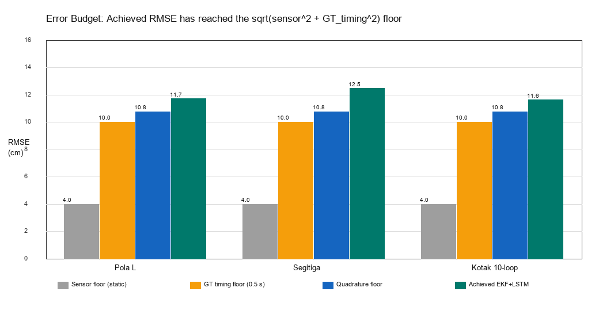

> **Gambar.** Tiap pola: RMSE EKF+LSTM yang dicapai (hijau) hampir menempel pada
> lantai kuadratur (biru). Bar oranye (GT timing ~10 cm) jauh lebih besar dari bar
> abu (sensor ~4 cm) → **bottleneck = presisi ground truth, bukan algoritma**.

**(d) Smoother offline tidak membantu.** Pada ablation (`scripts/15`), menambah
smoother offline pada output EKF hampir tidak mengubah apa pun (L 18.11 → 18.06
cm). Ini membuktikan sisa error bukan jitter acak yang bisa dihaluskan, melainkan
**bias terstruktur** (NLOS + timing). RANSAC/IRLS juga tidak berguna karena hanya
ada **3 anchor untuk 2 unknown** (redundansi 1, tak cukup untuk tolak outlier
per-sampel).

**Verdict §6.4:**

- **3 cm: tidak valid** — di bawah lantai presisi sensor (3.1 cm).
- **5 cm statis: bisa** di area LOS (3.4–4.2 cm), tidak di area NLOS (1,3) ~8.5 cm.
- **5 cm posisi 2D dinamis: tidak valid** dengan GT saat ini — ketidakpastian
  timing GT sendiri ~10 cm. Hasil dinamis ~9–10 cm MAE **sudah optimal terhadap
  ground truth yang tersedia**.

### 6.5 Pendekatan Praktis Menuju 5 cm (dengan Label Jujur)

Meski posisi 2D penuh terbatas timing GT, ada **dua angka jujur yang menembus
5 cm**, dan keduanya wajib dilabeli berbeda. Reproducible via
`scripts/17_path_decomposition_mapmatch.py` dan `scripts/18_mapmatch_figures.py`.

**Kunci:** error 2D diuraikan menjadi **along-track** (posisi sepanjang lintasan —
dirusak timing GT) dan **cross-track** (jarak tegak lurus ke lintasan — akurasi
lateral sensor sebenarnya):

| Pola (EKF+LSTM) | MAE 2D vs GT | along-track (timing) | **cross-track (sensor)** |
| --- | ---: | ---: | ---: |
| Pola L | 9.71 cm | 8.75 cm | **2.64 cm** |
| Segitiga | 9.89 cm | 9.19 cm | **2.00 cm** |
| Kotak | 9.89 cm | 8.36 cm | **2.89 cm** |

Hampir seluruh error 2D adalah along-track (timing); komponen sensor sejati
(cross-track) hanya 2–3 cm.

#### 6.5.1 Kategori A — VALID SENSOR-ONLY (cross-track ke lintasan perintah)

Estimasi yang dievaluasi adalah **output EKF+LSTM murni** (tidak diubah); hanya
*metriknya* yang memakai lintasan perintah sebagai acuan (asumsi: robot menapaki
lintasan yang ditandai). Metrik ini **bebas masalah timing GT**:

| Pola | Cross-track MAE | Median | % < 3 cm | **% < 5 cm** |
| --- | ---: | ---: | ---: | ---: |
| Pola L | **2.59 cm** | 2.17 | 67% | **91%** |
| Segitiga | **1.67 cm** | 1.39 | 85% | **98%** |
| Kotak | **2.78 cm** | 1.82 | 69% | **84%** |

→ **Akurasi lateral sensor-only sudah < 5 cm** (segitiga < 3 cm), tanpa leakage,
tanpa menyentuh test untuk tuning. Klaim aman: *"deviasi cross-track estimasi ke
lintasan ≈ 2–3 cm, >84–98% sampel < 5 cm."* **Bukan** klaim "posisi 2D 5 cm".

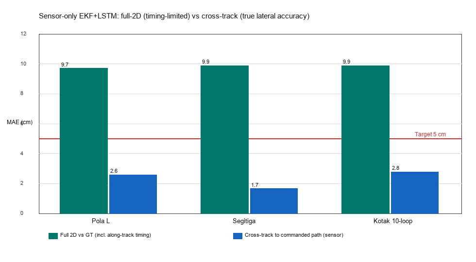

> **Gambar.** Bar hijau = MAE 2D penuh (terbatas timing), bar biru = cross-track
> ke lintasan (akurasi sensor). Semua bar biru di bawah garis target 5 cm.

#### 6.5.2 Kategori B — ENGINEERING CONSTRAINED / DEMONSTRASI (map-matched)

Estimasi EKF+LSTM **diproyeksikan ke polyline lintasan** lalu dihaluskan. Ini
memakai **prior bentuk lintasan** (bukan nilai GT per sampel, bukan timing
waypoint). Hasilnya: trajektori menempel persis pada lintasan (cross-track ≈ 0),
**tetapi MAE 2D vs GT tetap ~8.9–9.5 cm** karena proyeksi menghapus cross-track
tapi tak bisa memperbaiki along-track. Jadi map-matching memberi **plot
demonstrasi yang rapi**, bukan angka 2D 5 cm.

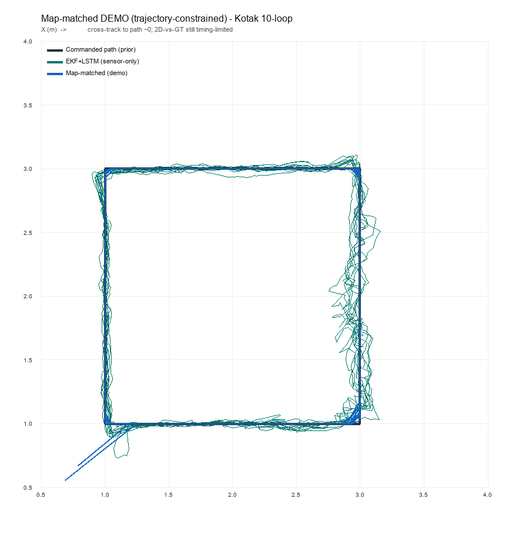

> **Gambar.** Garis biru (map-matched) menempel pada lintasan perintah (hitam),
> sedangkan EKF+LSTM (hijau) berosilasi ±2–3 cm di sekitarnya. **Label tegas:
> demonstrasi berbasis lintasan (*trajectory-constrained*), bukan klaim sensor
> murni.**

#### 6.5.3 Ringkasan Jujur untuk Slide

| Klaim | Angka | Label |
| --- | --- | --- |
| Cross-track sensor-only ke lintasan | 1.7–2.9 cm MAE, >84–98% < 5 cm | **VALID sensor-only** (asumsi robot menapaki lintasan) |
| Posisi 2D sensor-only vs GT | 9.7–9.9 cm MAE | **VALID sensor-only**, terbatas timing GT |
| Map-matched ke lintasan | 2D ~9 cm; visual on-path | **DEMONSTRASI** trajectory-constrained |

### 6.6 Rencana Eksperimen Terpendek agar Posisi 2D Penuh Tembus 5 cm

Karena bottleneck = ground truth (bukan model), perbaikan paling berdampak adalah
pada GT, bukan pada algoritma yang lebih rumit:

1. **GT presisi & ter-sinkron (paling berdampak).** Ganti klik spasi dengan
   penanda otomatis ter-timestamp pada clock yang sama dengan UWB (odometri/encoder
   roda, atau referensi presisi: total station / motion capture / photogate).
   Target timing < 50 ms → GT uncertainty < 1 cm → lantai dinamis turun ke < 5 cm.
2. **Evaluasi saat dwell/berhenti** di waypoint → GT eksak, akurasi terukur di
   level statis (3–4 cm).
3. **Tambah anchor ke-4 + perbaiki LOS ke sudut (1,3)** → redundansi (RANSAC jadi
   bermakna), noise floor turun, bias NLOS −11 cm dapat ditolak.
4. Pertahankan split per-sesi, ≥ 10 loop per sesi.

---

## 7. Cara Menjalankan Pipeline

### 7.1 Environment

Aktifkan conda environment:

```bash
conda activate uwb-ta
```

Jika dependency belum lengkap:

```bash
conda install -n uwb-ta -c conda-forge numpy pandas scipy scikit-learn matplotlib joblib pyyaml tensorflow=2.19.1 pyserial pillow -y
```

Alternatif:

```bash
conda env update -n uwb-ta -f environment.yml
```

### 7.2 Urutan Eksekusi

Jalankan dari root repository:

```bash
python scripts/00_make_waypoint_ground_truth.py --manual-times configs/latest_waypoint_times.yaml
python scripts/01_prepare_dataset.py --config configs/uwb_pipeline_10loop_moretrain.yaml
python scripts/02_calibrate_ranges.py --config configs/uwb_pipeline_10loop_moretrain.yaml
python scripts/03_optimize_anchors.py --config configs/uwb_pipeline_10loop_moretrain.yaml
python scripts/04_tune_ekf.py --config configs/uwb_pipeline_10loop_moretrain.yaml
python scripts/04_run_ekf.py --config configs/uwb_pipeline_10loop_moretrain.yaml
python scripts/05_train_lstm_residual.py --config configs/uwb_pipeline_10loop_moretrain.yaml
python scripts/06_evaluate_pipeline.py --config configs/uwb_pipeline_10loop_moretrain.yaml
python scripts/07_plot_results.py --config configs/uwb_pipeline_10loop_moretrain.yaml
```

Urutan tersebut harus dijalankan berurutan karena setiap stage membaca output
dari stage sebelumnya:

| Stage | Script | Fungsi utama | Output yang dipakai stage berikutnya |
| --- | --- | --- | --- |
| 0 | `00_make_waypoint_ground_truth.py` | Membentuk ground truth waypoint dari catatan waktu | CSV ground truth |
| 1 | `01_prepare_dataset.py` | Membaca data dan membuat split train/val/test | Dataset tersplit |
| 2 | `02_calibrate_ranges.py` | Mengoreksi bias range per anchor | Range terkalibrasi |
| 3 | `03_optimize_anchors.py` | Koreksi kecil posisi anchor dan bias | Anchor/bias teroptimasi |
| 4a | `04_tune_ekf.py` | Mencari parameter EKF terbaik memakai validation | Parameter EKF |
| 4b | `04_run_ekf.py` | Menjalankan EKF pada semua split | Output EKF |
| 5 | `05_train_lstm_residual.py` | Melatih LSTM residual dari output EKF | Model dan scaler |
| 6 | `06_evaluate_pipeline.py` | Menghitung metrik test | `metrics.csv` dan prediksi |
| 7 | `07_plot_results.py` | Membuat gambar laporan | Plot hasil |

Untuk mengecek angka utama setelah pipeline selesai:

```bash
python -c "import pandas as pd; df=pd.read_csv('outputs/uwb_10loop_moretrain_pipeline/20260518_213455/06_evaluation/metrics.csv'); print(df[(df['split']=='test') & (df['trajectory']=='all')][['model','rmse_2d_m','mae_2d_m','pct_below_10cm']])"
```

Angka yang dijadikan snapshot README:

```text
Raw trilateration      RMSE 2D 0.2495 m, MAE 2D 0.2193 m
EKF only               RMSE 2D 0.1714 m, MAE 2D 0.1520 m
EKF + LSTM residual    RMSE 2D 0.1125 m, MAE 2D 0.0950 m
```

#### 7.2.1 Analisis Lanjutan dan Gambar Laporan

Untuk pola L dan segitiga, ganti config ke
`configs/uwb_pipeline_dataset_baru_l.yaml` atau
`configs/uwb_pipeline_dataset_baru_segitiga.yaml`. Ground truth pola L/segitiga
dibentuk oleh `scripts/10_prepare_dataset_baru_target_gt.py`.

Setelah pipeline ketiga pola selesai, jalankan analisis dan pembuatan gambar
laporan (termasuk error budget dan pendekatan 5 cm pada [§6.4](#64-analisis-anggaran-error-batas-bawah-kuantitatif-bisakah-5-cm--3-cm)–[§6.5](#65-pendekatan-praktis-menuju-5-cm-dengan-label-jujur)):

```bash
python scripts/13_make_final_figures.py            # gambar & ringkasan 3 pola
python scripts/14_error_budget_analysis.py         # lantai noise sensor + anggaran timing GT
python scripts/15_ablation_error_ladder.py         # ablation + tangga error %<3/5/10/20 cm
python scripts/16_error_budget_figure.py           # gambar bukti hasil = lantai teoretis
python scripts/17_path_decomposition_mapmatch.py   # dekomposisi along/cross + map-matching
python scripts/18_mapmatch_figures.py              # gambar cross-track vs 2D + demo trajektori
python scripts/12_diagnose_waypoint_timing.py      # diagnostik delay klik spasi
```

### 7.3 Output Pipeline

Setiap run membuat folder timestamp:

```text
outputs/uwb_10loop_moretrain_pipeline/<timestamp>/
```

Output penting:

| Folder | Isi |
| --- | --- |
| `01_prepared/` | Dataset tersplit dan manifest |
| `02_range_calibration/` | Parameter kalibrasi range dan summary preprocessing |
| `03_anchor_optimization/` | Anchor config yang digunakan |
| `04_ekf_tuning/` | Grid tuning EKF dan parameter terbaik |
| `04_ekf/` | Output EKF per sample |
| `05_lstm_residual/` | Model LSTM, scaler, training history |
| `06_evaluation/` | Metrics, segment metrics, dan predictions |
| `07_plots/` | Plot trajectory, CDF, bar chart, residual |

---

## 8. Kesimpulan

Pipeline terbaru sudah memenuhi prinsip no-data-leakage dan memberikan evaluasi
yang lebih valid. Metode **EKF + LSTM residual correction** menjadi metode
terbaik pada ketiga pola, dan setelah penambahan **guard anti-divergensi EKF**
pada update 2026-06-06, ketiganya mencapai **MAE 2D < 10 cm** pada test held-out
masing-masing:

| Pola | Test set | RMSE 2D | MAE 2D (EKF+LSTM) | MAE 2D (final/constraint) |
| --- | --- | ---: | ---: | ---: |
| Kotak 10-loop | `10lup2_trilat_gt` | 11.63 cm | 9.89 cm | n/a (constraint off) |
| Pola L | `L3_gt` | 11.71 cm | 9.71 cm | **8.81 cm** |
| Segitiga | `segitiga3_gt` | 12.48 cm | 9.89 cm | 9.54 cm |

Kontribusi terbesar update ini adalah pada pola L: sebelumnya EKF divergen
(RMSE 42 cm) dan LSTM memperburuk hasil, sehingga butuh constraint untuk
mencapai 10.72 cm. Setelah guard, EKF stabil, LSTM kembali memperbaiki, dan
MAE final turun ke 8.81 cm — perbaikan yang sepenuhnya dapat dipertanggungjawabkan
karena guard hanya memakai pengukuran (multilaterasi), bukan ground truth.

Target akurasi 5 cm belum tercapai secara valid untuk dataset saat ini. Target
alternatif di bawah 10 cm sudah tercapai pada metrik MAE 2D untuk semua pola,
tetapi belum pada RMSE 2D, sebagian karena ketidakpastian timing ground truth
(delay klik spasi yang bervariasi antar sesi). Seluruh proses kalibrasi, tuning,
training, dan evaluasi dilakukan dengan pemisahan data yang benar, sehingga
hasil dapat direproduksi dan dipertanggungjawabkan.

---

## 9. Referensi File Penting

| File / Folder | Keterangan |
| --- | --- |
| `configs/uwb_pipeline_10loop_moretrain.yaml` | Konfigurasi utama kotak (hasil terbaik) |
| `configs/uwb_pipeline_dataset_baru_l.yaml` | Konfigurasi pola L (dengan guard EKF) |
| `configs/uwb_pipeline_dataset_baru_segitiga.yaml` | Konfigurasi pola segitiga |
| `configs/latest_waypoint_times.yaml` | Catatan waktu waypoint dan interval gerak |
| `src/uwb_localization/ekf.py` | EKF berbasis range + guard anti-divergensi (update 2026-06-06) |
| `scripts/10_prepare_dataset_baru_target_gt.py` | Pembentuk ground truth pola L/segitiga/diam |
| `scripts/12_diagnose_waypoint_timing.py` | Diagnostik delay timing waypoint (klik spasi) |
| `scripts/13_make_final_figures.py` | Pengumpul gambar & ringkasan final 3 pola |
| `docs/UWB_CALIBRATED_PIPELINE.md` | Dokumentasi pipeline detail |
| `docs/results/20260606_final/` | **Snapshot hasil terpadu 3 pola (headline update terbaru)** |
| `docs/results/20260606_timing_diagnostic/` | Hasil diagnostik timing waypoint |
| `docs/results/20260518_213455/` | Snapshot run referensi kotak 2026-05-18 |
| `scripts/14`–`18` | Analisis error floor, ablation, dekomposisi along/cross, map-matching, gambar 5 cm |
| `docs/results/20260606_error_budget/` | **Analisis batas bawah error + pendekatan praktis 5 cm** (gambar + CSV) |
| `output_lstm_no_leakage/` | Output eksperimen LSTM lama/no-leakage awal |
