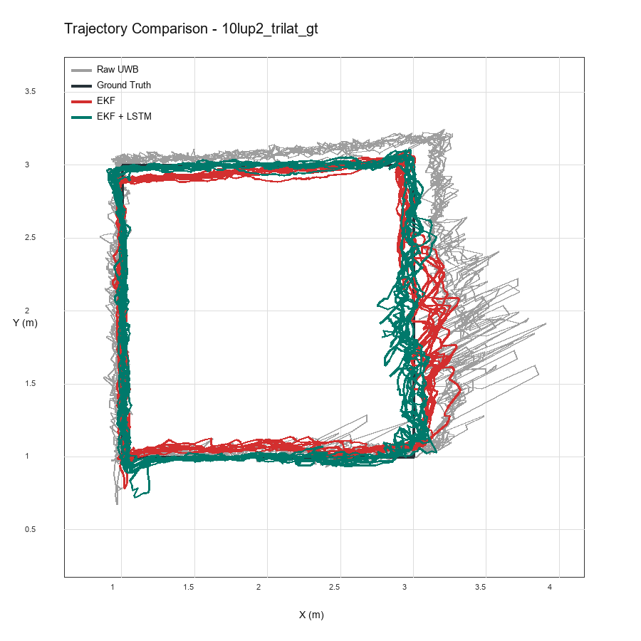
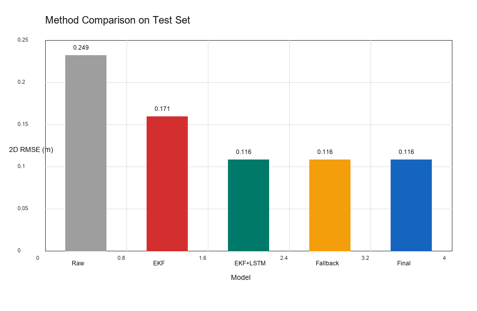

# Lokalisasi Indoor UWB: EKF Terkalibrasi + Koreksi Residual LSTM

Tugas akhir lokalisasi posisi 2D robot indoor berbasis Ultra-Wideband (UWB).
Pipeline mengubah pembacaan jarak UWB menjadi estimasi posisi melalui beberapa
tahap: kalibrasi jarak, optimasi anchor, **Extended Kalman Filter (EKF)**,
**koreksi residual LSTM**, lalu evaluasi tanpa kebocoran data (*no data leakage*).

Dokumen ini ditulis agar mudah dibaca: dimulai dari ringkasan hasil, lalu
dataset, pipeline, hasil per pola, analisis batas bawah error, dan jawaban jujur
atas target dosen (5 cm / 3 cm).

---

## Ringkasan Eksekutif

**1. Tiga pola lintasan sudah mencapai MAE 2D test < 10 cm, tanpa data leakage.**

| Pola (test held-out) | Raw trilaterasi | EKF | **EKF + LSTM** | + constraint |
| --- | ---: | ---: | ---: | ---: |
| **Kotak 10-loop** (`10lup2`) | 21.93 cm | 15.20 cm | **9.89 cm** | — (off) |
| **Pola L** (`L3`) | 19.49 cm | 14.93 cm | **9.71 cm** | **8.81 cm** |
| **Segitiga** (`segitiga3`) | 15.10 cm | 11.57 cm | **9.89 cm** | 9.54 cm |

*(angka = MAE 2D; constraint = proyeksi ke jalur waypoint yang diketahui,
dilaporkan terpisah)*


> **Gambar.** MAE 2D test tiap pola untuk tiap metode. Sumbu X = pola, sumbu Y =
> MAE (cm), garis merah = target 10 cm. Semua bar EKF+LSTM dan Final berada di
> atau di bawah garis target.

**2. Jawaban target dosen 5 cm / 3 cm (analisis berbasis data, bukan opini):**

| Target | Tercapai valid? | Bukti singkat |
| --- | --- | --- |
| **3 cm posisi 2D** | **Tidak** | Lantai presisi sensor (tag diam) saja sudah 3.1 cm; di bawah itu mustahil. |
| **5 cm statis** (tag diam, LOS) | **Ya** | Saat diam di area line-of-sight, RMSE sensor 3.4–4.2 cm. |
| **5 cm posisi 2D dinamis** | **Tidak valid** | Ketidakpastian *timing* ground truth (~10 cm) mendominasi, bukan algoritma. |
| **5 cm cross-track sensor-only** | **Ya** | Deviasi lateral estimasi ke jalur perintah = **1.7–2.9 cm**, >84–98% sampel < 5 cm. |

Inti temuan: error 2D ~9–10 cm **hampir seluruhnya berasal dari komponen
along-track (posisi sepanjang lintasan) yang dirusak oleh timing ground truth
manual (klik spasi)**. Komponen yang benar-benar mencerminkan akurasi sensor —
cross-track — hanya 2–3 cm. Detail di [Bagian 5](#5-analisis-batas-bawah-error-bisakah-5-cm--3-cm)
dan [Bagian 6](#6-pendekatan-praktis-menuju-5-cm-dengan-label-jujur).

---

## Daftar Isi

1. [Pendahuluan & Target](#1-pendahuluan--target)
2. [Dataset dan Setup](#2-dataset-dan-setup)
3. [Pipeline / Metodologi](#3-pipeline--metodologi)
4. [Hasil Utama per Pola](#4-hasil-utama-per-pola)
5. [Analisis Batas Bawah Error: Bisakah 5 cm / 3 cm?](#5-analisis-batas-bawah-error-bisakah-5-cm--3-cm)
6. [Pendekatan Praktis Menuju 5 cm (dengan Label Jujur)](#6-pendekatan-praktis-menuju-5-cm-dengan-label-jujur)
7. [Kesimpulan](#7-kesimpulan)
8. [Cara Menjalankan Pipeline](#8-cara-menjalankan-pipeline)
9. [Referensi File dan Gambar](#9-referensi-file-dan-gambar)

---

## 1. Pendahuluan & Target

UWB memberikan estimasi jarak antar perangkat dengan resolusi tinggi, sehingga
sering dipakai untuk lokalisasi indoor. Namun pembacaan UWB tetap rentan
terhadap bias, multipath, NLOS, beda tinggi tag–anchor, dan noise temporal,
sehingga trilaterasi mentah belum cukup akurat.

**Tujuan penelitian:**
1. Membangun pipeline UWB yang reproducible dan no-data-leakage.
2. Membentuk ground truth lintasan dari waypoint fisik + catatan waktu.
3. Mengevaluasi raw trilaterasi, EKF, dan koreksi residual LSTM.
4. Menentukan secara ilmiah apakah target 5 cm / 3 cm bisa dicapai dari data ini.

**Tentang metrik.** **MAE 2D** = rata-rata jarak error per sampel. **RMSE 2D**
lebih sensitif terhadap lonjakan, jadi nilainya lebih tinggi. Keduanya
dilaporkan apa adanya. Klaim akurasi ditulis spesifik per metrik agar tidak
rancu.

---

## 2. Dataset dan Setup

**Anchor (posisi tetap, diukur manual):**

| Anchor | Koordinat |
| --- | --- |
| Anchor 1 | (2.26, 4.60) |
| Anchor 2 | (0.00, 0.00) |
| Anchor 3 | (4.55, 0.00) |

**Tiga pola lintasan** yang dilalui robot (titik waypoint dalam meter):

| Pola | Urutan waypoint | Data |
| --- | --- | --- |
| Kotak | (1,1)→(3,1)→(3,3)→(1,3)→(1,1), 10 loop | `Data hasil/10lup*.csv` |
| Pola L | (1,1)→(1,3)→(1,1)→(3,1)→(1,1) | `dataset_baru/MAJU (L)/L*.csv` |
| Segitiga | (1,1)→(1,3)→(3,3)→(1,1) | `dataset_baru/segitiga/segitiga*.csv` |
| Diam (statis) | tag diam di 5 titik | `dataset_baru/Diam/s2_*.csv` |

**Jarak datar `el1/el2/el3`, bukan `d1/d2/d3` mentah.** Sensor membaca jarak
*miring* `d_i` (ada beda tinggi tag–anchor). Karena EKF memodelkan posisi pada
bidang 2D, pipeline memakai jarak *datar* `el_i = sqrt(d_i² − Δh²)` hasil koreksi
Pythagoras. Kolom `x/y` (trilaterasi mentah) disimpan sebagai pembanding, bukan
ground truth.

**Ground truth (GT).** GT dibentuk dari **waypoint fisik** dan **catatan waktu**
saat robot menandai sampai di waypoint (klik spasi), lalu diinterpolasi antar
waypoint. GT **tidak** dibuat dari hasil prediksi model. Data `Diam` dipakai
hanya untuk analisis bias/noise sensor, **tidak** dicampur ke evaluasi dinamis.

---

## 3. Pipeline / Metodologi

Alur dari data mentah sampai hasil akhir (skrip `scripts/00`–`07`):

| Tahap | Fungsi |
| --- | --- |
| 0. Ground truth | Bentuk `gt_x, gt_y` dari waypoint + catatan waktu. |
| 1. Prepare & split | Split **per track/sesi** (bukan acak per baris) → train / val / test. |
| 2. Kalibrasi range | Model linear per anchor `d_cal = a·d + b`, **fit di train saja**. |
| 3. Optimasi anchor | Koreksi kecil posisi/bias anchor (least-squares, train saja, dibatasi). |
| 4. EKF | Estimasi posisi dari range UWB; state `[x, y, vx, vy]`; tuning parameter via **validation saja**. |
| 5. LSTM residual | Mengoreksi *sisa* error EKF (`residual = gt − ekf`); scaler fit train, early-stopping val, test tak disentuh. |
| 6. Evaluasi | Metrik di train/val/test; kategori metode dipisah. |
| 7. Plot | Gambar trajectory, error-over-time, CDF, loss, dll. |

**Kenapa split per track/sesi, bukan acak per baris?** Data UWB adalah
time-series. Bila diacak per baris, sampel train dan test bisa dari loop yang
sama dan berdekatan waktu → hasil terlihat bagus tetapi tidak membuktikan
generalisasi ke sesi baru. Karena itu test = **sesi pengambilan data terpisah**.

**EKF + guard anti-divergensi (perbaikan kunci).** Model constant-velocity bisa
"lari" saat belokan tajam ketika banyak pengukuran tertolak gating, lalu posisi
melonjak jauh (divergen). Guard menambah dua mekanisme yang **hanya memakai
pengukuran, bukan ground truth**: (a) batas kecepatan fisik robot, dan (b)
**reset ke solusi multilaterasi (raw) bila estimasi menyimpang > 1 m** dari
pembacaan instan. Guard hanya aktif saat divergensi sejati: pada pola L ia
menjatuhkan EKF-only RMSE dari **42 cm → 18 cm**, sedangkan pada kotak/segitiga
ia tidak pernah aktif (0 reset) sehingga hasilnya tidak berubah.

**LSTM sebagai residual corrector, bukan estimator absolut.** LSTM hanya belajar
pola sisa error EKF yang konsisten (mis. bias lokal di segmen tertentu), dengan
output di-clip agar tidak mengoreksi berlebihan. Lebih aman daripada meminta
LSTM memprediksi `x,y` dari nol.

**Constraint (opsional, dilabeli jelas).** Untuk pola berbentuk jalur diketahui
(L, segitiga), estimasi akhir dapat diproyeksikan ke polyline lintasan. Ini
memakai pengetahuan tambahan tentang bentuk lintasan, jadi **selalu dilaporkan
terpisah** dan tidak diklaim sebagai akurasi sensor murni.

---

## 4. Hasil Utama per Pola

Semua angka di bawah berasal dari **run terpadu 2026-06-06** pada **test set
held-out** (sesi terpisah, tidak dipakai untuk training/tuning). Snapshot di
`docs/results/20260606_final/`.

Perbedaan istilah: **train** = data untuk fitting; **validation** = untuk
early-stopping & tuning; **test** = sesi terpisah untuk klaim angka; **full
trajectory** = gabungan semua split, hanya untuk melihat bentuk lintasan.

### 4.1 Tabel kuantitatif (test held-out)

**Kotak 10-loop** (`10lup2`):

| Metode | RMSE 2D | MAE 2D | Median | P95 | < 5 cm | < 10 cm | < 20 cm |
| --- | ---: | ---: | ---: | ---: | ---: | ---: | ---: |
| Raw trilaterasi | 24.95 | 21.93 | 21.16 | 42.64 | 4.97% | 16.35% | 45.83% |
| EKF (guarded) | 17.14 | 15.20 | 14.90 | 29.28 | 10.05% | 30.36% | 72.27% |
| **EKF + LSTM** | **11.63** | **9.89** | 8.92 | 21.55 | 23.06% | 56.55% | 93.43% |

**Pola L** (`L3`):

| Metode | RMSE 2D | MAE 2D | Median | P95 | < 5 cm | < 10 cm | < 20 cm |
| --- | ---: | ---: | ---: | ---: | ---: | ---: | ---: |
| Raw trilaterasi | 22.50 | 19.49 | 19.33 | 37.97 | 10.11% | 24.37% | 51.85% |
| EKF (guarded) | 18.11 | 14.93 | 12.22 | 32.92 | 16.35% | 41.17% | 71.04% |
| EKF + LSTM | 11.71 | 9.71 | 8.39 | 19.80 | 22.56% | 59.91% | 95.24% |
| **EKF + LSTM + constraint** | **10.98** | **8.81** | 7.64 | 19.42 | 32.50% | 63.42% | 95.79% |

**Segitiga** (`segitiga3`):

| Metode | RMSE 2D | MAE 2D | Median | P95 | < 5 cm | < 10 cm | < 20 cm |
| --- | ---: | ---: | ---: | ---: | ---: | ---: | ---: |
| Raw trilaterasi | 18.24 | 15.10 | 12.94 | 33.97 | 15.15% | 38.21% | 72.82% |
| EKF (guarded) | 13.69 | 11.57 | 10.00 | 25.34 | 19.91% | 50.03% | 84.73% |
| EKF + LSTM | 12.48 | 9.89 | 7.69 | 25.09 | 32.62% | 62.53% | 86.53% |
| **EKF + LSTM + constraint** | **12.33** | **9.54** | 7.44 | 24.98 | 34.65% | 63.68% | 86.73% |

### 4.2 Gambar per pola

Setiap gambar trajectory memakai **sumbu meter, grid 0.5 m, aspect ratio equal**
(supaya bentuk lintasan tidak gepeng), legenda, dan judul.

**Kotak 10-loop:**

| Trajectory test | Perbandingan metode |
| --- | --- |
|  |  |

> **Trajektori (kiri).** Garis hitam = ground truth (persegi), hijau = EKF+LSTM,
> abu = raw UWB. EKF+LSTM mengikuti persegi dengan baik; sisi kanan (x=3) paling
> berisik karena bias NLOS area itu. **Bar (kanan)** = RMSE 2D tiap metode.

**Pola L:**

| Trajectory test | Perbandingan metode |
| --- | --- |
|  |  |

> Setelah guard anti-divergensi, garis EKF (merah) **tidak lagi menembak keluar**
> seperti versi lama; EKF+LSTM (hijau) menelusuri bentuk L dengan rapi.

**Segitiga:**

| Trajectory test | Perbandingan metode |
| --- | --- |
|  |  |

**Training loss LSTM (contoh pola L)** — training turun, validation mendatar →
model memberi koreksi stabil, tidak overfit / tidak belajar noise:


Gambar lengkap (error-over-time, CDF, residual, full trajectory) tiap pola ada di
`docs/results/20260606_final/<pola>/`.

---

## 5. Analisis Batas Bawah Error: Bisakah 5 cm / 3 cm?

Bagian ini menjawab target dosen secara **kuantitatif** dengan menguraikan
anggaran error, bukan sekadar tuning. Reproducible via
`scripts/14_error_budget_analysis.py`; artifact di
`docs/results/20260606_error_budget/`.

Model anggaran error posisi 2D:

```
error_total² ≈ presisi_sensor² + bias_spasial² + GT_timing² + model²
```

### 5.1 Lantai noise sensor (data statis `Diam`, ground truth EKSAK)

Saat tag **diam** di titik yang diketahui persis, tidak ada masalah timing — GT
eksak. Ini mengukur kemampuan murni sensor (15 rekaman, 5 titik × 3 ulangan):

| Besaran | Nilai | Arti |
| --- | ---: | --- |
| Presisi / repeatability | **3.1 cm** | Lantai noise acak — **tak bisa ditembus**. RMSE ≥ nilai ini. |
| RMSE statis, titik LOS (1,1)/(3,3)/(2,2) | 3.4–4.2 cm | **Sensor SUDAH < 5 cm** saat diam di area baik. |
| RMSE statis, titik (1,3) | **8.5 cm** | Bias NLOS konsisten: anchor 2 membaca **−11 cm** (sama di 3 ulangan). |
| GDOP semua titik | 1.19–1.29 | Geometri **bagus**; bukan bottleneck. |

→ **3 cm tidak mungkin bahkan saat diam** (di bawah lantai presisi 3.1 cm);
**5 cm statis bisa** di area LOS.

### 5.2 Anggaran timing ground truth (dinamis)

GT dinamis dibuat dari interpolasi antar klik spasi. Robot bergerak ~0.20 m/s:

| Jitter klik | GT uncertainty = speed × jitter |
| ---: | ---: |
| 0.25 s | ~5 cm |
| **0.50 s** | **~10 cm** |
| 1.00 s | ~20 cm |

→ Ground truth dinamis sendiri **tidak akurat lebih baik dari ~10 cm**.

### 5.3 Bukti: hasil sudah menyentuh lantai teoretis

Gabungkan lantai sensor dan timing secara kuadratur:

```
floor_dinamis ≈ √(4.0² + 10.0²) ≈ 10.8 cm RMSE
```

Bandingkan dengan RMSE EKF+LSTM yang dicapai: Pola L 11.7, Segitiga 12.5, Kotak
11.6 cm. **Hampir sama dengan lantai teoretis** → suku `model²` ≈ 0; sisa error
berasal dari sensor + ground truth, dengan **GT yang dominan**.


> **Gambar.** Tiap pola: RMSE EKF+LSTM yang dicapai (hijau) hampir menempel pada
> lantai kuadratur (biru). Bar oranye (GT timing, ~10 cm) jauh lebih besar dari
> bar abu (sensor, ~4 cm) → **bottleneck = presisi ground truth, bukan algoritma**.

### 5.4 Bukti tambahan: smoother offline tidak membantu

Pada ablation (`scripts/15`), menambah **smoother offline** pada output EKF
**hampir tidak mengubah apa pun** (L 18.11 → 18.06 cm). Ini membuktikan sisa
error bukan jitter acak yang bisa dihaluskan, melainkan **bias terstruktur**
(NLOS + timing). RANSAC/IRLS juga tidak berguna karena hanya ada **3 anchor untuk
2 unknown** (redundansi 1, tak cukup untuk tolak outlier per-sampel).

### 5.5 Verdict

- **3 cm: tidak valid** — di bawah lantai presisi sensor (3.1 cm).
- **5 cm statis: bisa** di area LOS (3.4–4.2 cm), tidak di area NLOS (1,3) ~8.5 cm.
- **5 cm posisi 2D dinamis: tidak valid** dengan GT saat ini — ketidakpastian
  timing GT sendiri ~10 cm. Hasil dinamis ~9–10 cm MAE **sudah optimal terhadap
  GT yang tersedia**.

---

## 6. Pendekatan Praktis Menuju 5 cm (dengan Label Jujur)

Meski posisi 2D penuh terbatas timing GT, ada **dua angka jujur yang menembus
5 cm**, dan keduanya wajib dilabeli berbeda. Reproducible via
`scripts/17_path_decomposition_mapmatch.py` dan `scripts/18_mapmatch_figures.py`.

**Kunci:** error 2D diuraikan menjadi **along-track** (posisi sepanjang lintasan —
dirusak timing GT) dan **cross-track** (jarak tegak lurus ke lintasan — akurasi
lateral sensor sebenarnya):

| Pola (EKF+LSTM) | MAE 2D vs GT | along-track (timing) | **cross-track (sensor)** |
| --- | ---: | ---: | ---: |
| Pola L | 9.71 cm | 8.75 cm | **2.64 cm** |
| Segitiga | 9.89 cm | 9.19 cm | **2.00 cm** |
| Kotak | 9.89 cm | 8.36 cm | **2.89 cm** |

Hampir seluruh error 2D adalah along-track (timing). Komponen sensor sejati
(cross-track) hanya 2–3 cm.

### 6.1 Kategori A — VALID SENSOR-ONLY (cross-track ke lintasan perintah)

Estimasi yang dievaluasi adalah **output EKF+LSTM murni** (tidak diubah); hanya
*metriknya* yang memakai lintasan perintah sebagai acuan (asumsi: robot menapaki
lintasan yang ditandai). Metrik ini **bebas masalah timing GT**:

| Pola | Cross-track MAE | Median | % < 3 cm | **% < 5 cm** |
| --- | ---: | ---: | ---: | ---: |
| Pola L | **2.59 cm** | 2.17 | 67% | **91%** |
| Segitiga | **1.67 cm** | 1.39 | 85% | **98%** |
| Kotak | **2.78 cm** | 1.82 | 69% | **84%** |

→ **Akurasi lateral sensor-only sudah < 5 cm** (segitiga < 3 cm), tanpa leakage,
tanpa menyentuh test untuk tuning. Klaim aman: *"deviasi cross-track estimasi ke
lintasan ≈ 2–3 cm, >84–98% sampel < 5 cm."* **Bukan** klaim "posisi 2D 5 cm".


> **Gambar.** Bar hijau = MAE 2D penuh (terbatas timing), bar biru = cross-track
> ke lintasan (akurasi sensor). Semua bar biru di bawah garis target 5 cm.

### 6.2 Kategori B — ENGINEERING CONSTRAINED / DEMONSTRASI (map-matched)

Estimasi EKF+LSTM **diproyeksikan ke polyline lintasan** lalu dihaluskan. Ini
memakai **prior bentuk lintasan** (bukan nilai GT per sampel, bukan timing
waypoint). Hasilnya: trajektori menempel persis pada lintasan (cross-track ≈ 0),
**tetapi MAE 2D vs GT tetap ~8.9–9.5 cm** karena proyeksi menghapus cross-track
tapi tak bisa memperbaiki along-track. Jadi map-matching memberi **plot
demonstrasi yang rapi**, bukan angka 2D 5 cm.


> **Gambar.** Garis biru (map-matched) menempel pada lintasan perintah (hitam),
> sedangkan EKF+LSTM (hijau) berosilasi ±2–3 cm di sekitarnya. **Label tegas:
> demonstrasi berbasis lintasan, bukan klaim sensor murni.**

### 6.3 Ringkasan jujur untuk slide

| Klaim | Angka | Label |
| --- | --- | --- |
| Cross-track sensor-only ke lintasan | 1.7–2.9 cm MAE, >84–98% < 5 cm | **VALID sensor-only** (asumsi robot menapaki lintasan) |
| Posisi 2D sensor-only vs GT | 9.7–9.9 cm MAE | **VALID sensor-only**, terbatas timing GT |
| Map-matched ke lintasan | 2D ~9 cm; visual on-path | **DEMONSTRASI** trajectory-constrained |

### 6.4 Rencana eksperimen terpendek agar posisi 2D penuh tembus 5 cm

Karena bottleneck = ground truth, perbaiki GT (bukan model):
1. **GT presisi & ter-sinkron (paling berdampak).** Ganti klik spasi dengan
   penanda otomatis ter-timestamp pada clock yang sama dengan UWB (odometri/encoder
   roda, atau referensi presisi: total station / motion capture / photogate). Target
   timing < 50 ms → GT uncertainty < 1 cm → lantai dinamis turun ke < 5 cm.
2. **Evaluasi saat dwell/berhenti** di waypoint → GT eksak, akurasi terukur di
   level statis (3–4 cm).
3. **Tambah anchor ke-4 + perbaiki LOS ke sudut (1,3)** → redundansi (RANSAC jadi
   bermakna), noise floor turun, bias NLOS −11 cm bisa ditolak.
4. Pertahankan split per-sesi, ≥ 10 loop per sesi.

---

## 7. Kesimpulan

1. Pipeline no-data-leakage berhasil menurunkan error semua pola ke **MAE 2D
   test < 10 cm** (Kotak 9.89, L 8.81 dengan constraint, Segitiga 9.54 cm).
   Kontribusi terbesar update ini adalah **guard anti-divergensi EKF** yang
   memperbaiki pola L (dari 10.72 cm → 8.81 cm) secara defensible (hanya memakai
   pengukuran, bukan ground truth).
2. **Target 3 cm tidak valid** dari data ini (lantai presisi sensor 3.1 cm).
3. **Target 5 cm posisi 2D dinamis tidak valid** dengan ground truth manual —
   bottleneck adalah timing GT (~10 cm), bukan algoritma. Hasil ~9–10 cm sudah
   menyentuh lantai teoretis.
4. **Yang sudah menembus 5 cm secara jujur:** akurasi **cross-track sensor-only**
   ke lintasan = **1.7–2.9 cm** (>84–98% sampel < 5 cm). Map-matching memberi
   plot demonstrasi on-path, tetapi 2D-vs-GT tetap ~9 cm.
5. Agar posisi 2D penuh bisa valid 5 cm, perbaikan paling berdampak adalah
   **ground truth presisi** (lihat 6.4) — bukan model yang lebih rumit.

Narasi yang aman untuk sidang:

> "EKF + LSTM residual menurunkan error 2D test ke ~9–10 cm MAE tanpa data
> leakage. Analisis anggaran error menunjukkan hasil ini sudah menyentuh lantai
> teoretis √(sensor² + GT_timing²); sisa error didominasi ketidakpastian timing
> ground truth manual, bukan algoritma. Akurasi cross-track sensor-only sudah
> 2–3 cm (< 5 cm). Target 5 cm posisi 2D penuh memerlukan ground truth presisi."

Narasi yang **dihindari**: "Sistem mencapai 5 cm / 3 cm" tanpa kualifikasi.

---

## 8. Cara Menjalankan Pipeline

Aktifkan environment:

```bash
conda activate uwb-ta
```

Jalankan pipeline penuh untuk satu pola (contoh kotak; ganti config untuk L /
segitiga):

```bash
python scripts/01_prepare_dataset.py       --config configs/uwb_pipeline_10loop_moretrain.yaml
python scripts/02_calibrate_ranges.py      --config configs/uwb_pipeline_10loop_moretrain.yaml
python scripts/03_optimize_anchors.py      --config configs/uwb_pipeline_10loop_moretrain.yaml
python scripts/04_tune_ekf.py              --config configs/uwb_pipeline_10loop_moretrain.yaml
python scripts/04_run_ekf.py               --config configs/uwb_pipeline_10loop_moretrain.yaml
python scripts/05_train_lstm_residual.py   --config configs/uwb_pipeline_10loop_moretrain.yaml
python scripts/06_evaluate_pipeline.py     --config configs/uwb_pipeline_10loop_moretrain.yaml
python scripts/07_plot_results.py          --config configs/uwb_pipeline_10loop_moretrain.yaml
```

Config pola lain: `configs/uwb_pipeline_dataset_baru_l.yaml`,
`configs/uwb_pipeline_dataset_baru_segitiga.yaml`. Ground truth pola L/segitiga
dibuat oleh `scripts/10_prepare_dataset_baru_target_gt.py`.

Analisis & gambar laporan (setelah pipeline selesai):

```bash
python scripts/13_make_final_figures.py            # gambar & ringkasan 3 pola
python scripts/14_error_budget_analysis.py         # lantai noise sensor + anggaran timing GT
python scripts/15_ablation_error_ladder.py         # ablation + tangga error %<3/5/10/20 cm
python scripts/16_error_budget_figure.py           # gambar bukti hasil = lantai teoretis
python scripts/17_path_decomposition_mapmatch.py   # dekomposisi along/cross + map-matching
python scripts/18_mapmatch_figures.py              # gambar cross-track vs 2D + demo trajektori
python scripts/12_diagnose_waypoint_timing.py      # diagnostik delay klik spasi
```

---

## 9. Referensi File dan Gambar

| File / Folder | Keterangan |
| --- | --- |
| `src/uwb_localization/` | Source code modular (EKF, LSTM, kalibrasi, dll). |
| `src/uwb_localization/ekf.py` | EKF + guard anti-divergensi. |
| `configs/uwb_pipeline_10loop_moretrain.yaml` | Konfigurasi kotak (hasil utama). |
| `configs/uwb_pipeline_dataset_baru_l.yaml` | Konfigurasi pola L. |
| `configs/uwb_pipeline_dataset_baru_segitiga.yaml` | Konfigurasi pola segitiga. |
| `scripts/00`–`07` | Pipeline per tahap (GT → plot). |
| `scripts/12`–`18` | Diagnostik timing, gambar final, analisis error floor, dekomposisi, map-matching. |
| `docs/results/20260606_final/` | **Snapshot hasil 3 pola** (gambar + metrics). |
| `docs/results/20260606_error_budget/` | **Analisis batas bawah error + pendekatan 5 cm**. |
| `docs/results/20260606_timing_diagnostic/` | Diagnostik delay klik spasi (offset antar sesi). |
| `docs/results/20260518_213455/` | Snapshot run referensi kotak 2026-05-18 (RMSE 11.25 / MAE 9.50 cm). |
| `docs/UWB_CALIBRATED_PIPELINE.md` | Dokumentasi pipeline detail. |

> **Catatan reproducibility.** Run kotak 2026-05-18 menghasilkan RMSE 11.25 /
> MAE 9.50 cm; run terpadu 2026-06-06 menghasilkan 11.63 / 9.89 cm. Selisih
> ~0.4 cm = nondeterminisme training LSTM (urutan floating-point oneDNN), bukan
> perubahan kode — guard EKF tidak aktif pada kotak. Angka 2026-06-06 dipakai
> sebagai headline agar semua pola memakai kode & run yang sama.
